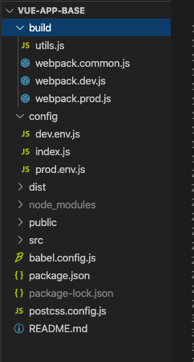

# 刘惠俊 Part2 模块二 模块化开发与规范化标准 作业

## 一、简答题

### 1、Webpack 的构建流程主要有哪些环节？如果可以请尽可能详尽的描述 Webpack 打包的整个过程。
+ 答：webpack 是一个现代 JavaScript 应用程序的静态模块打包器(module bundler)。当 webpack 处理应用程序时，它会递归地构建一个依赖关系图(dependency graph)，其中包含应用程序需要的每个模块，然后将所有这些模块打包成一个或多个 bundle。在介绍 webpack 的构建流程前，你需要先理解四个核心概念：
  + 入口(entry)： 入口起点(entry point)指示 webpack 应该使用哪个模块，来作为构建其内部依赖图的开始。进入入口起点后，webpack 会找出有哪些模块和库是入口起点（直接和间接）依赖的
  + 输出(output)：output 属性告诉 webpack 在哪里输出它所创建的 bundles，以及如何命名这些文件，默认值为 ./dist。基本上，整个应用程序结构，都会被编译到你指定的输出路径的文件夹中。
  + loader：loader 让 webpack 能够去处理那些非 JavaScript 文件（webpack 自身只理解 JavaScript）。loader 可以将所有类型的文件转换为 webpack 能够处理的有效模块，然后你就可以利用 webpack 的打包能力，对它们进行处理
  + 插件(plugins)：loader 被用于转换某些类型的模块，而插件则可以用于执行范围更广的任务。插件的范围包括，从打包优化和压缩，一直到重新定义环境中的变量。插件接口功能极其强大，可以用来处理各种各样的任务
构建的流程是：在 webpack 的配置文件中导出一个对象，这个对象包含 entry、output、module、plugins 和 resolve 的基本属性（并不局限与这些属性）。
  + 在 module 属性中我们可以定义用哪些 loader 解析某类文件，并可以设置解析文件的范围以及解析规则。
  + 在 plugins 属性中我们可以用各种插件来打包优化和压缩，还可以定义环境变量，删除和复制文件和文件夹
+ 有了 module 和 plugins 两个属性我们就可以解析各种文件为 webpack 能理解的模块，然后根据入口文件来打包进我们代码中指定的模块中，进而输出到我们想要的目录下。

### 2、Loader 和 Plugin 有哪些不同？请描述一下开发 Loader 和 Plugin 的思路。
+ 答：
+ loader 让 webpack 能够去处理那些非 JavaScript 文件（webpack 自身只理解 JavaScript）。loader 可以将所有类型的文件转换为 webpack 能够处理的有效模块，然后你就可以利用 webpack 的打包能力，对它们进行处理
+ loader 被用于转换某些类型的模块，而插件则可以用于执行范围更广的任务。插件的范围包括，从打包优化和压缩，一直到重新定义环境中的变量。插件接口功能极其强大，可以用来处理各种各样的任务，Webpack要求插件必须是一个函数或者是一个包含apply方法的对象。通过在生命周期的钩子中挂载函数实现扩展。插件机制的是webpack一个核心特性，目的是为了增强webpack自动化方面的能力。

+ 开发Loader要专注实现资源模块的加载，从而去实现整体项目的打包。

+ loader文件markdown-loader.js：
```js
const marked = require('marked')

module.exports = source => {
  // console.log(source)
  // return 'console.log("hello")'
  const html = marked(source)
  console.log(html)
  // 两种导出方式：
  // return `module.exports=${JSON.stringify(html)}`
  return `export default ${JSON.stringify(html)}`
}
```

+ 在webpack.config.js中如何使用：
```js
module: {
    rules: [
      {
        test: /.md$/,
        use: ['html-loader', './markdown-loader.js']
      }
    ]
  }
```

+ 开发Plugin是为了解决除了资源加载以外的其他的一些自动化工作。

+ 开发的插件可以是一个函数或者是一个包含apply方法的对象：
```js
class MyPlugin {
  apply (compiler) {
    console.log('MyPlugin 启动')
    compiler.hooks.emit.tap('MyPlugin', compilation => {
      // compilation 可以理解为此次打包的上下文
      for (const name in compilation.assets) {
        // console.log(name) // 文件名
        console.log(compilation.assets[name].source())
        if(name.endsWith('.js')) {
          const contents = compilation.assets[name].source()
          const withoutComments = contents.replace(/\/\*\*+\//g, '')
          compilation.assets[name] = {
            source: () => withoutComments,
            size: () => withoutComments.length
          }
        }
      }
    })
  }
}
```
+ 如何使用自定义插件：
```js
plugins: [
  new MyPlugin()
]
```

## 二、编程题
### 1、使用 Webpack 实现 Vue 项目打包任务
+ 答：代码目录为 ./code/assignmentCode/vue-app-base
+ package.json文件如下：
```js
{
    "name": "vue-app-base",
    "version": "0.1.0",
    "private": true,
    "scripts": {
        "serve": "webpack-dev-server --config build/webpack.dev.js",
        "build": "webpack --config build/webpack.prod.js",
        "lint": "eslint --ext js,vue src"
    },
    "dependencies": {
        "-": "0.0.1",
        "D": "^1.0.0",
        "babel-eslint": "^10.1.0",
        "core-js": "^3.6.5",
        "vue": "^2.6.11"
    },
    "devDependencies": {
        "autoprefixer": "^7.1.2",
        "babel-core": "^6.22.1",
        "babel-helper-vue-jsx-merge-props": "^2.0.3",
        "babel-loader": "^7.1.1",
        "babel-plugin-syntax-jsx": "^6.18.0",
        "babel-plugin-transform-runtime": "^6.22.0",
        "babel-plugin-transform-vue-jsx": "^3.5.0",
        "babel-preset-env": "^1.3.2",
        "babel-preset-stage-2": "^6.22.0",
        "chalk": "^2.0.1",
        "compression-webpack-plugin": "^4.0.0",
        "copy-webpack-plugin": "^4.0.1",
        "css-loader": "^0.28.0",
        "eslint": "^7.3.1",
        "eslint-plugin-vue": "^6.2.2",
        "extract-text-webpack-plugin": "^3.0.0",
        "file-loader": "^1.1.4",
        "friendly-errors-webpack-plugin": "^1.6.1",
        "html-webpack-plugin": "^2.30.1",
        "less": "^3.11.3",
        "less-loader": "^4.1.0",
        "node-notifier": "^5.1.2",
        "optimize-css-assets-webpack-plugin": "^3.2.0",
        "ora": "^1.2.0",
        "portfinder": "^1.0.13",
        "postcss-import": "^11.0.0",
        "postcss-loader": "^2.0.8",
        "postcss-url": "^7.2.1",
        "rimraf": "^2.6.0",
        "semver": "^5.3.0",
        "shelljs": "^0.7.6",
        "uglifyjs-webpack-plugin": "^1.1.1",
        "url-loader": "^0.5.8",
        "vue-loader": "^13.3.0",
        "vue-style-loader": "^3.0.1",
        "vue-template-compiler": "^2.5.2",
        "webpack": "^3.6.0",
        "webpack-bundle-analyzer": "^2.9.0",
        "webpack-dev-server": "^2.9.1",
        "webpack-merge": "^4.1.0"
    },
    "eslintConfig": {
        "root": true,
        "env": {
            "node": true
        },
        "extends": [
            "plugin:vue/essential",
            "eslint:recommended"
        ],
        "parserOptions": {
            "parser": "babel-eslint"
        },
        "rules": {}
    },
    "browserslist": [
        "> 1%",
        "last 2 versions",
        "not dead"
    ]
}

```
+ 文件目录如下：



+ 脚本 serve 的 webpack 配置文件为 build 目录下的 webpack.dev.js,内容如下：
```js
'use strict'
const utils = require('./utils')
const webpack = require('webpack')
const config = require('../config')
const merge = require('webpack-merge')
const path = require('path')
const baseWebpackConfig = require('./webpack.common')
const CopyWebpackPlugin = require('copy-webpack-plugin')
const HtmlWebpackPlugin = require('html-webpack-plugin')
const FriendlyErrorsPlugin = require('friendly-errors-webpack-plugin')
const portfinder = require('portfinder')

const HOST = process.env.HOST
const PORT = process.env.PORT && Number(process.env.PORT)

const devWebpackConfig = merge(baseWebpackConfig, {
    module: {
        rules: utils.styleLoaders({ sourceMap: config.dev.cssSourceMap, usePostCSS: true })
    },
    // cheap-module-eval-source-map is faster for development
    devtool: config.dev.devtool,

    // these devServer options should be customized in /config/index.js
    devServer: {
        clientLogLevel: 'warning',
        historyApiFallback: {
            rewrites: [
                { from: /.*/, to: path.posix.join(config.dev.assetsPublicPath, 'index.html') },
            ],
        },
        hot: true,
        contentBase: false, // since we use CopyWebpackPlugin.
        compress: true,
        host: HOST || config.dev.host,
        port: PORT || config.dev.port,
        open: config.dev.autoOpenBrowser,
        overlay: config.dev.errorOverlay ? { warnings: false, errors: true } : false,
        publicPath: config.dev.assetsPublicPath,
        proxy: config.dev.proxyTable,
        quiet: true, // necessary for FriendlyErrorsPlugin
        watchOptions: {
            poll: config.dev.poll,
        }
    },
    plugins: [
        new webpack.DefinePlugin({
            'process.env': require('../config/dev.env'),
            BASE_URL: '"/"'
        }),
        new webpack.HotModuleReplacementPlugin(),
        new webpack.NamedModulesPlugin(), // HMR shows correct file names in console on update.
        new webpack.NoEmitOnErrorsPlugin(),
        // https://github.com/ampedandwired/html-webpack-plugin
        new HtmlWebpackPlugin({
            title: 'liuzi-Vue-Webpack',
            template: './public/index.html',
            filename: 'index.html',
            inject: true
        }),
        // // copy custom static assets
        // new CopyWebpackPlugin([
        //   {
        //     from: path.resolve(__dirname, '../static'),
        //     to: config.dev.assetsSubDirectory,
        //     ignore: ['.*']
        //   }
        // ])
    ]
})

module.exports = new Promise((resolve, reject) => {
    portfinder.basePort = process.env.PORT || config.dev.port
    portfinder.getPort((err, port) => {
        if (err) {
            reject(err)
        } else {
            // publish the new Port, necessary for e2e tests
            process.env.PORT = port
                // add port to devServer config
            devWebpackConfig.devServer.port = port

            // Add FriendlyErrorsPlugin
            devWebpackConfig.plugins.push(new FriendlyErrorsPlugin({
                compilationSuccessInfo: {
                    messages: [`Your application is running here: http://${devWebpackConfig.devServer.host}:${port}`],
                }
            }))

            resolve(devWebpackConfig)
        }
    })
})
```
+ webpack.dev.js 中依赖的 webpack.common.js 的内容如下：
```js
'use strict'
const path = require('path')
const utils = require('./utils')
const config = require('../config')
const webpack = require('webpack')

function resolve(dir) {
    return path.join(__dirname, '..', dir)
}


module.exports = {
    context: path.resolve(__dirname, '../'),
    entry: {
        app: './src/main.js'
    },
    output: {
        path: config.build.assetsRoot,
        filename: '[name].js',
        publicPath: process.env.NODE_ENV === 'production' ?
            config.build.assetsPublicPath :
            config.dev.assetsPublicPath
    },
    resolve: {
        extensions: ['.js', '.vue', '.json'],
        alias: {
            'vue$': 'vue/dist/vue.esm.js',
            '@': resolve('src'),
        }
    },
    module: {
        rules: [{
                test: /\.vue$/,
                loader: 'vue-loader'
            },
            {
                test: /\.js$/,
                loader: 'babel-loader',
                include: [resolve('src'), resolve('test'), resolve('node_modules/webpack-dev-server/client')]
            },
            {
                test: /\.(png|jpe?g|gif|svg)(\?.*)?$/,
                loader: 'url-loader',
                options: {
                    limit: 10000,
                    name: utils.assetsPath('img/[name].[hash:7].[ext]')
                }
            },
            {
                test: /\.(mp4|webm|ogg|mp3|wav|flac|aac)(\?.*)?$/,
                loader: 'url-loader',
                options: {
                    limit: 10000,
                    name: utils.assetsPath('media/[name].[hash:7].[ext]')
                }
            },
            {
                test: /\.(woff2?|eot|ttf|otf)(\?.*)?$/,
                loader: 'url-loader',
                options: {
                    limit: 10000,
                    name: utils.assetsPath('fonts/[name].[hash:7].[ext]')
                }
            }
        ]
    },
    plugins: [
        new webpack.BannerPlugin('write by liuzi at time:' + Date.now())
    ]
}
```

+ webpack.dev.js 中依赖的 utils 模块中的代码如下：
```js
'use strict'
const path = require('path')
const config = require('../config')
const ExtractTextPlugin = require('extract-text-webpack-plugin')

exports.assetsPath = function(_path) {
    const assetsSubDirectory = process.env.NODE_ENV === 'production' ?
        config.build.assetsSubDirectory :
        config.dev.assetsSubDirectory

    return path.posix.join(assetsSubDirectory, _path)
}

exports.cssLoaders = function(options) {
    options = options || {}

    const cssLoader = {
        loader: 'css-loader',
        options: {
            sourceMap: options.sourceMap
        }
    }

    const postcssLoader = {
        loader: 'postcss-loader',
        options: {
            sourceMap: options.sourceMap
        }
    }

    // generate loader string to be used with extract text plugin
    function generateLoaders(loader, loaderOptions) {
        const loaders = options.usePostCSS ? [cssLoader, postcssLoader] : [cssLoader]

        if (loader) {
            loaders.push({
                loader: loader + '-loader',
                options: Object.assign({}, loaderOptions, {
                    sourceMap: options.sourceMap
                })
            })
        }

        // Extract CSS when that option is specified
        // (which is the case during production build)
        if (options.extract) {
            return ExtractTextPlugin.extract({
                use: loaders,
                fallback: 'vue-style-loader'
            })
        } else {
            return ['vue-style-loader'].concat(loaders)
        }
    }

    // https://vue-loader.vuejs.org/en/configurations/extract-css.html
    return {
        css: generateLoaders(),
        postcss: generateLoaders(),
        less: generateLoaders('less'),
        sass: generateLoaders('sass', { indentedSyntax: true }),
        scss: generateLoaders('sass'),
        stylus: generateLoaders('stylus'),
        styl: generateLoaders('stylus')
    }
}

// Generate loaders for standalone style files (outside of .vue)
exports.styleLoaders = function(options) {
    const output = []
    const loaders = exports.cssLoaders(options)

    for (const extension in loaders) {
        const loader = loaders[extension]
        output.push({
            test: new RegExp('\\.' + extension + '$'),
            use: loader
        })
    }

    return output
}
```
+ 脚本 build 的 webpack 配置文件为 build 目录下的 webpack.prod.js,内容如下：
```js
'use strict'
const path = require('path')
const utils = require('./utils')
const webpack = require('webpack')
const config = require('../config')
const merge = require('webpack-merge')
const baseWebpackConfig = require('./webpack.common')
const CopyWebpackPlugin = require('copy-webpack-plugin')
const HtmlWebpackPlugin = require('html-webpack-plugin')
const ExtractTextPlugin = require('extract-text-webpack-plugin')
const OptimizeCSSPlugin = require('optimize-css-assets-webpack-plugin')
const UglifyJsPlugin = require('uglifyjs-webpack-plugin')

const env = require('../config/prod.env')

const webpackConfig = merge(baseWebpackConfig, {
    module: {
        rules: utils.styleLoaders({
            sourceMap: config.build.productionSourceMap,
            extract: true,
            usePostCSS: true
        })
    },
    devtool: config.build.productionSourceMap ? config.build.devtool : false,
    output: {
        path: config.build.assetsRoot,
        filename: utils.assetsPath('js/[name].[chunkhash].js'),
        chunkFilename: utils.assetsPath('js/[id].[chunkhash].js')
    },
    plugins: [
        // http://vuejs.github.io/vue-loader/en/workflow/production.html
        new webpack.DefinePlugin({
            'process.env': env,
            BASE_URL: '"/"'
        }),
        new UglifyJsPlugin({
            uglifyOptions: {
                compress: {
                    warnings: false
                }
            },
            sourceMap: config.build.productionSourceMap,
            parallel: true
        }),
        // extract css into its own file
        new ExtractTextPlugin({
            filename: utils.assetsPath('css/[name].[contenthash].css'),
            // Setting the following option to `false` will not extract CSS from codesplit chunks.
            // Their CSS will instead be inserted dynamically with style-loader when the codesplit chunk has been loaded by webpack.
            // It's currently set to `true` because we are seeing that sourcemaps are included in the codesplit bundle as well when it's `false`, 
            // increasing file size: https://github.com/vuejs-templates/webpack/issues/1110
            allChunks: true,
        }),
        // Compress extracted CSS. We are using this plugin so that possible
        // duplicated CSS from different components can be deduped.
        new OptimizeCSSPlugin({
            cssProcessorOptions: config.build.productionSourceMap ? { safe: true, map: { inline: false } } : { safe: true }
        }),
        // generate dist index.html with correct asset hash for caching.
        // you can customize output by editing /index.html
        // see https://github.com/ampedandwired/html-webpack-plugin
        new HtmlWebpackPlugin({
            title: 'liuzi-Vue-Webpack',
            template: './public/index.html',
            filename: 'index.html',
            inject: true,
            minify: {
                removeComments: true,
                collapseWhitespace: true,
                removeAttributeQuotes: true
                    // more options:
                    // https://github.com/kangax/html-minifier#options-quick-reference
            },
            // necessary to consistently work with multiple chunks via CommonsChunkPlugin
            chunksSortMode: 'dependency'
        }),
        // keep module.id stable when vendor modules does not change
        new webpack.HashedModuleIdsPlugin(),
        // enable scope hoisting
        new webpack.optimize.ModuleConcatenationPlugin(),
        // split vendor js into its own file
        new webpack.optimize.CommonsChunkPlugin({
            name: 'vendor',
            minChunks(module) {
                // any required modules inside node_modules are extracted to vendor
                return (
                    module.resource &&
                    /\.js$/.test(module.resource) &&
                    module.resource.indexOf(
                        path.join(__dirname, '../node_modules')
                    ) === 0
                )
            }
        }),
        // extract webpack runtime and module manifest to its own file in order to
        // prevent vendor hash from being updated whenever app bundle is updated
        new webpack.optimize.CommonsChunkPlugin({
            name: 'manifest',
            minChunks: Infinity
        }),
        // This instance extracts shared chunks from code splitted chunks and bundles them
        // in a separate chunk, similar to the vendor chunk
        // see: https://webpack.js.org/plugins/commons-chunk-plugin/#extra-async-commons-chunk
        new webpack.optimize.CommonsChunkPlugin({
            name: 'app',
            async: 'vendor-async',
            children: true,
            minChunks: 3
        }),

        // copy custom static assets
        new CopyWebpackPlugin([{
            from: path.resolve(__dirname, '../public'),
            to: config.build.assetsSubDirectory,
            ignore: ['.*']
        }])
    ]
})

if (config.build.productionGzip) {
    const CompressionWebpackPlugin = require('compression-webpack-plugin')

    webpackConfig.plugins.push(
        new CompressionWebpackPlugin({
            asset: '[path].gz[query]',
            algorithm: 'gzip',
            test: new RegExp(
                '\\.(' +
                config.build.productionGzipExtensions.join('|') +
                ')$'
            ),
            threshold: 10240,
            minRatio: 0.8
        })
    )
}

if (config.build.bundleAnalyzerReport) {
    const BundleAnalyzerPlugin = require('webpack-bundle-analyzer').BundleAnalyzerPlugin
    webpackConfig.plugins.push(new BundleAnalyzerPlugin())
}

module.exports = webpackConfig
```
+ postcss.config.js中的内容如下：
```js
module.exports = {
    plugins: {
        'autoprefixer': { browsers: 'last 5 version' }
    }
}
```
