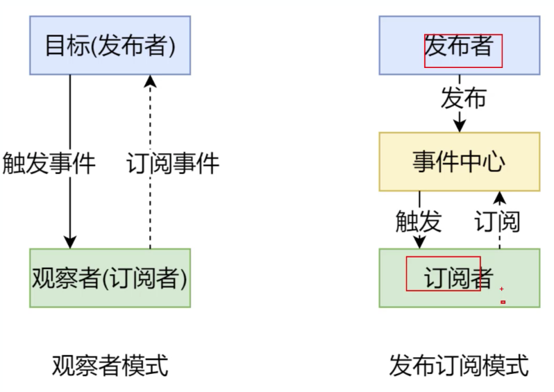
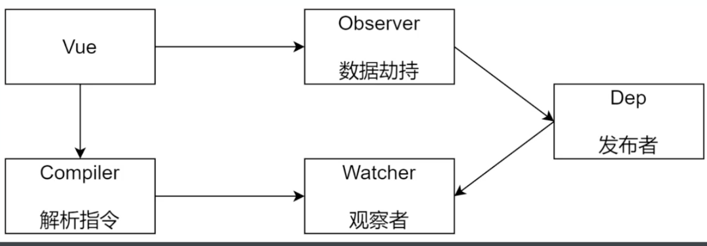

## 手写 Vue Route、手写响应式、虚拟 DOM 和 Diff 算法

### 任务二：Vue-Router 原理实现
#### 1、Vue Router 使用步骤
+ router/index.js
  + 1、注册路有插件
  ```js
  // Vue.use 是用来注册插件，他会调用传入对象的 install 方法，如果是函数就直接调用函数
  Vue.use(VueRouter);
  ```
  + 2、定义路由规则
  ```js
  const routes = [{
          path: "/",
          name: "Home",
          component: Home
      },
      {
          path: "/about",
          name: "About",
          // route level code-splitting
          // this generates a separate chunk (about.[hash].js) for this route
          // which is lazy-loaded when the route is visited.
          component: () =>
              import ( /* webpackChunkName: "about" */ "../views/About.vue")
      }
  ];
  ```
  + 3、创建 router 对象
  ```js
  const router = new VueRouter({
      routes
  });
  ```
+ main.js
  + 注册 route 对象:
  ```js
  new Vue({
    router,
    store,
    render: h => h(App)
  }).$mount("#app");
  ```
+ App.vue:
  + 创建路由组件的占位
  ```js
  <router-view />
  ```

#### 2、动态路由
+ 在 path 后加参数：
```js
// 配置动态路由参数
{
    path: "/about/:user",
    name: "About",
    // 开启 props 会把 URL 中的参数传递给组件
    // 在组件中通过 props 来接收 URL 参数
    props: true,
    // route level code-splitting
    // this generates a separate chunk (about.[hash].js) for this route
    // which is lazy-loaded when the route is visited.

    component: () =>
        import ( /* webpackChunkName: "about" */ "../views/About.vue") // 路由懒加载
}

// 获取动态路由参数
<div>
  <!-- 方式1：通过当前路由规则，获取数据 -->
  通过当前路由规则获取： {{$route.params.user}}
</div>
---
<div>
  <!-- 方式2：路由规则中开启 props 传参 -->
  通过开启 props 获取： {{user}}
</div>
<script>
export default {
  props: ['user']
}
</script>
```

#### 3、嵌套路由
+ 1、components/Layout.vue,设置 <router-view> 占位
```js
<template>
  <div>
    <div>header</div>
    <div>
      <router-view></router-view>
    </div>
    <div>footer</div>
  </div>
</template>
```
+ 2、router/index.js, routes 配置如下
```js
// 加载组件
import Layout from '@/components/Layout.vue'
import Index from '@/views/Index.vue'
import Login from '@/views/Login.vue'
// 路由规则
const routes = [
    // 嵌套路由
    {
        path: "/",

        component: Layout,
        children: [{
                name: 'index',
                path: '',
                component: Index
            },
            {
                path: "/about/:user",
                name: "About",
                // 开启 props 会把 URL 中的参数传递给组件
                // 在组件中通过 props 来接收 URL 参数
                props: true,
                // route level code-splitting
                // this generates a separate chunk (about.[hash].js) for this route
                // which is lazy-loaded when the route is visited.
                component: () =>
                    import ( /* webpackChunkName: "about" */ "../views/About.vue")
            }
        ]
    },
    {
        path: "/about/:user",
        name: "About",
        // 开启 props 会把 URL 中的参数传递给组件
        // 在组件中通过 props 来接收 URL 参数
        props: true,
        // route level code-splitting
        // this generates a separate chunk (about.[hash].js) for this route
        // which is lazy-loaded when the route is visited.
        component: () =>
            import ( /* webpackChunkName: "about" */ "../views/About.vue")
    }
];
```
#### 4、编程式导航
```js
<button @click="push"> push </button>
<script>
  export default {
    methods: {
      push () {
        this.$router.push({name: 'About', params: {user: 1}})
        // this.$router.push('/')
        // this.$router.push({name: 'Index'})
      }
    }
  }
</script>
```
#### 5、Hash 模式和 History 模式
+ 表现形式的区别
  + hash 模式
    + https://music.163.com/#/playlist?id=3102961863
  + history 模式
    + https://music.163.com/playlist/3102961863
+ 原理的区别
  + hash 模式是基于锚点，以及 onhashchange 事件
  + history 模式是基于 html5 中的 history Api
    + history.pushState()   IE10 以后才支持
    + history.replaceState()
+ 设置 history 模式
```js
const router = new VueRouter({
  mode: 'history',
  routes
})
```
#### 6、vue-router 实现原理
+ Hash 模式
  + URL 中 # 后面的内容作为路劲地址
  + 监听 hashchange 事件
  + 根据当前路由地址找到对应组件重新渲染
+ History 模式
  + 通过 history.pushState() 方法改变地址栏
  + 监听 popstate 事件（ 注意：pushstate 和 replaceState 方法时不会触发）
  + 根据当前路由地址找到对应组件重新渲染

#### 7、VueRouter实现
+ 代码见 ./code/router


### 任务三、模拟 Vue.js 响应式原理
#### 1、准备工作
+ 1)、数据驱动：
  + 数据响应式：
    + 数据模型仅仅是普通的 javascript 对象，而当我们修改数据时，视图会进行更新，避免了繁琐的 DOM 操作，提高开发效率
  + 双向绑定：
    + 数据改变，视图改变；视图改变，数据也随之改变
    + 我们可以使用 v-model 在表单元素上创建双向数据绑定
  + 数据驱动是 vue 最独特的特性之一
    + 开发过程中仅需要关注数据本身，不需要关心数据是如何渲染视图
+ 2)、响应式的核心原理
  + vue2的代码实现见 ./code/defineProperty/vue2.html
  + vue3的代码实现见  ./code/defineProperty/vue3.html
+ 3)、发布订阅模式和观察者模式
  + 发布订阅模式
    + 我们假定，存在一个“信号中心”，某个任务执行完成，就向信号中心“发布”（publish）一个信号，其他任务可以向信号中心“订阅”（subscribe）这个信号，从而知道什么时候自己可以开始执行。这就叫做“发布/订阅模式”
    + 代码见 ./code/eventEmitter/eventEmitter.html
  + 观察者模式
    + 观察者（订阅者） -- Watcher
      + update():当事件发生时，具体要做的事情
    + 目标（发布者） -- Dep
      + subs 数组：存储所有的观察者
      + addSub()：添加观察者
      + notify()：当事件发生，调用所有观察者的 update() 方法
    + 没有事件中心
    + + 代码见 ./code/eventEmitter/Watcher.html
+ 4)、总结：
  + 观察者模式是由具体目标调度，比如当事件触发，Dep 就会去调用观察者的方法，所以观察者模式的订阅者与发布者之间是存在依赖的
  + 发布订阅模式由统一调度中心调用，因此发布者与订阅者不需要知道对方的存在

#### 2、自己动手实现个 minVue
+ 1）、整体分析
  + Vue 基本结构
  + 打印 Vue 实例观察
  + 整体结构
  + 
+ Vue 
  + 把 data 中的成员注入到 Vue 实例，并且把 data 中的成员转成 getter/setter
  + 功能：
    + 负责接收初始化的参数（选项）
    + 负责把 data 中的属性注入到 Vue 实例，转换成 getter/setter，见代码 ./code/minVue/vue.js
    + 负责调用 observer 监听 data 中所有属性的变化  见代码 ./code/minVue/observer.js
      + Observer
        + 能够对数据对象的所有属性进行监听，如有变动可拿到最新值并通知 Dep
        + 功能：
          + 负责把 data 选项中的属性转换成响应式数据
          + data 中的某个属性也是对象，把该属性转换成响应式数据
          + 数据变化发送通知
    + 负责调用 compiler 解析指令/插值表达式
      + 功能
        + 负责编译模板，解析指令插值表达式
        + 负责页面的首次渲染
        + 当数据变化后重新渲染视图
    + Dep类
      + 功能
        + 收集依赖，添加观察者（watcher)
        + 通知所有观察者
    + Watcher类
      + 当数据变化触发依赖，dep 通知所有的 watcher 实例更新视图
      + 自身实例化的时候往 dep 对象中添加自己


