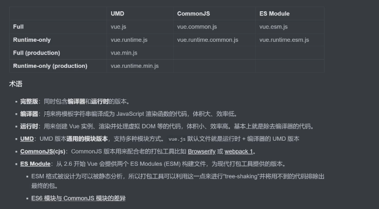
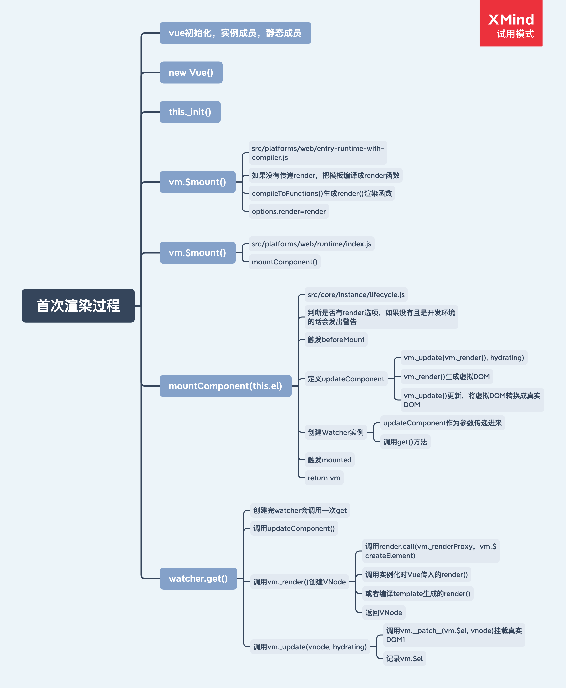
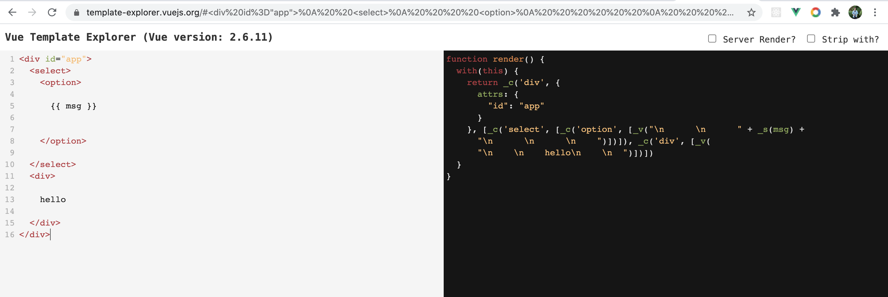
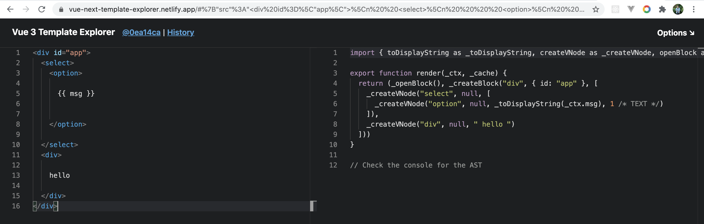
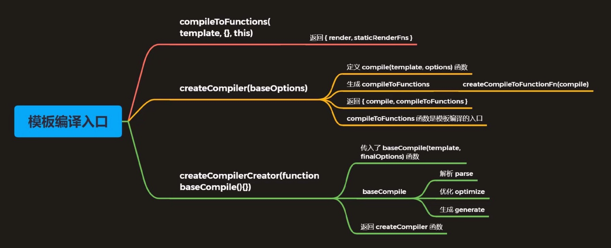
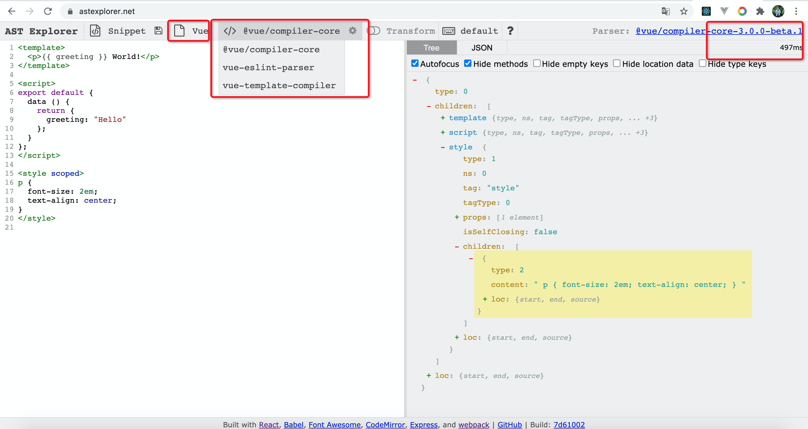
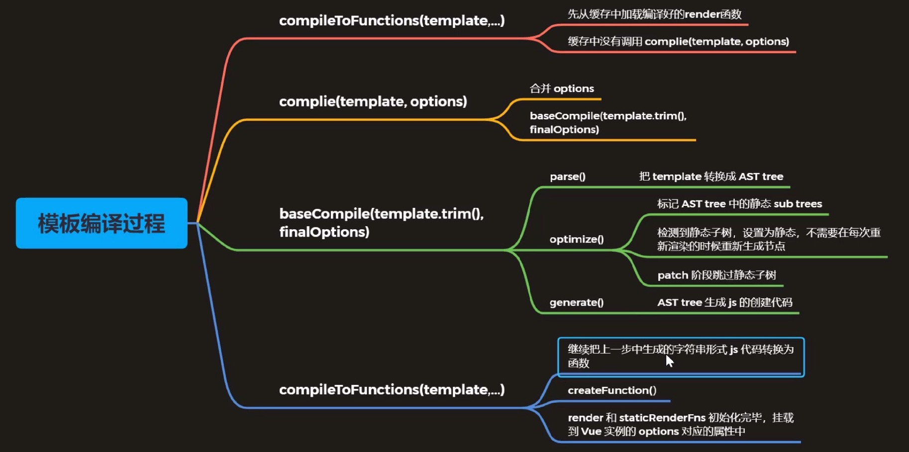

## Vue.js 源码分析（响应式、虚拟 DOM、模板编译和组件化）项目见：<https://github.com/smallSix6/fed-e-task-liuhuijun/tree/master/fed-e-task-03-02>

### 任务一：Vue.js 源码剖析-响应式原理
#### 1、Vue 的不同构建版本
+ 
+ Full：包含编译器和运行时的构建。
+ 编译器：负责将模板字符串编译为JavaScript渲染函数的代码。
+ 运行时：负责创建Vue实例，渲染和修补虚拟DOM等的代码。基本上，所有内容都减去编译器。
+ UMD：UMD构建可通过script标签直接在浏览器中使用。来自 <https://unpkg.com/vue> 的 Unpkg CDN的默认文件是Runtime + Compiler UMD构建（vue.js）。
+ CommonJS的：CommonJS的建立旨在用于与旧捆扎机像 browserify或的WebPack 1。这些捆绑器（pkg.main）的默认文件是“仅运行时” CommonJS构建（vue.runtime.common.js）。
+ ES模块：ES模块版本旨在与现代捆绑器（例如 webpack 2或汇总）一起使用。这些捆绑程序（pkg.module）的默认文件是“仅运行时ES模块”构建（vue.runtime.esm.js）。

#### 2、入口文件
+ 寻找入口文件
  + 查看 dist/vue.js 的构建过程
+ 执行构建
```js
"dev": "rollup -w -c scripts/config.js --sourcemap --environment TARGET:web-full-dev",
```
  + script/config.js 的执行过程
    + 作用：生成 rollup 构建的配置文件
    + 使用环境变量 TARGET=web-full-de
    ```js
    // 判断环境变量是否有 TARGET
    // 如果有的话，使用 gitConfig() 生成 rollup 配置文件
    if (process.env.TARGET) {
        module.exports = genConfig(process.env.TARGET)
    } else {
        exports.getBuild = genConfig
        exports.getAllBuilds = () => Object.keys(builds).map(genConfig)
    }
    ```
  + 最后生成 src/platforms/web/entry-runtime-with-compiler.js 文件
+ 通过查看源码解决下面问题
  + 观察以下代码，通过阅读源码，回答在页面上输出的结果
  ```js
  const vm = new Vue({
    el: '#app'
    template: '<h3> Hello Template </h3>,
    render (h) {
      return h('h4', 'Hello Render')
    }
  })
  ```
+ 阅读源码记录
  + el 不能是 body 或者 html 标签
  + 如果没有 render, 把 template 转换成 render 函数
  + 如果有 render 方法，直接调用 mount 挂载 DOM
```js
Vue.prototype.$mount = function(
    el ? : string | Element,
    // 非 ssr 情况下为 false, ssr 时候为 true
    hydrating ? : boolean
): Component {
    // 获取 el 对象
    el = el && query(el)

    /* istanbul ignore if */
    if (el === document.body || el === document.documentElement) {
        process.env.NODE_ENV !== 'production' && warn(
            `Do not mount Vue to <html> or <body> - mount to normal elements instead.`
        )
        return this
    }

    const options = this.$options
        // resolve template/el and convert to render function
    if (!options.render) {
       ...
    }
    // 调用 mount 方法，渲染 DOM
    return mount.call(this, el, hydrating)
}
```
+ 页面渲染流程的 Call Stack 为：
  + Vue
  + Vue._init
  + Vue.$mount

#### 3、Vue 初始化的过程
+ 四个导出 Vue 的模块
  + src/platforms/web/entry-runtime-with-compiler.js
    + web 平台相关的入口
    + 重写了平台相关的 $mount() 方法
    + 注册了 Vue.compile() 方法，传递一个 HTML 字符串返回 render 函数
  + src/platforms/web/runtime/index.js
    + web 平台相关
    + 注册和平台相关的全局指令：v-model、v-show
    + 注册和平台相关的全局组件：v-transition、v-transition-group
    + 全局方法：
      + __patch__:把虚拟 DOM 转换成真实 DOM
      + $mount: 挂载方法
  + src/core/index.js
    + 与平台无关
    + 设置了 vue 的静态方法， initGlobalAPI(Vue) 
+ src/core/instance/index.js
    + 与平台无关
    + 定义了构造函数，调用了 this._init(options) 方法
    + 给 Vue 中混入了常用的实例成员
    ```js
    // 此处不用 class 的原因是因为方便后续给 Vue 实例混入实例成员
    function Vue(options) {
        if (process.env.NODE_ENV !== 'production' &&
            !(this instanceof Vue)
        ) {
            warn('Vue is a constructor and should be called with the `new` keyword')
        }
        // 调用 _init() 方法
        this._init(options)
    }

    // 注册 vm 的 _init() 方法，初始化 vm
    initMixin(Vue)
        // 注册 vm 的 $data/$props/$set/$delete/$watch
    stateMixin(Vue)
        // 初始化事件相关方法
        // $on/$once/$off/$emit
    eventsMixin(Vue)

    // 初始化生命周期相关的混入方法
    // _update/$forceUpdate/$destroy
    lifecycleMixin(Vue)
        // 混入 render
        // $nextTick/_render
    renderMixin(Vue)

    export default Vue
    ```

#### 4、Vue 初始化——静态成员
+ src/core/global-api/index.js
  + 设置 Vue 的静态方法，initGlobalAPI(Vue)
   ```js
    export function initGlobalAPI(Vue: GlobalAPI) {
        // config
        const configDef = {}
        configDef.get = () => config
        if (process.env.NODE_ENV !== 'production') {
            configDef.set = () => {
                warn(
                    'Do not replace the Vue.config object, set individual fields instead.'
                )
            }
        }
        // 初始化 Vue.config 对象
        // 在 src/platforms/web/runtime/index.js 里设置了 config 属性
        Object.defineProperty(Vue, 'config', configDef)

        // exposed util methods.
        // NOTE: these are not considered part of the public API - avoid relying on
        // them unless you are aware of the risk.
        Vue.util = {
            warn,
            extend,
            mergeOptions,
            defineReactive
        }

        Vue.set = set
        Vue.delete = del
        Vue.nextTick = nextTick

        // 2.6 explicit observable API
        Vue.observable = < T > (obj: T): T => {
            observe(obj)
            return obj
        }

        Vue.options = Object.create(null)
        ASSET_TYPES.forEach(type => {
            Vue.options[type + 's'] = Object.create(null)
        })

        // this is used to identify the "base" constructor to extend all plain-object
        // components with in Weex's multi-instance scenarios.
        Vue.options._base = Vue

        extend(Vue.options.components, builtInComponents)
            // 注册 Vue.use(),用来注册插件
        initUse(Vue)
            // 注册 Vue.mixin() 实现混入    
        initMixin(Vue)
            // 注册 Vue.extend() 基于传入的 options 返回一个组件的构造函数
        initExtend(Vue)
            // 注册 Vue.directive()、Vue.component()、Vue.filter()
        initAssetRegisters(Vue)
    }
    ```
  + initUse(Vue)  注册 Vue.use(),用来注册插件
  ```js
  import { toArray } from '../util/index'
  export function initUse (Vue: GlobalAPI) {
    Vue.use = function (plugin: Function | Object) {
      const installedPlugins = (this._installedPlugins || (this._installedPlugins = []))
      if (installedPlugins.indexOf(plugin) > -1) {
        return this
      }

      // additional parameters
      // 把数组中的第一个元素（plugin）去除
      const args = toArray(arguments, 1)
      // 把 this(vue) 插入第一个元素的位置
      args.unshift(this)
      if (typeof plugin.install === 'function') {
        plugin.install.apply(plugin, args)
      } else if (typeof plugin === 'function') {
        plugin.apply(null, args)
      }
      installedPlugins.push(plugin)
      return this
    }
  }
  ```

#### 5、Vue 初始化——实例成员
+ src/core/instance/index.js
```js
// 此处不用 class 的原因是因为方便后续给 Vue 实例混入实例成员
function Vue(options) {
    if (process.env.NODE_ENV !== 'production' &&
        !(this instanceof Vue)
    ) {
        warn('Vue is a constructor and should be called with the `new` keyword')
    }
    // 调用 _init() 方法
    this._init(options)
}

// 注册 vm 的 _init() 方法，初始化 vm
initMixin(Vue)
    // 注册 vm 的 $data/$props/$set/$delete/$watch
stateMixin(Vue)
    // 初始化事件相关方法
    // $on/$once/$off/$emit
eventsMixin(Vue)

// 初始化生命周期相关的混入方法
// _update/$forceUpdate/$destroy
lifecycleMixin(Vue)
    // 混入 render
    // $nextTick/_render
renderMixin(Vue)

export default Vue
```

#### 6、Vue 初始化——实例成员——init
+ initMixin(Vue)   注册 vm 的 _init() 方法，初始化 vm
```js
export function initMixin(Vue: Class < Component > ) {
    // 给 Vue 实力增加 init() 方法
    // 合并 options 并且初始化操作
    Vue.prototype._init = function(options ? : Object) {
        const vm: Component = this
            // a uid
        vm._uid = uid++

            let startTag, endTag
                /* istanbul ignore if */
        if (process.env.NODE_ENV !== 'production' && config.performance && mark) {
            startTag = `vue-perf-start:${vm._uid}`
            endTag = `vue-perf-end:${vm._uid}`
            mark(startTag)
        }

        // a flag to avoid this being observed
        vm._isVue = true
            // merge options
        if (options && options._isComponent) {
            // optimize internal component instantiation
            // since dynamic options merging is pretty slow, and none of the
            // internal component options needs special treatment.
            initInternalComponent(vm, options)
        } else {
            vm.$options = mergeOptions(
                resolveConstructorOptions(vm.constructor),
                options || {},
                vm
            )
        }
        /* istanbul ignore else */
        if (process.env.NODE_ENV !== 'production') {
            initProxy(vm)
        } else {
            vm._renderProxy = vm
        }
        // expose real self
        vm._self = vm
            // vm 的生命周期相关变量初始化
            // $children/$parent/$root/$refs
        initLifecycle(vm)
            // vm 的事件监听初始化，父组件绑定在当前组件上的事件
        initEvents(vm)
            // vm 的编译 render 初始化
            // $slot/$scopedSlots/_c/$createElement/$attrs/$listenrs
        initRender(vm)
            // beforeCreate 生命钩子的回调
        callHook(vm, 'beforeCreate')
            // 把 inject 的成员注入到 vm 上
        initInjections(vm) // resolve injections before data/props
            // 初始化 vm 的 _props/methods/_data/computed/watch
        initState(vm)
            // 初始化 provide
        initProvide(vm) // resolve provide after data/props
            // created 生命钩子的回调
        callHook(vm, 'created')

        /* istanbul ignore if */
        if (process.env.NODE_ENV !== 'production' && config.performance && mark) {
            vm._name = formatComponentName(vm, false)
            mark(endTag)
            measure(`vue ${vm._name} init`, startTag, endTag)
        }

        if (vm.$options.el) {
            vm.$mount(vm.$options.el)
        }
    }
}
```
  + initState(vm)   初始化 vm 的 _props/methods/_data/computed/watch
  ```js
  export function initState (vm: Component) {
    vm._watchers = []
    const opts = vm.$options
    if (opts.props) initProps(vm, opts.props)
    if (opts.methods) initMethods(vm, opts.methods)
    if (opts.data) {
      initData(vm)
    } else {
      observe(vm._data = {}, true /* asRootData */)
    }
    if (opts.computed) initComputed(vm, opts.computed)
    if (opts.watch && opts.watch !== nativeWatch) {
      initWatch(vm, opts.watch)
    }
  }
  ```
#### 7、首次渲染过程——Vue.prototype._init
+ 首次渲染主要流程如下：
  + 1、初始化实例成员：
    + initMixin(Vue)
    + stateMixin(Vue)
    + eventsMixin(Vue)
    + lifecycleMixin(Vue)
    + renderMixin(Vue)
  + 2、初始化静态成员：
    + initGlobalAPI(Vue)
  + 3、调用 _init() 方法：this._init(options) 即 Vue.prototype._init
    + **Vue.prototype._init** 源码文件见 src/core/instance/init.js
    ```js
    export function initMixin(Vue: Class < Component > ) {
        // 给 Vue 实力增加 init() 方法
        // 合并 options 并且初始化操作
        Vue.prototype._init = function(options ? : Object) {
            ...
            // 如果是 Vue 实例不需要被 observe
            vm._isVue = true
                // merge options
            if (options && options._isComponent) {
                initInternalComponent(vm, options)
            } else {
                vm.$options = mergeOptions(
                    resolveConstructorOptions(vm.constructor),
                    options || {},
                    vm
                )
            }
            /* istanbul ignore else */
            if (process.env.NODE_ENV !== 'production') {
                initProxy(vm)
            } else {
                vm._renderProxy = vm
            }
            // expose real self
            vm._self = vm
                // vm 的生命周期相关变量初始化
                // $children/$parent/$root/$refs
            initLifecycle(vm)
                // vm 的事件监听初始化，父组件绑定在当前组件上的事件
            initEvents(vm)
                // vm 的编译 render 初始化
                // $slot/$scopedSlots/_c/$createElement/$attrs/$listenrs
            initRender(vm)
                // beforeCreate 生命钩子的回调
            callHook(vm, 'beforeCreate')
                // 把 inject 的成员注入到 vm 上
            initInjections(vm) // resolve injections before data/props
                // 初始化 vm 的 _props/methods/_data/computed/watch
            initState(vm)
                // 初始化 provide
            initProvide(vm) // resolve provide after data/props
                // created 生命钩子的回调
            callHook(vm, 'created')
            ...
            if (vm.$options.el) {
                // 调用 mount 方法（重点）
                vm.$mount(vm.$options.el)
            }
        }
    }
    ```
    + **vm.$mount** (重写 $mount 方法的主要作用就是 compiler template) 方法源码如下，文件见 src/platform/web/entry-runtime-with-compiler.js ：
    ```js
    const mount = Vue.prototype.$mount
    Vue.prototype.$mount = function(
        el ? : string | Element,
        // 非 ssr 情况下为 false, ssr 时候为 true
        hydrating ? : boolean
    ): Component {
        // 获取 el 对象
        el = el && query(el)
        ...
        const options = this.$options
            // resolve template/el and convert to render function
        if (!options.render) {
            let template = options.template
            if (template) {
                if (typeof template === 'string') {
                    if (template.charAt(0) === '#') {
                        template = idToTemplate(template)
                            /* istanbul ignore if */
                        if (process.env.NODE_ENV !== 'production' && !template) {
                            warn(
                                `Template element not found or is empty: ${options.template}`,
                                this
                            )
                        }
                    }
                } else if (template.nodeType) {
                    template = template.innerHTML
                } else {
                    if (process.env.NODE_ENV !== 'production') {
                        warn('invalid template option:' + template, this)
                    }
                    return this
                }
            } else if (el) {
                template = getOuterHTML(el)
            }
            if (template) {
                ...
                const { render, staticRenderFns } = compileToFunctions(template, {
                    outputSourceRange: process.env.NODE_ENV !== 'production',
                    shouldDecodeNewlines,
                    shouldDecodeNewlinesForHref,
                    delimiters: options.delimiters,
                    comments: options.comments
                }, this)
                options.render = render
                options.staticRenderFns = staticRenderFns
                ...
            }
        }
        // 调用 mount 方法，渲染 DOM
        return mount.call(this, el, hydrating)
    }
    ```
    + **Vue.prototype.$mount**(这个方法在 runtime-with-compiler 的时候会被重写) 方法源码如下，文件见 src/platforms/web/runtime/index.js：
    ```js
    Vue.prototype.$mount = function(
        el ? : string | Element,
        hydrating ? : boolean
    ): Component {
        el = el && inBrowser ? query(el) : undefined
        return mountComponent(this, el, hydrating)
    }
    ```
    + **mountComponent** 方法源码如下，文件见 src/core/instance/lifecycle.js：
    ```js
    export function mountComponent (
      vm: Component,
      el: ?Element,
      hydrating?: boolean
    ): Component {
      vm.$el = el
      if (!vm.$options.render) {
        vm.$options.render = createEmptyVNode
      }
      callHook(vm, 'beforeMount')

      let updateComponent
      /* istanbul ignore if */
      if (process.env.NODE_ENV !== 'production' && config.performance && mark) {
        updateComponent = () => {
          const name = vm._name
          const id = vm._uid
          const startTag = `vue-perf-start:${id}`
          const endTag = `vue-perf-end:${id}`

          mark(startTag)
          const vnode = vm._render()
          mark(endTag)
          measure(`vue ${name} render`, startTag, endTag)

          mark(startTag)
          vm._update(vnode, hydrating)
          mark(endTag)
          measure(`vue ${name} patch`, startTag, endTag)
        }
      } else {
        updateComponent = () => {
          vm._update(vm._render(), hydrating)
        }
      }
      new Watcher(vm, updateComponent, noop, {
        before () {
          if (vm._isMounted && !vm._isDestroyed) {
            callHook(vm, 'beforeUpdate')
          }
        }
      }, true /* isRenderWatcher */)
      hydrating = false
      if (vm.$vnode == null) {
        vm._isMounted = true
        callHook(vm, 'mounted')
      }
      return vm
    }
    ```

+ 首次渲染的流程图见：


#### 8、数据响应式原理——响应式处理入口
+ 通过查看源码解决下面问题
  + vm.msg = { count: 0 }, 重新给属性赋值，是否是响应式的？
  + vm.arr[0] = 4，给数组元素赋值，试图是否会更新
  + vm.arr.length = 0，修改数组的 length，试图是否会更新
  + vm.arr.push(4)，试图是否会更新
+ 响应式处理的入口
  + 整个响应式处理的过程是比较复杂的，下面我们先从入口开始看起
    + src/core/instance/init.js
      + initState(vm)  vm状态的初始化
      + 初始化了 _data、_props、methods 等
    + **initData(vm)**: src/core/instance/state.js
    ```js
    // 数据的初始化
    if (opts.data) {
      initData(vm)
    } else {
      observe(vm._data={}, true  /*  asRootData */)
    }
    ```
    + **observe(value: any, asRootData: ? boolean)**: src/core/observer/index.js
    ```js
    export function observe(value: any, asRootData: ? boolean): Observer | void {
        // 判断 value 是否是对象
        if (!isObject(value) || value instanceof VNode) {
            return
        }
        let ob: Observer | void
            // 如果 value 有 __ob__(observer 对象) 属性  结束
        if (hasOwn(value, '__ob__') && value.__ob__ instanceof Observer) {
            ob = value.__ob__
        } else if (
            shouldObserve &&
            !isServerRendering() &&
            (Array.isArray(value) || isPlainObject(value)) &&
            Object.isExtensible(value) &&
            !value._isVue
        ) {
            // 创建一个 Observer 对象
            ob = new Observer(value)
        }
        if (asRootData && ob) {
            ob.vmCount++
        }
        return ob
    }
    ```
    + **class Observer**:  src/core/observer/index.js
    ```js
    export class Observer {
        // 观测对象
        value: any;
        // 依赖对象
        dep: Dep;
        // 实例计数器
        vmCount: number; // number of vms that have this object as root $data
        constructor(value: any) {
            this.value = value
            this.dep = new Dep()
                // 初始化实例的 vmCount 为0
            this.vmCount = 0
                // 将实例挂载到观察对象的 __ob__ 属性
            def(value, '__ob__', this)
                // 数组的响应式处理
            if (Array.isArray(value)) {
                if (hasProto) {
                    protoAugment(value, arrayMethods)
                } else {
                    copyAugment(value, arrayMethods, arrayKeys)
                }
                // 为数组中的每一个对象创建一个 observer 实例
                this.observeArray(value)
            } else {
                // 遍历对象中的每一个属性，转换成 setter/getter
                this.walk(value)
            }
        }
        /**
        * Walk through all properties and convert them into
        * getter/setters. This method should only be called when
        * value type is Object.
        */
        walk(obj: Object) {
            const keys = Object.keys(obj)
            for (let i = 0; i < keys.length; i++) {
                defineReactive(obj, keys[i])
            }
        }

        /**
        * Observe a list of Array items.
        */
        observeArray(items: Array < any > ) {
            for (let i = 0, l = items.length; i < l; i++) {
                observe(items[i])
            }
        }
    }
    ```
    + **defineReactive** (为一个对象定义一个响应式的属性): src/core/observer/index.js
    ```js
    export function defineReactive(
        obj: Object,
        key: string,
        val: any,
        customSetter ? : ? Function,
        shallow ? : boolean
    ) {
        // 创建依赖对象实例
        const dep = new Dep()
            // 获取 obj 的属性描述符对象
        const property = Object.getOwnPropertyDescriptor(obj, key)
        if (property && property.configurable === false) {
            return
        }
        // 提供预定义的存取器函数
        // cater for pre-defined getter/setters
        const getter = property && property.get
        const setter = property && property.set
        if ((!getter || setter) && arguments.length === 2) {
            val = obj[key]
        }
        // 判断是否递归观察子对象，并将子对象属性都转换成 getter/setter，返回子观察对象
        let childOb = !shallow && observe(val)
        Object.defineProperty(obj, key, {
            enumerable: true,
            configurable: true,
            get: function reactiveGetter() {
                // 如果预定义的 getter 存在则 value 等于 getter 调用的返回值
                // 否则直接赋予属性值
                const value = getter ? getter.call(obj) : val
                    // 如果存在当前依赖目标，即 watcher 对象，则建立依赖
                if (Dep.target) {
                    dep.depend()
                        // 如果子观察目标存在，建立子对象的依赖关系
                    if (childOb) {
                        childOb.dep.depend()
                            // 如果属性是数组，则特殊处理收集数组对象依赖
                        if (Array.isArray(value)) {
                            dependArray(value)
                        }
                    }
                }
                // 返回属性值
                return value
            },
            set: function reactiveSetter(newVal) {
                // 如果预定义的 getter 存在则 value 等于 getter 调用的返回值
                // 否则直接赋予属性值
                const value = getter ? getter.call(obj) : val
                    // 如果新值等于旧值或者新值旧值为 NaN 则不执行
                    /* eslint-disable no-self-compare */
                if (newVal === value || (newVal !== newVal && value !== value)) {
                    return
                }
                /* eslint-enable no-self-compare */
                if (process.env.NODE_ENV !== 'production' && customSetter) {
                    customSetter()
                }
                // 如果没有 setter 直接返回
                // #7981: for accessor properties without setter
                if (getter && !setter) return
                    // 如果预定义 setter 存在则调用，否则直接更新新值
                if (setter) {
                    setter.call(obj, newVal)
                } else {
                    val = newVal
                }
                // 如果新值是对象，观察子对象并返回子对象的 observer 对象
                childOb = !shallow && observe(newVal)
                    // 派发更新(发布更改通知)
                dep.notify()
            }
        })
    }
    ```
+ 数据响应式原理——依赖收集
  + **defineReactive**：入口在 src/core/observer/index.js/defineReactive 函数里
  ```js
  // 创建依赖对象实例
  const dep = new Dep()
  if (Dep.target) {
    dep.depend()
        // 如果子观察目标存在，建立子对象的依赖关系
    if (childOb) {
        childOb.dep.depend()
            // 如果属性是数组，则特殊处理收集数组对象依赖
        if (Array.isArray(value)) {
            dependArray(value)
        }
    }
  }
  ```
  + **class Dep**(创建依赖对象实例)：文件在 src/core/observer/dep.js
  ```js
  export default class Dep {
      // 静态属性，watcher 对象
      static target: ? Watcher;
      // dep 实例 Id
      id: number;
      // dep 实例对应的 watcher 对象/订阅者数组
      subs: Array < Watcher > ;

      constructor() {
              this.id = uid++
                  this.subs = []
          }
          // 添加新的订阅者 watcher 对象
      addSub(sub: Watcher) {
              this.subs.push(sub)
          }
          // 移除订阅者
      removeSub(sub: Watcher) {
              remove(this.subs, sub)
          }
          // 将观察对象和 watcher 建立依赖
      depend() {
              if (Dep.target) {
                  // 如果 target 存在，把 dep 对象添加到 watcher 的依赖中
                  Dep.target.addDep(this)
              }
          }
          // 发布通知
      notify() {
          // stabilize the subscriber list first
          const subs = this.subs.slice()
          if (process.env.NODE_ENV !== 'production' && !config.async) {
              // subs aren't sorted in scheduler if not running async
              // we need to sort them now to make sure they fire in correct
              // order
              subs.sort((a, b) => a.id - b.id)
          }
          for (let i = 0, l = subs.length; i < l; i++) {
              subs[i].update()
          }
      }
  }
  ```
  + Dep.target 的 target 的添加逻辑在组件 mount 阶段时 mountComponent 函数里会添加 new Watcher() ,Watcher 类里的 constructor 里会调用 get 方法中的 pushTarget(this) 
    + **class Watcher**：src/core/observer/watcher.js
    ```js
    export default class Watcher {
      vm: Component;
      expression: string;
      cb: Function;
      id: number;
      deep: boolean;
      user: boolean;
      lazy: boolean;
      sync: boolean;
      dirty: boolean;
      active: boolean;
      deps: Array<Dep>;
      newDeps: Array<Dep>;
      depIds: SimpleSet;
      newDepIds: SimpleSet;
      before: ?Function;
      getter: Function;
      value: any;

      constructor (
        vm: Component,
        expOrFn: string | Function,
        cb: Function,
        options?: ?Object,
        isRenderWatcher?: boolean
      ) {
        this.vm = vm
        if (isRenderWatcher) {
          vm._watcher = this
        }
        vm._watchers.push(this)
        // options
        if (options) {
          this.deep = !!options.deep
          this.user = !!options.user
          this.lazy = !!options.lazy
          this.sync = !!options.sync
          this.before = options.before
        } else {
          this.deep = this.user = this.lazy = this.sync = false
        }
        this.cb = cb
        this.id = ++uid // uid for batching
        this.active = true
        this.dirty = this.lazy // for lazy watchers
        this.deps = []
        this.newDeps = []
        this.depIds = new Set()
        this.newDepIds = new Set()
        this.expression = process.env.NODE_ENV !== 'production'
          ? expOrFn.toString()
          : ''
        // parse expression for getter
        if (typeof expOrFn === 'function') {
          this.getter = expOrFn
        } else {
          this.getter = parsePath(expOrFn)
          if (!this.getter) {
            this.getter = noop
            process.env.NODE_ENV !== 'production' && warn(
              `Failed watching path: "${expOrFn}" ` +
              'Watcher only accepts simple dot-delimited paths. ' +
              'For full control, use a function instead.',
              vm
            )
          }
        }
        this.value = this.lazy
          ? undefined
          : this.get()
      }

      /**
      * Evaluate the getter, and re-collect dependencies.
      */
      get () {
        pushTarget(this)
        let value
        const vm = this.vm
        try {
          value = this.getter.call(vm, vm)
        } catch (e) {
          if (this.user) {
            handleError(e, vm, `getter for watcher "${this.expression}"`)
          } else {
            throw e
          }
        } finally {
          // "touch" every property so they are all tracked as
          // dependencies for deep watching
          if (this.deep) {
            traverse(value)
          }
          popTarget()
          this.cleanupDeps()
        }
        return value
      }

      /**
      * Add a dependency to this directive.
      */
      addDep (dep: Dep) {
        const id = dep.id
        if (!this.newDepIds.has(id)) {
          this.newDepIds.add(id)
          this.newDeps.push(dep)
          if (!this.depIds.has(id)) {
            dep.addSub(this)
          }
        }
      }

      /**
      * Clean up for dependency collection.
      */
      cleanupDeps () {
        let i = this.deps.length
        while (i--) {
          const dep = this.deps[i]
          if (!this.newDepIds.has(dep.id)) {
            dep.removeSub(this)
          }
        }
        let tmp = this.depIds
        this.depIds = this.newDepIds
        this.newDepIds = tmp
        this.newDepIds.clear()
        tmp = this.deps
        this.deps = this.newDeps
        this.newDeps = tmp
        this.newDeps.length = 0
      }

      /**
      * Subscriber interface.
      * Will be called when a dependency changes.
      */
      update () {
        /* istanbul ignore else */
        if (this.lazy) {
          this.dirty = true
        } else if (this.sync) {
          this.run()
        } else {
          queueWatcher(this)
        }
      }

      /**
      * Scheduler job interface.
      * Will be called by the scheduler.
      */
      run () {
        if (this.active) {
          const value = this.get()
          if (
            value !== this.value ||
            // Deep watchers and watchers on Object/Arrays should fire even
            // when the value is the same, because the value may
            // have mutated.
            isObject(value) ||
            this.deep
          ) {
            // set new value
            const oldValue = this.value
            this.value = value
            if (this.user) {
              try {
                this.cb.call(this.vm, value, oldValue)
              } catch (e) {
                handleError(e, this.vm, `callback for watcher "${this.expression}"`)
              }
            } else {
              this.cb.call(this.vm, value, oldValue)
            }
          }
        }
      }

      /**
      * Evaluate the value of the watcher.
      * This only gets called for lazy watchers.
      */
      evaluate () {
        this.value = this.get()
        this.dirty = false
      }

      /**
      * Depend on all deps collected by this watcher.
      */
      depend () {
        let i = this.deps.length
        while (i--) {
          this.deps[i].depend()
        }
      }

      /**
      * Remove self from all dependencies' subscriber list.
      */
      teardown () {
        if (this.active) {
          // remove self from vm's watcher list
          // this is a somewhat expensive operation so we skip it
          // if the vm is being destroyed.
          if (!this.vm._isBeingDestroyed) {
            remove(this.vm._watchers, this)
          }
          let i = this.deps.length
          while (i--) {
            this.deps[i].removeSub(this)
          }
          this.active = false
        }
      }
    }
    ```
    + **pushTarget**(将 watcher 挂载到 Dep 的 target 属性下)：src/core/observer/dep.js
    ```js
    // Dep.target 用来存放目前正在使用的 watcher
    // 全局唯一，并且只能有一个 watcher 被使用
    Dep.target = null
    const targetStack = []
    // 入栈并将当前 watcher 赋值给 Dep.target
    export function pushTarget(target: ? Watcher) {
        targetStack.push(target)
        Dep.target = target
    }
    ```
    + dep.depend(收集依赖的过程)：src/core/observer/index.js/defineReactive 函数里
    + Dep 类里的 **depend** 方法源码如下：src/core/observer/dep.js
    ```js
            // 将观察对象和 watcher 建立依赖
        depend() {
            // Dep.target = watcher
            if (Dep.target) {
                // 如果 target 存在，把 dep 对象添加到 watcher 的依赖中
                Dep.target.addDep(this)
            }
        }
    ```
    + Watcher 类里的 **addDep** 方法源码如下：src/core/observer/watcher.js
    ```js
    addDep (dep: Dep) {
      const id = dep.id
      if (!this.newDepIds.has(id)) {
        this.newDepIds.add(id)
        this.newDeps.push(dep)
        if (!this.depIds.has(id)) {
          dep.addSub(this)
        }
      }
    }
    ```
    + Dep 类里的 **addSub** 方法源码如下：src/core/observer/dep.js
    ```js
    // 添加新的订阅者 watcher 对象
    addSub(sub: Watcher) {
      this.subs.push(sub)
    }
    ```
+ 依赖收集的流程图见 ./依赖收集流程.xmind

#### 9、数据响应式原理——数组
+ 数组响应式的入口 **class Observer**：src/core/observer/index.js
```js
export class Observer {
    // 观测对象
    value: any;
    // 依赖对象
    dep: Dep;
    // 实例计数器
    vmCount: number; // number of vms that have this object as root $data

    constructor(value: any) {
        this.value = value
        this.dep = new Dep()
            // 初始化实例的 vmCount 为0
        this.vmCount = 0
            // 将实例挂载到观察对象的 __ob__ 属性
        def(value, '__ob__', this)
            // 数组的响应式处理
        if (Array.isArray(value)) {
            if (hasProto) {
                protoAugment(value, arrayMethods)
            } else {
                copyAugment(value, arrayMethods, arrayKeys)
            }
            // 为数组中的每一个对象创建一个 observer 实例
            this.observeArray(value)
        } else {
            // 遍历对象中的每一个属性，转换成 setter/getter
            this.walk(value)
        }
    }
  ...
}
```
+ Watcher类
  + Watcher 分为三种，Computed Watcher、用户 Watcher(侦听器)、渲染 Watcher
  + 渲染 Watcher 的创建时机
    + **mountComponent**：src/core/instance/lifecycle.js
    ```js
    export function mountComponent (
      vm: Component,
      el: ?Element,
      hydrating?: boolean
    ): Component {
      vm.$el = el
      ...
      let updateComponent
      /* istanbul ignore if */
      if (process.env.NODE_ENV !== 'production' && config.performance && mark) {
        ...
      } else {
        updateComponent = () => {
          vm._update(vm._render(), hydrating)
        }
      }
      new Watcher(vm, updateComponent, noop, {
        before () {
          if (vm._isMounted && !vm._isDestroyed) {
            callHook(vm, 'beforeUpdate')
          }
        }
      }, true /* isRenderWatcher */)
      ...
      return vm
    }
    ```
+ 响应式数组对象发生改变时的流程：
  + dep 的 **notify()**：src/core/observer/dep.js
  ```js
  // 发布通知
  notify() {
      // stabilize the subscriber list first
      const subs = this.subs.slice()
      if (process.env.NODE_ENV !== 'production' && !config.async) {
          // subs aren't sorted in scheduler if not running async
          // we need to sort them now to make sure they fire in correct
          // order
          // 根据 id 来排序 sub
          subs.sort((a, b) => a.id - b.id)
      }
      // 调用每个订阅者的 update 方法实现更新
      for (let i = 0, l = subs.length; i < l; i++) {
          subs[i].update()
      }
  }
  ```
  + **sub[i].update()**：c
  ```js
  update() {
      /* istanbul ignore else */
      if (this.lazy) {
          this.dirty = true
      } else if (this.sync) {
          this.run()
      } else {
          queueWatcher(this)
      }
  }
  ```
  + **queueWatcher(this)**：src/core/observer/scheduler.js
  ```js
  export function queueWatcher (watcher: Watcher) {
    const id = watcher.id
    if (has[id] == null) {
      has[id] = true
      if (!flushing) {
        queue.push(watcher)
      } else {
        // if already flushing, splice the watcher based on its id
        // if already past its id, it will be run next immediately.
        let i = queue.length - 1
        while (i > index && queue[i].id > watcher.id) {
          i--
        }
        queue.splice(i + 1, 0, watcher)
      }
      // queue the flush
      if (!waiting) {
        waiting = true

        if (process.env.NODE_ENV !== 'production' && !config.async) {
          flushSchedulerQueue()
          return
        }
        nextTick(flushSchedulerQueue)
      }
    }
  }
  ```
  + **nextTick(flushSchedulerQueue)**：src/core/observer/scheduler.js
  + **flushSchedulerQueue**：src/core/observer/scheduler.js
  ```js
  function flushSchedulerQueue () {
    flushing = true
    let watcher, id

    // Sort queue before flush.
    // This ensures that:
    // 1. Components are updated from parent to child. (because parent is always
    //    created before the child)
    // 2. A component's user watchers are run before its render watcher (because
    //    user watchers are created before the render watcher)
    // 3. If a component is destroyed during a parent component's watcher run,
    //    its watchers can be skipped.
    queue.sort((a, b) => a.id - b.id)

    // do not cache length because more watchers might be pushed
    // as we run existing watchers
    for (index = 0; index < queue.length; index++) {
      watcher = queue[index]
      if (watcher.before) {
        watcher.before()
      }
      id = watcher.id
      has[id] = null
      watcher.run()
      // in dev build, check and stop circular updates.
      if (process.env.NODE_ENV !== 'production' && has[id] != null) {
        circular[id] = (circular[id] || 0) + 1
        if (circular[id] > MAX_UPDATE_COUNT) {
          warn(
            'You may have an infinite update loop ' + (
              watcher.user
                ? `in watcher with expression "${watcher.expression}"`
                : `in a component render function.`
            ),
            watcher.vm
          )
          break
        }
      }
    }
  ```
  + **watcher.run()**：src/core/observer/watcher.js
  ```js
  run() {
      if (this.active) {
          const value = this.get()
          if (
              value !== this.value ||
              // Deep watchers and watchers on Object/Arrays should fire even
              // when the value is the same, because the value may
              // have mutated.
              isObject(value) ||
              this.deep
          ) {
              // set new value
              const oldValue = this.value
              this.value = value
              if (this.user) {
                  try {
                      this.cb.call(this.vm, value, oldValue)
                  } catch (e) {
                      handleError(e, this.vm, `callback for watcher "${this.expression}"`)
                  }
              } else {
                  this.cb.call(this.vm, value, oldValue)
              }
          }
      }
  }
  ```
  + this.get() 即 watcher 的 get 方法，触发收集依赖和更新

#### 10、set——源码
+ 定义位置
  + Vue.set()
    + src/core/global-api/index.js
    ```js
    Vue.set = set
    Vue.delete = del
    Vue.nextTick = nextTick
    ```
  + vm.$set()
    + src/core/instance/index.js
    ```js
        // 注册 vm 的 $data/$props/$set/$delete/$watch
    stateMixin(Vue)
    ```
    + src/core/instance/state.js
    ```js
    Vue.prototype.$set = set
    Vue.prototype.$delete = del
    ```
+ **set()**：src/core/observer/index.js
```js
export function set(target: Array < any > | Object, key: any, val: any): any {
    if (process.env.NODE_ENV !== 'production' &&
        (isUndef(target) || isPrimitive(target))
    ) {
        warn(`Cannot set reactive property on undefined, null, or primitive value: ${(target: any)}`)
    }
    // 判断 target 是否是对象，key 是否是合法的索引
    if (Array.isArray(target) && isValidArrayIndex(key)) {
        target.length = Math.max(target.length, key)
            // 通过 splice 对 key 位置的元素进行替换
            // splice 在 array.js 进行了响应式的处理
        target.splice(key, 1, val)
        return val
    }
    // 如果 key 在对象中已经存在直接赋值
    if (key in target && !(key in Object.prototype)) {
        target[key] = val
        return val
    }
    // 获取 target 中的 observer 对象
    const ob = (target: any).__ob__
        // 如果 target 是 vue 实例或者 $data 直接返回
    if (target._isVue || (ob && ob.vmCount)) {
        process.env.NODE_ENV !== 'production' && warn(
            'Avoid adding reactive properties to a Vue instance or its root $data ' +
            'at runtime - declare it upfront in the data option.'
        )
        return val
    }
    // 如果 ob 不存在，target 不是响应式对象，则不添加响应式的处理并直接赋值
    if (!ob) {
        target[key] = val
        return val
    }
    // 把 key 设置为响应式属性
    defineReactive(ob.value, key, val)
        // 发送通知
    ob.dep.notify()
    return val
}
```

#### 11、delete——源码
+ vm.$delete
  + 功能：删除对象的属性。如果对象是响应式的，确保删除能触发更新视图。这个方法主要用于避开 Vue 不能检测到属性被删除的限制，但是你应该很少会使用它。
    + 注意：目标对象不能是一个 Vue 实例或 Vue 实例的根数据对象。
  + 示例：
  ```js
  vm.$delete(vm.obj, 'msg')
  ```
+ 定义位置
  + Vue.delete： src/core/global-api/index.js
  + **delete()**：src/core/observer/index.js
  ```js
  export function del(target: Array < any > | Object, key: any) {
      if (process.env.NODE_ENV !== 'production' &&
          (isUndef(target) || isPrimitive(target))
      ) {
          warn(`Cannot delete reactive property on undefined, null, or primitive value: ${(target: any)}`)
      }
      // 判断是否是数组，以及 key 是否合法
      if (Array.isArray(target) && isValidArrayIndex(key)) {
          // 如果是数组通过 splice 删除
          // splice 做过响应式处理
          target.splice(key, 1)
          return
      }
      // 获取 target 的 ob 对象
      const ob = (target: any).__ob__
          // 如果 target 是 vue 实例或者 $data 直接返回
      if (target._isVue || (ob && ob.vmCount)) {
          process.env.NODE_ENV !== 'production' && warn(
              'Avoid deleting properties on a Vue instance or its root $data ' +
              '- just set it to null.'
          )
          return
      }
      // 如果 target 对象没有 key 属性直接返回
      if (!hasOwn(target, key)) {
          return
      }
      // 删除属性
      delete target[key]
      if (!ob) {
          return
      }
      // 发送通知
      ob.dep.notify()
  }
  ```
  
#### 12、watch——回顾
+ vm.$watch(expOrFn, callback, [options])
  + 功能：观察 Vue 实例变化的一个表达式或计算属性函数，回调函数得到的参数为新值和旧值。表达式只接受监督的键路径。对于更复杂的表达式，用一个函数取代
  + 参数：
    + expOrFn：要监视的 $data 中的属性，可以是表达式或函数
    + callback：数据变化后执行函数
      + 函数：回调函数
      + 对象：具有 handler 属性(字符串或者函数)，如果该属性为字符串则 methods 中相应的定义
    + options：可选的选项
      + deep：布尔类型，深度监听
      + immediate：布尔类型，是否立即执行一次回调函数

  + 示例：
  ```js
  var vm = new Vue({
    data: {
      a: 1,
      b: 2,
      c: 3,
      d: 4,
      e: {
        f: {
          g: 5
        }
      }
    },
    watch: {
      a: function (val, oldVal) {
        console.log('new: %s, old: %s', val, oldVal)
      },
      // 方法名
      b: 'someMethod',
      // 该回调会在任何被侦听的对象的 property 改变时被调用，不论其被嵌套多深
      c: {
        handler: function (val, oldVal) { /* ... */ },
        deep: true
      },
      // 该回调将会在侦听开始之后被立即调用
      d: {
        handler: 'someMethod',
        immediate: true
      },
      // 你可以传入回调数组，它们会被逐一调用
      e: [
        'handle1',
        function handle2 (val, oldVal) { /* ... */ },
        {
          handler: function handle3 (val, oldVal) { /* ... */ },
          /* ... */
        }
      ],
      // watch vm.e.f's value: {g: 5}
      'e.f': function (val, oldVal) { /* ... */ }
    }
  })
  vm.a = 2 // => new: 2, old: 1
  ```
  + 三种类型的 Watcher 对象
    + 没有静态方法，因为 $watch 方法中要使用 Vue 的实例
    + Watcher 分三种：计算属性 Watcher、用户 Watche（侦听器）、渲染 Watcher
      + 创建顺序：计算属性 Watcher、用户 Watcher(侦听器)、渲染 Watcher
    + vm.$watche()
      + src/core/instance/state.js

#### 13、watche——源码
+ **initState(vm: Component)**：src/core/instance/state.js
```js
export function initState (vm: Component) {
  vm._watchers = []
  const opts = vm.$options
  if (opts.props) initProps(vm, opts.props)
  if (opts.methods) initMethods(vm, opts.methods)
  if (opts.data) {
    initData(vm)
  } else {
    observe(vm._data = {}, true /* asRootData */)
  }
  if (opts.computed) initComputed(vm, opts.computed)
  if (opts.watch && opts.watch !== nativeWatch) {
    initWatch(vm, opts.watch)
  }
}
```
+ **initWatch (vm: Component, watch: Object**：src/core/instance/state.js
```js
function initWatch (vm: Component, watch: Object) {
  for (const key in watch) {
    const handler = watch[key]
    if (Array.isArray(handler)) {
      for (let i = 0; i < handler.length; i++) {
        createWatcher(vm, key, handler[i])
      }
    } else {
      createWatcher(vm, key, handler)
    }
  }
}
```
+ **createWatcher (vm: Component, expOrFn: string | Function, handler: any, options?: Object)**：src/core/instance/state.js
```js
function createWatcher (
  vm: Component,
  expOrFn: string | Function,
  handler: any,
  options?: Object
) {
  if (isPlainObject(handler)) {
    options = handler
    handler = handler.handler
  }
  if (typeof handler === 'string') {
    handler = vm[handler]
  }
  return vm.$watch(expOrFn, handler, options)
}
```
+ **vm.$watch(expOrFn, handler, options)**：src/core/instance/state.js
```js
Vue.prototype.$watch = function(
    expOrFn: string | Function,
    cb: any,
    options ? : Object
): Function {
    // 获取 Vue 实例 this
    const vm: Component = this
    if (isPlainObject(cb)) {
        // 判断如果 cb 是对象,执行 createWatcher 
        return createWatcher(vm, expOrFn, cb, options)
    }
    options = options || {}
        // 标记为用户 watcher
    options.user = true
        // 创建用户 watcher 对象
    const watcher = new Watcher(vm, expOrFn, cb, options)
        // 判断 immediate 如果为 true
    if (options.immediate) {
        // 立即执行一次 cb 回调，并且把当前值传入
        try {
            cb.call(vm, watcher.value)
        } catch (error) {
            handleError(error, vm, `callback for immediate watcher "${watcher.expression}"`)
        }
    }
    // 返回取消监听的方法
    return function unwatchFn() {
        watcher.teardown()
    }
}
```

#### 14、nextTick——源码
+ 异步更新队列——nextTick()
  + Vue 更新 DOM 是异步执行的，批量的
    + 在下次 DOM 更新循环结束之后执行延迟回调，在修改数据之后立即使用这个方法，获得更新后的 DOM
  + vm.$nextTick(function(){/* 操作DOM */}) / Vue.nextTick(function(){})
+ vm.$nextTick 代码演示
```js
<div id="app">
    <p ref='p1'>{{msg}}</p>
</div>

<script src="../../dist/vue.js"></script>
<script>
    const vm = new Vue({
            el: '#app',
            data: {
                msg: 'Hello nextTick',
                name: 'Vue.js',
                title: 'Title'
            },
            mounted() {
                this.msg = 'Hello World'
                this.name = 'Hello snambdom'
                this.title = 'Vue.js'
                this.$nextTick(() => {
                    console.log(this.$refs.p1.textContent)
                })
            }
        })
</script>
```
+ 源码
  + 定义位置
    + src/core/instance/render.js
    ```js
    Vue.prototype.$nextTick = function(fn: Function) {
        return nextTick(fn, this)
    }
    ```
  + 流程：
    + 手动调用 vm.$nextTick()
    + 在 Watcher 的 queueWatcher 中执行 nextTick()
    + src/core/util/next-tick.js
    ```js
    export function nextTick(cb? : Function, ctx? : Object) {
        let _resolve
            // 把 cb 加上异常处理存入 callbacks 数组中
        callbacks.push(() => {
            if (cb) {
                try {
                    // 调用 cb()
                    cb.call(ctx)
                } catch (e) {
                    handleError(e, ctx, 'nextTick')
                }
            } else if (_resolve) {
                _resolve(ctx)
            }
        })
        if (!pending) {
            pending = true
                // 调用
            timerFunc()
        }
        // $flow-disable-line
        if (!cb && typeof Promise !== 'undefined') {
            // 返回 promise 对象
            return new Promise(resolve => {
                _resolve = resolve
            })
        }
    }
    ```


### 任务二：vue.js源码剖析——虚拟 DOM
#### 1、虚拟 DOM 概念回顾
+ 什么是虚拟 DOM
  + 虚拟 DOM(Virtual DOM) 是使用 JavaScript 对象描述真实 DOM
  + Vue.js 中的虚拟 DOM 借鉴 Snabbdom, 并添加了 Vue.js 的特性。
    + 例如：指令和组件机制
+ 为什么要使用虚拟 DOM
  + 避免直接操作 DOM，提高开发效率
  + 作为一个中间层可以跨平台
  + 虚拟 DOM 不一定可以提高性能
    + 首次渲染的时候会增加开销
    + 复杂视图情况下提升渲染性能

#### 2、代码示例
```js
<div id="app">
</div>

<script src="../../dist/vue.js"></script>
<script>
    const vm = new Vue({
        el: '#app',
        render(h) {
            // h(tag, data, children)
            // return h('h1', this.msg)
            // return h('h1', { domProps: {innerHTML: this.msg} })
            // return h('h1', {attrs: {id:'title'}}, this.msg)
            const vnode = h(
                'h1', {
                    attrs: {
                        id: 'title'
                    }
                },
                this.msg
            )
            console.log(vnode)
            return vnode
        },
        data: {
            msg: 'Hello Vue'
        }
    })
</script>
```
+ h 函数
  + vm.$createElement(tag, data, children, normalizeChildren)
    + tag: 标签名称或者组件对象
    + data: 描述 tag, 可以设置 DOM 的属性或者标签的属性
    + children: tag 中的文本内容或者子节点
+ VNode
  + VNode 的核心属性
    + tag
    + data
    + children
    + text
    + elm
    + key

#### 3、VNode 的创建过程
+ 
+ xmind文件见: ./VNode创建过程.xmind

#### 4、vm._update(vm._render(), hydrating) : src/core/instance/lifecycle.js
```js
  // _update 方法的作用是把 VNode 渲染成真实的 DOM
    // 首次渲染会调用，数据更新会调用
    Vue.prototype._update = function(vnode: VNode, hydrating ? : boolean) {
        const vm: Component = this
        const prevEl = vm.$el
        const prevVnode = vm._vnode
        const restoreActiveInstance = setActiveInstance(vm)
        vm._vnode = vnode
            // Vue.prototype.__patch__ is injected in entry points
            // based on the rendering backend used.
        if (!prevVnode) {
            // initial render
            vm.$el = vm.__patch__(vm.$el, vnode, hydrating, false /* removeOnly */ )
        } else {
            // updates
            vm.$el = vm.__patch__(prevVnode, vnode)
        }
        restoreActiveInstance()
            // update __vue__ reference
        if (prevEl) {
            prevEl.__vue__ = null
        }
        if (vm.$el) {
            vm.$el.__vue__ = vm
        }
        // if parent is an HOC, update its $el as well
        if (vm.$vnode && vm.$parent && vm.$vnode === vm.$parent._vnode) {
            vm.$parent.$el = vm.$el
        }
        // updated hook is called by the scheduler to ensure that children are
        // updated in a parent's updated hook.
    }
```

#### 5、patch 函数的初始化
+ Vue.js 中 patch 的初始化
  + 位置：src/platforms/web/runtime/index.js
  ```js
  import {patch} from './patch'
  Vue.prototype.__patch__ = inBrowser ? patch : noop
  ```
+ **patch** 函数的位置：src/platforms/web/runtime/patch.js
```js
import * as nodeOps from 'web/runtime/node-ops'
import { createPatchFunction } from 'core/vdom/patch'
import baseModules from 'core/vdom/modules/index'
import platformModules from 'web/runtime/modules/index'

// the directive module should be applied last, after all
// built-in modules have been applied.
const modules = platformModules.concat(baseModules)

export const patch: Function = createPatchFunction({ nodeOps, modules })
```
  + **nodeOps** ：src/platforms/web/runtime/node-ops
  ```js
  import { namespaceMap } from 'web/util/index'

  export function createElement (tagName: string, vnode: VNode): Element {
    const elm = document.createElement(tagName)
    if (tagName !== 'select') {
      return elm
    }
    // false or null will remove the attribute but undefined will not
    if (vnode.data && vnode.data.attrs && vnode.data.attrs.multiple !== undefined) {
      elm.setAttribute('multiple', 'multiple')
    }
    return elm
  }

  export function createElementNS (namespace: string, tagName: string): Element {
    return document.createElementNS(namespaceMap[namespace], tagName)
  }

  export function createTextNode (text: string): Text {
    return document.createTextNode(text)
  }

  export function createComment (text: string): Comment {
    return document.createComment(text)
  }

  export function insertBefore (parentNode: Node, newNode: Node, referenceNode: Node) {
    parentNode.insertBefore(newNode, referenceNode)
  }

  export function removeChild (node: Node, child: Node) {
    node.removeChild(child)
  }

  export function appendChild (node: Node, child: Node) {
    node.appendChild(child)
  }

  export function parentNode (node: Node): ?Node {
    return node.parentNode
  }

  export function nextSibling (node: Node): ?Node {
    return node.nextSibling
  }

  export function tagName (node: Element): string {
    return node.tagName
  }

  export function setTextContent (node: Node, text: string) {
    node.textContent = text
  }

  export function setStyleScope (node: Element, scopeId: string) {
    node.setAttribute(scopeId, '')
  }
  ```
  + **modules** ：const modules = platformModules.concat(baseModules)
+ **createPatchFunction({ nodeOps, modules })**：src/core/vdom/patch.js
  + return function patch (oldVnode, vnode, hydrating, removeOnly)
+ 流程图：
  + 
+ VNode 渲染为真实 DOM 过程详见：./note/VNode渲染为真实DOM.xmind


### 任务三： Vue模板编译

#### 一、模板编译介绍

##### 1. 模板编译简介

+ 模板编译的主要目的是将模板（template）转换为渲染函数（render）

```html
<div>
  <h1 @click="handler">
    title
  </h1>
  <p>
		some content    
  </p>
</div>
```

渲染函数:

```js
render (h) {
  return h('div', [
    h('h1', { on: { click: this.handler } }, 'title'),
    h('p', 'some content')
  ])
}
```

#### 2. 模板编译的作用

+ Vue2.0使用VNode描述视图以及各种交互，用户自己编写VNode比较复杂
+ 用户只需要编写类似HTML的代码  -  Vue.js模板，通过编译器将模板转换为返回VNode的render函数
+ .vue文件会被webpack在构建的过程中转换成render函数

### 二、体验模板编译的结果

#### 1. 编译生成的函数的位置

+ `_c()`
  + `src/core/instance/render.js`
+ `_m()/_v()/_s()`
  + `src/core/instance/render-helpers/index.js`

#### 2. 模板编译的结果

```js
(function anonymous() {
  with (this) {
    return _c(
    	"div",
      { attrs: { id: "app" } },
      [
        _m(0), // 静态标签
        _v(" "), // 节点之间的空白字符
        _c("p", [_v(_s(msg))]), // _s是转换成字符串
        _v(" "),
        _c("comp", { on: {myclick: handler } }), // 自定义模板
      ],
      1 // 1表示如果是二维数组，会进行拍平
    )
  }
})
```

#### 3. Vue Template Explorer

这是一个网页工具，是将HTML模板转换为render函数，

Vue2网址是：https://template-explorer.vuejs.org/



Vu3网址是：https://vue-next-template-explorer.netlify.app/




我们可以看到Vue对render函数做了优化，此外Vue2中的模板中尽量不要出现多余的空白，因为都会被转换到render函数中，Vue3的模板中的空白则不影响render函数

### 三、模板编译的入口



### 四、模板编译的过程

#### 1. 模板编译入口

位置：src/compiler/create-compiler.js

createCompilerCreator函数返回了compile对象和compileToFunctions函数。

模板编译的入口函数 compileToFunctions() 中的 generate 函数的作用是把优化后的 AST 转换成代码

模板和插值表达式在编译的过程中都会被转换成对应的代码形式，不会出现在 render 函数中

#### 2. 模板编译过程 - baseCompile - AST

位置：src/compiler/index.js

在createCompilerCreator函数中，首先用parse函数把模板转换成ast抽象语法树，然后使用optimize函数优化抽象语法树，再用generate函数把抽象语法书生成字符串形式的js代码

```js
export const createCompiler = createCompilerCreator(function baseCompile (
  template: string,
  options: CompilerOptions
): CompiledResult {
  // 把模板转换成ast抽象语法树
  // 抽象语法树，用来以树形的方式描述代码结构
  const ast = parse(template.trim(), options)
  if (options.optimize !== false) {
    // 优化抽象语法树
    optimize(ast, options)
  }
  // 把抽象语法书生成字符串形式的js代码
  const code = generate(ast, options)
  return {
    ast,
    // 渲染函数
    render: code.render,
    // 静态渲染函数
    staticRenderFns: code.staticRenderFns
  }
})
```

#### 3. 为什么要使用抽象语法树

+ 模板字符串转换成AST后，可以通过AST对模板做优化处理
+ 标记模板中的静态内容，在patch的时候直接掉过静态内容
+ 在patch的过程中静态内容不需要对比和重新渲染

#### 4. AST在线生成网站

AST 在线生成网址：https://astexplorer.net/



#### 5. 模板编译过程 - baseCompile - optimize

位置：src/compiler/optimizer.js

优化处理，跳过静态子树。staticRoot是静态根节点。指节点中只包含纯文本的节点，是静态节点，但不是静态根节点，因为此时优化的成本大于收益，Vue认为这种优化会带来负面的影响

静态根节点不会被重新渲染，patch 的过程中会跳过静态根节点。

#### 6. 模板编译过程 - baseCompile - generate

generate() 函数返回的是字符串形式的代码，还需要 toFunctions() 转换成函数的形式


#### 7. 模板编译过程 - 总结



### 五、组件化回顾

+ 一个Vue组件就是一个用于预定义选项的一个Vue实例
+ 一个组件可以组成页面上的一个功能完备的区域，组件可以包含脚本、样式、模板

### 六、组件注册

#### 1. 组件注册方式

+ 全局组件
+ 局部组件

#### 2. Vue.extend

根据传入的选项创建组件的构造函数，组件的构造函数继承自Vue的构造函数。

### 七、组件的创建过程

#### 1. 回购首次渲染过程

+ Vue构造函数
+ this._init()
+ this.$mount()
+ mountComponent()
+ new Watcher() 渲染Watcher
+ updateComponent()
+ vm.render() -> createElement()
+ vm._update()

#### 2. 组件的patch过程

先创建父组件，再创建子组件。

先挂载子组件，再挂载父组件。

在 createElement() 函数中调用 createComponent() 创建的是组件的 VNode。组件对象是在组件的 init 钩子函数中创建的，然后在  patch() --> createElm() --> createComponent() 中挂载组件

全局组件之所以可以在任意组件中使用是因为 Vue 构造函数的选项被合并到了 VueComponent 组件构造函数的选项中。

局部组件的使用范围被限制在当前组件内是因为，在创建当前组件的过程中传入的局部组件选项，其它位置无法访问

