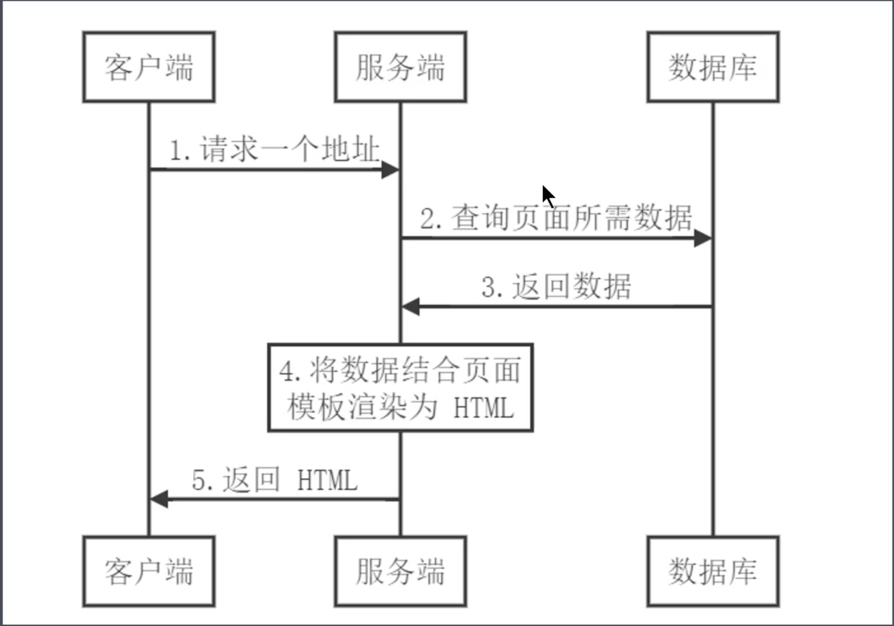
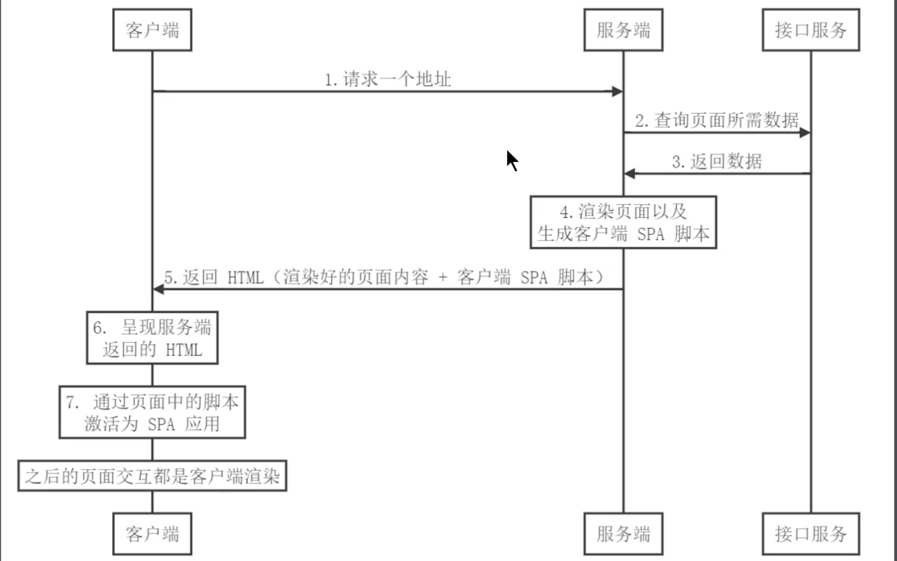
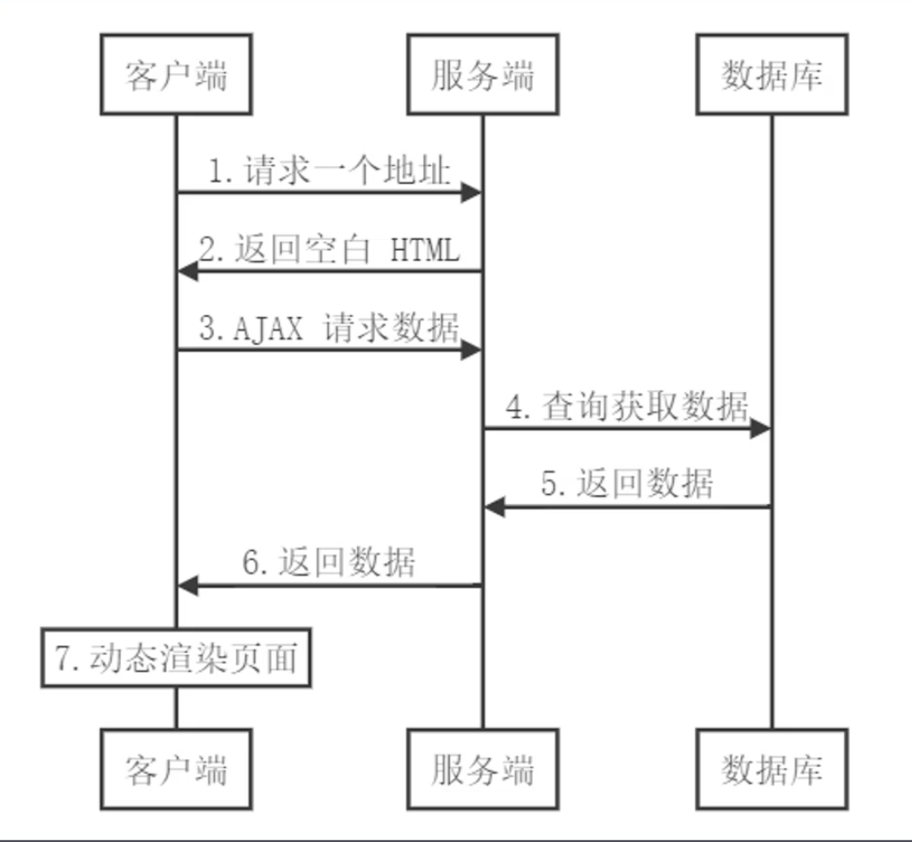
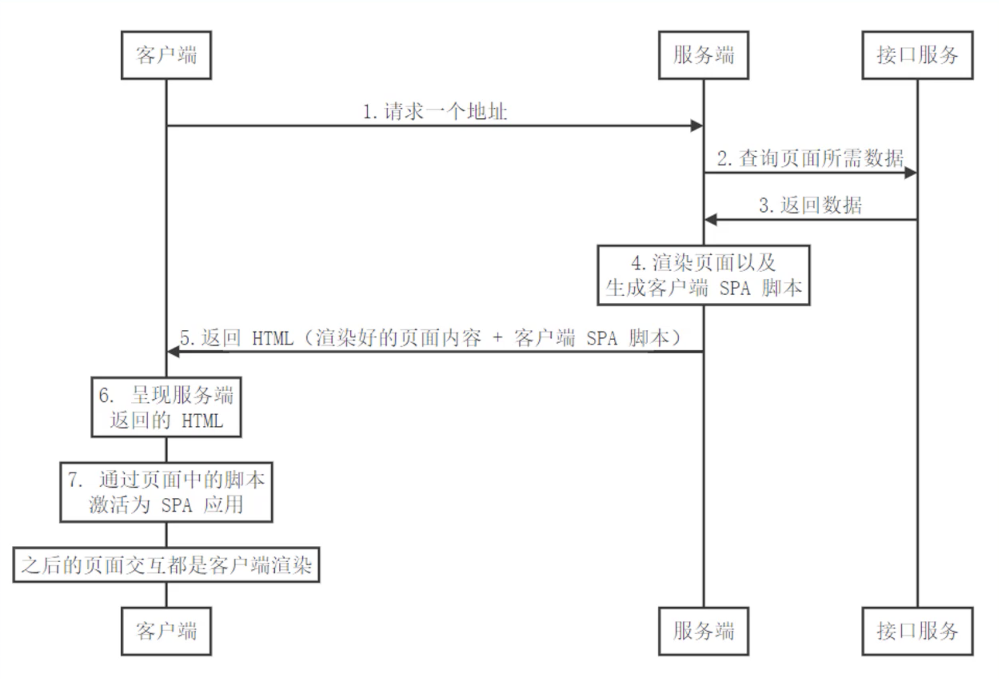
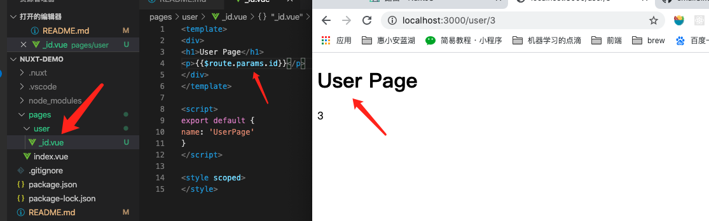
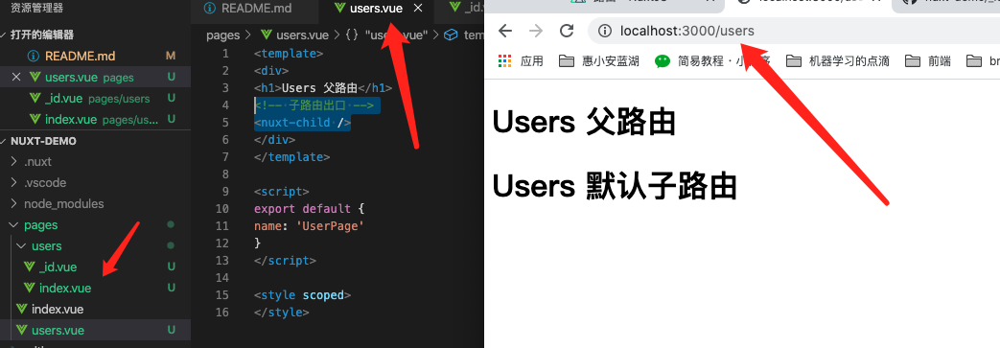
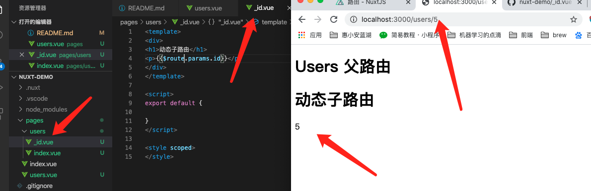
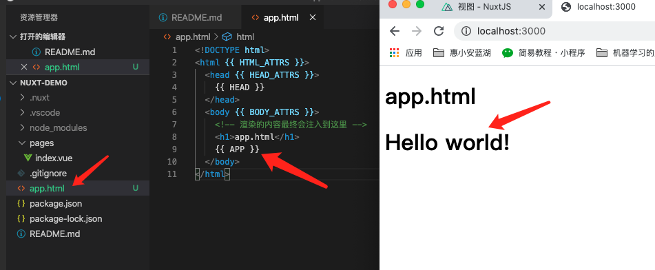
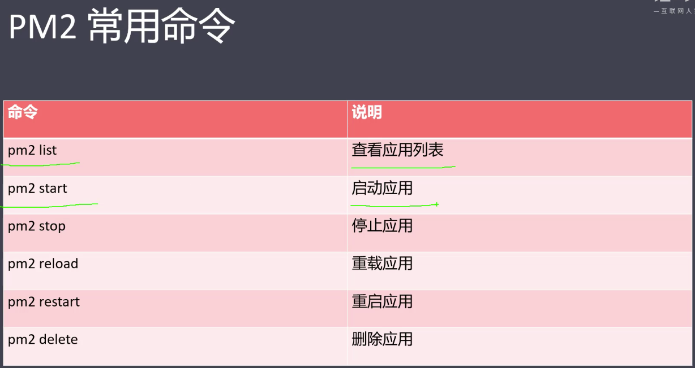
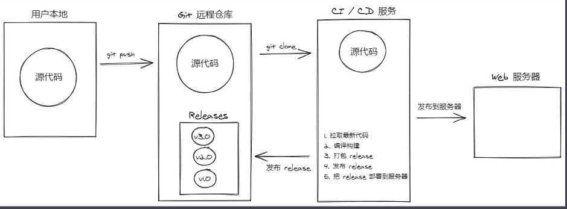

## Vuex 数据流管理及Vue.js 服务端渲染（SSR）项目见：<https://github.com/smallSix6/fed-e-task-liuhuijun/tree/master/fed-e-task-03-03>

### 任务一：Vuex 状态管理
#### 1、课程目标
+ Vue 组件间通信方式回顾
+ Vuex 核心概念和基本使用回顾
+ 购物车案例
+ 模拟实现 Vuex

#### 2、组件内的状态管理流程
+ 状态管理：
  + state：驱动应用的数据源
  + view：以声明方式将 state 映射到视图
  + actions：响应在 view 上的用户输入导致的状态变化

#### 3、组件间通信方式回顾
+ 四种通信方式：
  + 父组件给子组件传值
    + 子组件通过 props 接收数据
    + 父组件中给子组件通过相应属性传值
  + 子组件给父组件传值
    + 子组件通过 this.$emit(fn, data)
    + 父组件中给子组件通过 v-on:子组件emit的函数名=父组件函数名
  + 不相关组件传值
    + 通过事件中心 eventbus 触发和注册事件
    ```js
    import Vue from 'vue'
    export default new Vue()
    ```
    + 触发 eventsbus 中的事件
    ```js
    <template>
      <div>
        <h1>Event Bus Sibling01</h1>
        <div class="number" @click="sub">-</div>
        <input type="text" style="width: 30px; text-align: center" :value="value">
        <div class="number" @click="add">+</div>
      </div>
    </template>

    <script>
    import bus from './eventbus'

    export default {
      props: {
        num: Number
      },
      created () {
        this.value = this.num
      },
      data () {
        return {
          value: -1
        }
      },
      methods: {
        sub () {
          if (this.value > 1) {
            this.value--
            bus.$emit('numchange', this.value)
          }
        },
        add () {
          this.value++
          bus.$emit('numchange', this.value)
        }
      }
    }
    </script>

    <style>
    .number {
      display: inline-block;
      cursor: pointer;
      width: 20px;
      text-align: center;
    }
    </style>
    ```
    + 注册事件
    ```js
    <template>
      <div>
        <h1>Event Bus Sibling02</h1>

        <div>{{ msg }}</div>
      </div>
    </template>

    <script>
    import bus from './eventbus'
    export default {
      data () {
        return {
          msg: ''
        }
      },
      created () {
        bus.$on('numchange', (value) => {
          this.msg = `您选择了${value}件商品`
        })
      }
    }
    </script>

    <style>

    </style>
    ```
  + 通过 ref 获取子组件
    + ref 两个作用
      + 在普通 HTML 标签上使用 ref，获取到的是 DOM
      ```js
      <template>
        <div>
          <h1>ref Child</h1>
          <input ref="input" type="text" v-model="value">
        </div>
      </template>

      <script>
      export default {
        data () {
          return {
            value: ''
          }
        },
        methods: {
          focus () {
            this.$refs.input.focus()
          }
        }
      }
      </script>

      ```
      + 在组件标签上使用 ref，获取到的是组件实例
      ```js
      <template>
        <div>
          <h1>ref Parent</h1>

          <child ref="c"></child>
        </div>
      </template>

      <script>
      import child from './04-Child'
      export default {
        components: {
          child
        },
        mounted () {
          this.$refs.c.focus()
          this.$refs.c.value = 'hello input'
        }
      }
      </script>
      ```

#### 4、Vuex 回顾
+ 什么是 Vuex:
  + Vuex 专门为 Vue.js 设计的状态管理库
  + Vuex 采用集中式的方式存储需要共享的状态
  + Vuex 的作用是进行状态管理，解决复杂组件通信，数据共享
  + Vuex 集成到了 devtools 中，提供了 time-travel 时光旅行历史回滚功能
+ 什么情况下使用 Vuex
  + 非必要的情况下不要使用 Vuex
  + 大型的单页应用程序
    + 多个视图依赖于同一状态
    + 来自不同视图的行为需要变更同一状态


#### 5、Vuex 核心概念回顾
+ Store： 是一个容器，包含着应用中的大部分状态，不能直接改变 store 中的状态，要通过 mutation 的方式改变状态。
+ State：是状态，保存在 Store 中，因为 Store 是唯一的，所以 State 也是唯一的，也称为单一状态树。这里的状态是响应式的。
+ Getter：是 Vuex 中的计算属性，方便从一个属性派生出其他的值。它内部会对计算的属性进行缓存，只有当依赖改变的时候，才会重新进行计算。
+ Mutation：状态的变换必须要通过提交 Mutation 来完成。
+ Action：和 MuTation 类似，不同的是 Action 可以进行异步的操作，内部改变状态的时候，都需要提交 Mutation。
+ Module：当 Store 太过臃肿时，可以将 Store 分成多个模块，每个模块里有 State、Mutation、Action、Getter，甚至是子模块。

#### 6、State
+ store/index.js 中定义 store
```js
export default new Vuex.Store({
  state: {
    count: 0,
    msg: 'Hello Vuex'
  },
  mutations: {},
  actions: {},
  modules: {}
})
```
+ App.vue 文件中引入 store
```js
<template>
  <div id="app">
    <h1>Vuex - Demo</h1>
    <!-- count：{{ count }} <br>
    msg: {{ msg }} -->
    <!-- count：{{ $store.state.count }} <br>
    msg: {{ $store.state.msg }} -->
    count: {{ num }} <br>
    msg: {{ message }}
  </div>
</template>
<script>
import { mapState } from 'vuex'
export default {
  computed: {
    // count: state => state.count
    // ...mapState(['count', 'msg'])
    ...mapState({ num: 'count', message: 'msg' })
  }
}
</script>
```
#### 7、Getter
+ 用法：
```js
export default new Vuex.Store({
  state: {
    count: 0,
    msg: 'Hello Vuex'
  },
  getters: {
    reverseMsg (state) {
      return state.msg.split('').reverse().join('')
    }
  },
  mutations: {},
  actions: {},
  modules: {}
})
```
```js
<template>
  <div id="app">
    <h1>Vuex - Demo</h1>
    reverseMsg: {{ reverseMsg }}
  </div>
</template>
<script>
import { mapState, mapGetters } from 'vuex'
export default {
  computed: {
    ...mapGetters(['reverseMsg'])
  }
}
</script>
```

#### 8、Mutation
```js
<template>
  <div id="app">
    <h1>Vuex - Demo</h1>
    <!-- count：{{ count }} <br>
    msg: {{ msg }} -->
    <!-- count：{{ $store.state.count }} <br>
    msg: {{ $store.state.msg }} -->
    count: {{ num }} <br>
    msg: {{ message }}
    <h2>Getter</h2>
    reverseMsg: {{ reverseMsg }}
    <h2>Mutation</h2>
    <!-- <button @click="$store.commit('increate', 2)">Mutation</button> -->
    <button @click="increate(3)">Mutation</button>
  </div>
</template>
<script>
import { mapState, mapGetters, mapMutations } from 'vuex'
export default {
  computed: {
    // count: state => state.count
    // ...mapState(['count', 'msg'])
    ...mapState({ num: 'count', message: 'msg' }),
    ...mapGetters(['reverseMsg'])
  },
  methods: {
    ...mapMutations(['increate'])
  }
}
</script>
```
```js
export default new Vuex.Store({
  state: {
    count: 0,
    msg: 'Hello Vuex'
  },
  getters: {
    reverseMsg (state) {
      return state.msg.split('').reverse().join('')
    }
  },
  mutations: {
    increate (state, payload) {
      state.count += payload
    }
  },
  actions: {},
  modules: {}
})
```

#### 9、Action
```js
<template>
  <div id="app">
    <h1>Vuex - Demo</h1>
    count: {{ num }} <br>
    <!-- <div @click="$store.dispatch('increateAsync', 5)">Action</div> -->
    <div @click="increateAsync(6)">Action</div>
  </div>
</template>
<script>
import { mapState, mapGetters, mapMutations, mapActions } from 'vuex'
export default {
  computed: {
    // count: state => state.count
    // ...mapState(['count', 'msg'])
    ...mapState({ num: 'count', message: 'msg' }),
    ...mapGetters(['reverseMsg'])
  },
  methods: {
    ...mapMutations(['increate']),
    ...mapActions(['increateAsync'])
  }
}
</script>
```
```js
export default new Vuex.Store({
  state: {
    count: 0,
    msg: 'Hello Vuex'
  },
  getters: {
    reverseMsg (state) {
      return state.msg.split('').reverse().join('')
    }
  },
  mutations: {
    increate (state, payload) {
      state.count += payload
    }
  },
  actions: {
    increateAsync (context, payload) {
      setTimeout(() => {
        context.commit('increate', payload)
      }, 2000)
    }
  },
  modules: {}
})
```

#### 10、Module
```js
import Vue from 'vue'
import Vuex from 'vuex'
import products from './modules/products'
import cart from './modules/cart'

Vue.use(Vuex)

export default new Vuex.Store({
  state: {
    count: 0,
    msg: 'Hello Vuex'
  },
  getters: {
    reverseMsg (state) {
      return state.msg.split('').reverse().join('')
    }
  },
  mutations: {
    increate (state, payload) {
      state.count += payload
    }
  },
  actions: {
    increateAsync (context, payload) {
      setTimeout(() => {
        context.commit('increate', payload)
      }, 2000)
    }
  },
  modules: {
    products,
    cart
  }
})
```
+ 在 store 中添加 modules 属性，开启多个子模块，products 中的代码如下：
```js
const state = {
  products: [
    { id: 1, title: 'iPhone 11', price: 8000 },
    { id: 2, title: 'iPhone 12', price: 10000 }
  ]
}
const getters = {}
const mutations = {
  setProducts (state, payload) {
    state.products = payload
  }
}
const actions = {}

export default {
  namespaced: true,  // 开启命名空间
  state,
  getters,
  mutations,
  actions
}
```
+ App.vue 中的代码如下：
```js
<template>
  <div id="app">
    <h1>Vuex - Demo</h1>
    <!-- count：{{ count }} <br>
    msg: {{ msg }} -->
    <!-- count：{{ $store.state.count }} <br>
    msg: {{ $store.state.msg }} -->
    count: {{ num }} <br>
    msg: {{ message }}
    <h2>Getter</h2>
    reverseMsg: {{ reverseMsg }}
    <h2>Mutation</h2>
    <!-- <button @click="$store.commit('increate', 2)">Mutation</button> -->
    <button @click="increate(3)">Mutation</button>
    <!-- <div @click="$store.dispatch('increateAsync', 5)">Action</div> -->
    <div @click="increateAsync(5)">Action</div>

    <h2>Module</h2>
    products: {{ products }} <br>
    <button @click="setProducts([])">Module</button>
  </div>
</template>
<script>
import { mapState, mapGetters, mapMutations, mapActions } from 'vuex'
export default {
  computed: {
    // count: state => state.count
    // ...mapState(['count', 'msg'])
    ...mapState({ num: 'count', message: 'msg' }),
    ...mapGetters(['reverseMsg']),
    ...mapState('products', ['products'])
  },
  methods: {
    ...mapMutations(['increate', 'setProducts']),
    ...mapActions(['increateAsync']),
    ...mapMutations('products', ['setProducts'])
  }
}
</script>
```

#### 11、Vuex 严格模式
+ Vuex 中的状态的更新要通过提交 mutation 来修改，但其实在组件中还可以通过`$store.state.msg`进行修改，从语法从面来说这是没有问题的，但是这破坏了 Vuex 的约定，如果在组件中直接修改 state，devtools 无法跟踪到这次状态的修改。
+ 开启严格模式之后，如果在组件中直接修改 state 会抛出错误，但数据仍被成功修改。
+ 如何开启：在 store 中增加一个属性 strict 为 true
```js
export default new Vuex.Store({
  strict: process.env.NODE_ENV !== 'production',
})
```
+ 注意：不要在生产模式下开启严格模式，严格模式会深度检查状态树，检查不合规的状态改变，会影响性能。
+ 我们可以在开发模式下开启严格模式，在生产模式中关闭严格模式:
+ `  strict: process.env.NODE_ENV !== 'production',`

#### 12、Vuex插件介绍
  + Vuex的插件就是一个函数
  + 这个函数接受一个store参数
+ 这个参数可以订阅一个函数，让这个函数在所有的mutation结束之后执行。
```js
const myPlugin = store => {
  // 当store初始化后调用
  store.subscribe((mutation, state) => {
    // 每次mutation之后调用
    // mutation的格式为{ type, payload }
  })
}
```
+ Store/index.js
```js
import Vue from 'vue'
import Vuex from 'vuex'
import products from './modules/products'
import cart from './modules/cart'
Vue.use(Vuex)

const myPlugin = store => {
  store.subscribe((mutation, state) => {
    if (mutation.type.startsWith('cart/')) {
      window.localStorage.setItem('cart-products', JSON.stringify(state.cart.cartProducts))
    }
  })
}

export default new Vuex.Store({
  state: {
  },
  mutations: {
  },
  actions: {
  },
  modules: {
    products,
    cart
  },
  plugins: [myPlugin]
})
```

#### 13、模拟 Vuex 的实现
```js
let _Vue = null
class Store {
  constructor (options) {
    const {
      state = {},
      getters = {},
      mutations = {},
      actions = {}
    } = options
    this.state = _Vue.observable(state)
    this.getters = Object.create(null)
    Object.keys(getters).forEach(key => {
      Object.defineProperty(this.getters, key, {
        get: () => getters[key](state)
      })
    })
    this._mutations = mutations
    this._actions = actions
  }

  commit (type, payload) {
    this._mutations[type](this.state, payload)
  }

  dispatch (type, payload) {
    this._actions[type](this, payload)
  }
}

function install (Vue) {
  _Vue = Vue
  _Vue.mixin({
    beforeCreate () {
      if (this.$options.store) {
        _Vue.prototype.$store = this.$options.store
      }
    }
  })
}

export default {
  Store,
  install
}
```


### 任务二：服务端渲染基础
#### 1、概述
  + SPA 单页应用
    + 优点：
      + 用户体验好
      + 开发效率高
      + 渲染性能好
      + 可维护性好  
    + 缺点：
      + 首屏渲染时间长
      + 不利于 SEO  
  + 借鉴传统的服务器渲染
    + 
  + 客户端激活为 SPA
    + 
  + 同构应用
    + 通过服务端渲染首屏直出，解决SPA应用首屏渲染慢以及不利于SEO问题
    + 通过客户端渲染结果页面内容交互得到更好的用户体验
    + 这种方式通常称之为现代化的服务端渲染，也叫同构渲染
    + 这种方式构建的应用称之为服务端渲染应用或者是同构应用
  + 相关概念
    + 什么是渲染：把数据和模板拼接在一起。渲染的本质就是字符串的解析替换。
    + 传统的服务端渲染：将数据结合页面模板渲染为 HTML 返回给客户端
    + 客户端渲染
    + 现代化的服务端渲染（同构渲染）

#### 2、传统的服务端渲染案例
+ 地址见：../code/oldRender
+ index.js
```js
const express = require('express')
const fs = require('fs')
const template = require('art-template')

const app = express()

app.get('/', (req, res) => {
  // 1. 获取页面模板
  const templateStr = fs.readFileSync('./index.html', 'utf-8')
  console.log(templateStr)
  // 2. 获取数据
  const data = JSON.parse(fs.readFileSync('./data.json', 'utf-8'))
  console.log(data)
  // 3. 渲染：数据 + 模板 = 最终结果
  const html = template.render(templateStr, data)
  console.log(html)
  // 4. 把渲染结果发送给客户端
  res.send(html)
})

app.listen(3000, () => {
  console.log('running......')
})
```
+ index.html
```html
<!DOCTYPE html>
<html lang="en">
<head>
  <meta charset="UTF-8">
  <meta name="viewport" content="width=device-width, initial-scale=1.0">
  <title>Document</title>
</head>
<body>
  <p>{{message}}</p>
</body>
</html>
```
```json
{
  "message": "人善被人欺，有事不要虚，所有精神小伙全部听令。整起来！天黑路滑，这社会复杂，你往高处爬，那么就有小人来找茬，精神来自灵魂，不是动手伤人，气质来自豪横，但豪横不是进牢门，懂滴撒！散会！（@阿溪🔥）"
}
```
+ 缺点：
  + 前后端代码完全耦合在一起，不利于开发和维护
  + 前端没有足够发挥空间
  + 服务端压力大
  + 用户体验一般

#### 3、客户端渲染CSR

+ 之前服务端渲染的缺点，随着客户端Ajax技术的普及得到了有效的解决，Ajax 使得客户端动态获取数据成为可能，因此，服务端渲染的工作来到了客户端。
+ 后端负责处理数据接口
+ 前端负责将接口数据渲染到页面中
+ 前端更为独立，不再受限于后端。
+ 但客户端渲染也存在一些明显的不足：
  + 首屏渲染慢：因为客户端渲染至少发起 Http 请求三次，第一次是请求页面，第二次是请求页面里的 JS 脚本，第三次是动态数据请求。
  + 不利于 SEO：因为客户端渲染的内容都是由 JS 生成的，而搜索引擎只会请求网络路径的 html，不会去将 html 里的 JS 脚本再去请求做解析处理，因此搜索引擎获取到的首屏是空的，单页应用 SEO 几乎为0。

#### 4、现代化的服务端渲染（同构渲染）
+ 同构渲染 = 后端渲染 + 前端渲染
  + 基于React、Vue等框架，客户端渲染和服务端渲染的结合
    + 在客户端执行一次，用户实现服务器端渲染（首屏直出）
    + 在客户端再执行一次，用于接管页面交互
  + 核心解决SEO和首屏渲染慢的问题
  + 拥有传统服务端渲染的优点，也有客户端渲染的优点。
+ 
+ 如何实现同构渲染?
  + 使用Vue、React等框架的官方解决方案
    + 优点：有助于理解原理
    + 缺点：需要搭建环境
  + 使用第三方解决方案
    + React生态的Next.js
    + Vue生态的Nuxt.js

#### 5、Nuxt.js为例演示同构渲染应用
+ 流程演示，完整代码见：../code/nuxt-Test/ssr ：
  + 1、创建一个文件夹，然后进入文件夹执行`yarn init`生成包管理器
  + 2、然后执行`yarn add nuxt`安装Nuxt
  + 3、在 package.json 增加 scripts 脚本命令`"dev": "nuxt"`
  + 4、创建 pages 文件夹，在这个文件夹中创建 index.vue 文件和 about.vue 文件，nuxt 会根据 pages 路径自动生成路由。
  + 5、index.vue 中请求数据
    ```js
    <template>
      <div id="app">
        {{message}}
      </div>
    </template>
    <script>
    import axios from 'axios'
    export default {
      name: 'Home',
      components: {},
      // Nuxt 中提供一个钩子函数`asyncData()`，专门用于获取服务端渲染的数据。
      async asyncData () {
        const { data } = await axios({
          method: 'GET',
          // 注意此处的 URL 要指定当前端口，否则默认会去服务端的 80 端口去查找。
          url: 'http://localhost:3000/data.json'
        })
        // 这里返回的数据会和 `data () {}` 中的数据合并到一起给页面使用
        return data
      }
    }
    </script>
    <style scoped></style>
    ```
  + 6、一次请求就拿到了完整页面，Nuxt 的服务端渲染方案解决了首屏渲染慢的问题和 SEO 的问题
  + 7、Nuxt 生成的是 SPA 单页应用，可以通过增加路由导航看出来，Home 和 About 两个组件切换时页面没有刷新。创建一个文件夹 layouts，然后在这个文件夹中创建一个 default.vue 文件，这个文件夹名 layouts 和 其下的 default.vue 是固定的，不能更改
  ```js
  <template>
  <div>
  <!-- 路由出口 -->
    <ul>
      <li>
        <!-- 类似于 router-link，用于单页面应用导航 -->
        <nuxt-link to="/">Home</nuxt-link>
      </li>
      <li>
        <!-- 类似于 router-link，用于单页面应用导航 -->
        <nuxt-link to="/about">About</nuxt-link>
      </li>
    </ul>
  <!-- 子页面出口 -->
    <nuxt />
  </div>
  </template>

  <script>
  export default {

  }
  </script>
  <style scoped></style>
  ```

#### 6、同构渲染的问题
+ 开发条件有限
  + 浏览器特定的代码只能在某些生命周期钩子函数中使用
  + 一些外部扩展库可能需要特殊处理才能在服务端渲染应用中运行
  + 不能在服务端渲染期间操作DOM
  + 。。。
  + 某些代码操作需要区分运行环境
+ 涉及构建设置和部署的更多要求
  |      | 客户端渲染                | 同构渲染                   |
  | ---- | ----------------- | ------------------ |
  | 构建 | 仅构建客户端应用即可      | 需要构建两个端             |
  | 部署 | 可以部署在任意 web 服务器中 | 只能部署在 Node.js Server 中 |
+ 更多的服务器端负载
  + 在 Node 中渲染完整的应用程序，相比仅仅提供静态文件服务器，需要大量占用 CPU 资源
  + 如果应用在高流量环境下使用，需要准备相应的服务器负载
  + 需要更多的服务端渲染优化工作处理
  + 。。。

### 任务三：NuxtJS基础，项目地址见：< https://github.com/smallSix6/nuxt-demo >

#### 1、NuxtJS 介绍
+ Nuxt.js 是什么
  + 一个基于 Vue.js 生态的第三方开源服务端渲染应用框架
  + 它可以帮我们轻松的使用 Vue.js 技术栈构建同构应用
  + 官网：< https://zh.nuxtjs.org >
  + Github 仓库：< https://github.com/nuxt/nuxt.js >
#### 2、初始化 NuxtJS 项目
+ Nuxt.js 的三种使用方式
  + 初始化项目
    + 官方文档：< https://zh.nuxtjs.org/guide/installation >
      + 方式一：使用 create-nuxt-app
      + 方式二：手动创建
        + 项目根目录运行 `npm init -y`,并如下添加脚本
          ```js
          {
            "name": "my-app",
            "scripts": {
              "dev": "nuxt"
            }
          }
          ```
        + 安装 Nuxt: `npm install --save nuxt`
        + 新建 pages 目录
          + 此目录下新建我们的文件 index.vue 文件，作为首页
        + `npm run dev` 启动项目
  + 已有的 Node.js 服务端项目
    + 直接把 Nuxt 当作一个中间件集成到 Node Web Server 中
  + 现有的 Vue.js 项目
    + 非常熟悉 Nuxt.js
    + 至少百分之十的代码改动

#### 3、路由
+ 基础路由
  + 假设 pages 的目录结构如下：
    ```js
    pages/
    --| user/
    -----| index.vue
    -----| one.vue
    --| index.vue
    ```
    + 那么，Nuxt.js 自动生成的路由配置如下：
    ```js
    router: {
      routes: [
        {
          name: 'index',
          path: '/',
          component: 'pages/index.vue'
        },
        {
          name: 'user',
          path: '/user',
          component: 'pages/user/index.vue'
        },
        {
          name: 'user-one',
          path: '/user/one',
          component: 'pages/user/one.vue'
        }
      ]
    }
    ```
+ 路由导航
  + a 标签
    + 它会刷新整个页面，不要使用
  + nuxt-link 组件
    + https://router.vuejs.org/zh/api/#router-link-props
  + 编程式导航
    + https://router.vuejs.org/zh/guide/essentials/navigation.html
    ```js
    <template>
    <div>
    <p>About Page</p>
    <!-- a 链接，刷新导航，走服务端渲染 -->
    <h2>a链接</h2>
    <a href="/">首页</a>

    <!-- router-link  导航连接组件 -->
    <h2>router-link</h2>
    <router-link to='/'>首页</router-link>

    <!-- 编程式导航 -->
    <button @click="onClick">首页</button>
    </div>
    </template>
    <script>
    export default {
    name: "aboutPage",
    methods: {

      onClick() {
        this.$router.push('/')
      }
    }
    }
    </script>
    <style scoped>
    </style>
    ```
+ 动态路由
  + 在 Nuxt.js 里面定义带参数的动态路由，需要创建对应的以下划线作为前缀的 Vue 文件或目录。以下目录结构：
  ```js
  pages/
  --| _slug/
  -----| comments.vue
  -----| index.vue
  --| users/
  -----| _id.vue
  --| index.vue
  ```
  + Nuxt.js 生成对应的路由配置表为：
  ```js
  router: {
    routes: [
      {
        name: 'index',
        path: '/',
        component: 'pages/index.vue'
      },
      {
        name: 'users-id',
        path: '/users/:id?',
        component: 'pages/users/_id.vue'
      },
      {
        name: 'slug',
        path: '/:slug',
        component: 'pages/_slug/index.vue'
      },
      {
        name: 'slug-comments',
        path: '/:slug/comments',
        component: 'pages/_slug/comments.vue'
      }
    ]
  }
  ```
  + 
+ 嵌套路由
  + Vue Router 嵌套路由
    + https://router.vuejs.org/zh/guide/essentials/nested-routes.html
  + Nuxt.js 嵌套路由
    + https://zh.nuxtjs.org/guide/routing/
    + 你可以通过 vue-router 的子路由创建 Nuxt.js 应用的嵌套路由。
    + 创建内嵌子路由，你需要添加一个 Vue 文件，同时添加一个与该文件同名的目录用来存放子视图组件。
    + `Warning: 别忘了在父组件(.vue文件) 内增加 <nuxt-child/> 用于显示子视图内容`
    + 假设文件结构如下：
    ```js
    pages/
    --| users/
    -----| _id.vue
    -----| index.vue
    --| users.vue
    ```
    + Nuxt.js 自动生成的路由配置如下：
    ```js
    router: {
      routes: [
        {
          path: '/users',
          component: 'pages/users.vue',
          children: [
            {
              path: '',
              component: 'pages/users/index.vue',
              name: 'users'
            },
            {
              path: ':id',
              component: 'pages/users/_id.vue',
              name: 'users-id'
            }
          ]
        }
      ]
    }
    ```
  + 
  + 
+ 自定义路由配置
  + 参考文档：https://zh.nuxtjs.org/api/configuration-router
  + 在项目根目录下新建 nuxt.config.js，配置内容如下：
    ```js
    // Nuxt.js 配置文件
    module.exports = {
      router: {
        // 应用的根 URL。举个例子，如果整个单页面应用的所有资源可以通过 /app/ 来访问，那么 base 配置项的值需要设置为 '/app/'
        base: '/app/',
        // routes: 一个数组，路由配置表
        // resolve: 解析路由组件路劲
        extendRoutes(routes, resolve) {
          routes.push({
            name: '/hello',
            path: 'hello',
            component: resolve(__dirname, 'pages/about.vue') // 匹配到 /hello 时加载 about.vue 组件
          })
        }
      }
    }
    ```

#### 4、视图
+ 模板
  + 参考文档：https://zh.nuxtjs.org/guide/views
  + 
+ 布局
  + uxt.js 允许你扩展默认的布局，或在 layout 目录下创建自定义的布局
    + 默认布局
      + 可通过添加 layouts/default.vue 文件来扩展应用的默认布局
      + 提示: 别忘了在布局文件中添加 <nuxt/> 组件用于显示页面的主体内容。
      + 默认布局的源码如下：
      ```js
      <template>
      <div>
      <h1>layouts/default.vue 组件</h1>
      <!-- 页面出口，类似于子路由 -->
      <nuxt />
      </div>
      </template>

      <script>
      export default {

      }
      </script>

      <style scoped>
      </style>
      ```
    + 自定义布局
      + layouts 目录中的每个文件 (顶级) 都将创建一个可通过页面组件中的 layout 属性访问的自定义布局。
      + 假设我们要创建一个 博客布局 并将其保存到layouts/blog.vue:
      ```js
      <template>
        <div>
          <div>我的博客导航栏在这里</div>
          <nuxt />
        </div>
      </template>
      ```
      + 然后我们必须告诉页面 (即pages/posts.vue) 使用您的自定义布局：
      ```js
      <template>
        <!-- Your template -->
      </template>
      <script>
        export default {
          layout: 'blog'
          // page component definitions
        }
      </script>
      ```

#### 5、异步数据（完整代码见：< https://github.com/smallSix6/nuxt-demo/tree/08-%E5%BC%82%E6%AD%A5%E6%95%B0%E6%8D%AE >
+ asyncData 方法
  + 参考文档：https://zh.nuxtjs.org/guide/async-data
  + 基本用法：
    + 它会将 asyncData 返回的数据融合组件 data 方法返回数据一并给组件
    + 调用时机：服务端渲染期间和客户端路由更新之前
  + 注意事项：
    + 只能在页面中使用,子组件中不能使用（即 components 文件夹下的文件），子组件中的异步数据可以通过页面组件的 props 传给子组件，示例如 components/Test1.vue 子组件中的代码
      ```js
      <template>
      <div>
      <h1>test1Page</h1>
      <p>{{foo}}</p>
      </div>
      </template>

      <script>
      export default {
        async asyncData () {
          return {
            // 这个数据对象在子组件中使用的话会报错
            foo: 'bar'
          }
        }
      }
      </script>

      <style scoped>
      </style>
      ```
    + 没有 this，因为它是在组件初始化之前被调用的
  + 使用场景：当你想要动态页面内容有利于 SEO 或者是提升受评渲染速度的时候，就在 asyncData 中发送请求拿数据。如果是非异步数据或者普通数据，则正常的初始化到 data 中即可
+ 上下文对象：
  + 可通过 API context< https://zh.nuxtjs.org/api/context > 来了解该对象的所有属性和方法。
    ```js
    export default {
      async asyncData (context) {
        // 可以访问到 context 对象
        console.log(context.params)
        return {
          // 这个数据对象在子组件中使用的话会报错
          foo: 'bar'
        }
      }
    }
    ```
  + context 变量的可用属性一览
    |属性字段                |类型             |可用              |描述  |
    | --------------------- | ----------------- | ------------------ | ------------|
    |app                    |Vue 根实例 	    |客户端 & 服务端	   |包含所有插件的 Vue 根实例。例如：在使用 axios 的时候，你想获取 $axios 可以直接通过 context.app.$axios 来获取|
    |isClient	              |Boolean	       |客户端 & 服务端	    |是否来自客户端渲染（废弃。请使用 process.client ）|
    |isServer	              |Boolean	       |客户端 & 服务端	    |是否来自服务端渲染（废弃。请使用 process.server ）|
    |isStatic	              |Boolean	       |客户端 & 服务端	    |是否来自 nuxt generate 静态化（预渲染）（废弃。请使用 process.static ）|
    |isDev	                |Boolean	       |客户端 & 服务端	    |是否是开发 dev 模式，在生产环境的数据缓存中用到|
    |isHMR	                |Boolean	       |客户端 & 服务端	    |是否是通过模块热替换 webpack hot module replacement (仅在客户端以 dev 模式)|
    |route	                |Vue Router 路由  |客户端 & 服务端	   |Vue Router 路由实例|
    |store	                |Vuex 数据	      |客户端 & 服务端	   |Vuex.Store 实例。只有vuex 数据流存在相关配置时可用|
    |env	                  |Object	         |客户端 & 服务端	    |nuxt.config.js 中配置的环境变量，见 环境变量 api|
    |params	                |Object	         |客户端 & 服务端	    |route.params 的别名|
    |query	                |Object	         |客户端 & 服务端	    |route.query 的别名|
    |req	                  |http.Request	   |服务端	           |Node.js API 的 Request 对象。如果 Nuxt 以中间件形式使用的话，这个对象就根据你所使用的框架而定。nuxt generate 不可用|
    |res	                  |http.Response	 |服务端	           |Node.js API 的 Response 对象。如果 Nuxt 以中间件形式使用的话，这个对象就根据你所使用的框架而定。nuxt generate 不可用|
    |redirect	              |Function	       |客户端 & 服务端	    |用这个方法重定向用户请求到另一个路由。状态码在服务端被使用，默认 302 redirect([status,] path [, query])|
    |error	                |Function	       |客户端 & 服务端	    |用这个方法展示错误页：error(params) 。params 参数应该包含 statusCode 和 message 字段|
    |nuxtState	            |Object	         |客户端	           |Nuxt 状态，在使用 beforeNuxtRender 之前，用于客户端获取 Nuxt 状态，仅在 universal 模式下可用|
    |beforeNuxtRender(fn)	  |Function	       |服务端	           |使用此方法更新 __NUXT__ 在客户端呈现的变量，fn 调用 (可以是异步) { Components, nuxtState } ，参考 示例  |


### 任务四：NuxtJS 综合案例

#### 1、案例介绍
  + 案例名称：RealWorld
  + 一个开源的学习项目，目的就是帮助开发者快速学习新技能
  + Github 仓库：https://github.com/gothinkster/realworld
  + 在线示例：https://demo.realworld.io/#/
  + 页面模板：https://github.com/gothinkster/realworld-starter-kit/blob/master/FRONTEND_INSTRUCTIONS.md
  + 接口文档：https://github.com/gothinkster/realworld/tree/master/api
  + 学习前提：
    + Vue.js 使用经验
    + Nuxt.js 基础
    + Node.js、webpack 相关使用经验
  + 学习收获：
    + 掌握使用 Nuxt.js 开发同构渲染应用
    + 增强 Vue.js 实践能力
    + 掌握同构渲染应用中常见的功能处理
      + 用户状态管理
      + 页面访问权限处理
      + SEO 优化
      + 。。。
    + 掌握同构渲染应用的发布与部署
#### 2、项目初始化
+ 创建项目
  + mkdir realworld-nuxtjs
  + npm init -y
  + npm i nuxt
  + 配置启动脚本
  + 创建 pages 目录，配置初始页面
+ 导入页面模板
  + 导入样式资源
    + 根目录下新建 app.html,内容如下：
    ```js
    <!DOCTYPE html>
    <html {{ HTML_ATTRS }}>
      <head {{ HEAD_ATTRS }}>
        {{ HEAD }}
        <link href="https://cdn.jsdelivr.net/npm/ionicons@2.0.1/css/ionicons.min.css" rel="stylesheet" type="text/css">
        <link href="//fonts.googleapis.com/css?family=Titillium+Web:700|Source+Serif+Pro:400,700|Merriweather+Sans:400,700|Source+Sans+Pro:400,300,600,700,300italic,400italic,600italic,700italic" rel="stylesheet" type="text/css">
        <!-- Import the custom Bootstrap 4 theme from our hosted CDN -->
        <link rel="stylesheet" href="/index.css">
      </head>
      <body {{ BODY_ATTRS }}>
        {{ APP }}
      </body>
    </html>
    ```
  + 导入布局组件
    + 在 pages 目录下新建 layouts 文件夹
    + 在 layouts 文件夹下新建 index.vue 文件，代码如下：
    ```js
    <template>
      <div>
        <!-- 顶部导航栏 -->
        <nav class="navbar navbar-light">
          <div class="container">
            <a class="navbar-brand" href="index.html">conduit</a>
            <ul class="nav navbar-nav pull-xs-right">
              <li class="nav-item">
                <!-- Add "active" class when you're on that page" -->
                <a class="nav-link active" href="">Home</a>
              </li>
              <li class="nav-item">
                <a class="nav-link" href="">
                  <i class="ion-compose"></i>&nbsp;New Post
                </a>
              </li>
              <li class="nav-item">
                <a class="nav-link" href="">
                  <i class="ion-gear-a"></i>&nbsp;Settings
                </a>
              </li>
              <li class="nav-item">
                <a class="nav-link" href="">Sign up</a>
              </li>
            </ul>
          </div>
        </nav>
        <!-- 顶部导航栏 -->

        <!-- 子路由 -->
        <nuxt-child />
        <!-- 子路由 -->

        <!-- 底部 -->
        <footer>
          <div class="container">
            <a href="/" class="logo-font">conduit</a>
            <span class="attribution">
              An interactive learning project from <a href="https://thinkster.io">Thinkster</a>. Code &amp; design licensed under MIT.
            </span>
          </div>
        </footer>
        <!-- 底部 -->
      </div>
    </template>

    <script>
      export default {
        name: 'Header',
        components: {
        
        },
        props: {
        
        },
        data() {
          return {}
        },
        computed: {
        
        },
        watch: {
        
        },
        created() {},
        mounted() {},
        methods: {
        
        },
      }
    </script>

    <style scoped>
      
    </style>
    ```
    + 根目录下新建`nuxt.config.js`文件,自定义路由
    ```js
    module.exports = {
      router: {
        // 自定义路由表规则
        extendRoutes(routes, resolve) {
          // 清除 Nuxt.js 基于 pages 目录默认生成的路由表规则
          routes.splice(0)
          routes.push(...[
            {
              path: '/',
              component: resolve(__dirname, 'pages/layouts/'),
              children: [
                {
                  path: '', // 默认子路由
                  name: 'home',
                  component: resolve(__dirname, 'pages/home/')
                },
                {
                  path: '/login',
                  name: 'login',
                  component: resolve(__dirname, 'pages/login/')
                },
                {
                  path: '/register',
                  name: 'register',
                  component: resolve(__dirname, 'pages/login/')
                },
              ]
            }
          ])
        }
      }
    }
    ```
  + 配置页面组件
  + 处理顶部导航链接


#### 3、发布部署
+ 打包
  + 打包 Nuxt.js 应用
    + < https://zh.nuxtjs.org/guide/commands >
  |命令     	   |描述|
  | -----       |---|
  |nuxt	        |启动一个热加载的 Web 服务器（开发模式） localhost:3000。|
  |nuxt build	  |利用 webpack 编译应用，压缩 JS 和 CSS 资源（发布用）。|
  |nuxt start	  |以生产模式启动一个 Web 服务器 (需要先执行nuxt build)。|
  |nuxt generate|编译应用，并依据路由配置生成对应的 HTML 文件 (用于静态站点的部署)|
+ 最简单的部署方式
  + 配置 Host + Port
  + 压缩发布包(.nuxt、static、nuxt.config.js、package.json 和 package-lock.json)
  + 把发布包传到服务端
  + 解压
  + 安装依赖
  + 启动服务
+ 使用 PM2 启动服务
  + Github 仓库地址：< https://github.com/Unitech/pm2 >
  + 官方文档：< https://pm2.io/ >
  + 安装：npm install --global pm2
  + 启动：pm2 start 脚本路径
  + pm2 常用命令
    + 
+ 自动化部署介绍
  + 现代化的部署方式（CI/CD）
    + 
+ 准备自动部署内容
  + 环境准备
    + linux 服务器
    + 把代码提交到 Github 远程仓库
  + 配置 Github Access Token
    + 生成：< https://github.com/settings/token >
    + 配置到项目的 Secrets 中：< https://github.com/smallSix6/realworld-nuxrjs/settings/secrest >
  + 配置 Github Actions 执行脚本
    + 在项目根目录创建 .github/workflows 目录
    + 下载 main.yml 到 workflows 目录中
      + < https://gist.github.com/lipengzhou/b92f80142afa37aea397da47366bd872 >
    + 修改配置
    + 配置 PM2 配置文件
    + 提交更新
    + 查看自动部署状态
    + 访问网站
    + 提交更新


