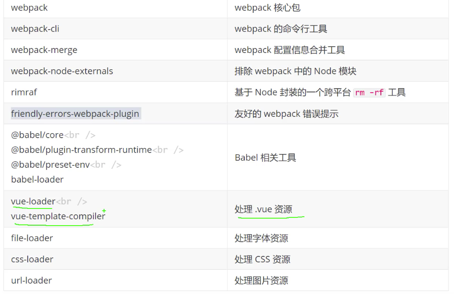

## 搭建自己的SSR、静态站点生成（SSG）及封装 Vue.js 组件库 （项目见：<https://github.com/smallSix6/fed-e-task-liuhuijun/tree/master/fed-e-task-03-04>

### 任务一：搭建自己的 SSR
#### 1、渲染一个 Vue 的实例
+ npm init -y
+ npm i vue vue-server-renderer
+ 根目录下新建 server.js
```js
const Vue = require('vue')
const renderer = require('vue-server-renderer').createRenderer()

const app = new Vue({
  template: `
      <div id="app">
        <h1> {{ message }}</h1 >
      </div >
  `,
  data: {
    message: '刘惠俊'
  }
})
renderer.renderToString(app, (err, html) => {
  if (err) throw err
  console.log(html)
})
```
+ 执行上述代码，结果如下：
```js
<div id="app" data-server-rendered="true"><h1> 刘惠俊</h1></div>
```

#### 2、使用 HTML 模板结合到 web 服务器中
+ index.template.html 中内容如下：
```js
<!DOCTYPE html>
<html lang="en">

<head>
  <meta charset="UTF-8">
  <meta name="viewport" content="width=device-width, initial-scale=1.0">
  {{{meta}}}
  <title>{{title}}</title>
</head>

<body>
  <!--vue-ssr-outlet-->
</body>

</html>
```
+ server.js 中内容如下：
```js
const Vue = require('vue')
const fs = require('fs')
const renderer = require('vue-server-renderer').createRenderer({
  template: fs.readFileSync('./index.template.html', 'utf-8')
})
const express = require('express')

const server = express()

server.get('/', (req, res) => {
  const app = new Vue({
    template: `
      <div id="app">
        <h1> {{ message }}</h1 >
      </div >
  `,
    data: {
      message: '刘惠俊'
    }
  })
  renderer.renderToString(app, {
    title: '刘惠俊',  // html 中用 {{title}}, title 字段会被解析
    meta: `<meta name="description" content="刘惠俊">`  // html 中用 {{{meta}}}, meta 字段不会被解析
  }, (err, html) => {
    if (err) {
      res.status(500).end('server Error')
    }
    res.setHeader('Content-Type', 'text/html;charset=utf8')
    res.end(html)
  })
})

server.listen(3000, () => {
  console.log('server running at port 3000')
})
```


#### 3、构建配置
+ 基本思路
  + 
+ 源码结构(< https://ssr.vuejs.org/zh/guide/structure.html#%E4%BD%BF%E7%94%A8-webpack-%E7%9A%84%E6%BA%90%E7%A0%81%E7%BB%93%E6%9E%84 >)
  + +src
    + -app.js
    ```js
    // 通用入口
    import Vue from 'vue'
    import App from './App.vue'

    // 导出一个工厂函数，用于创建新的
    // 应用程序、router 和 store 实例
    export function createApp() {
      const app = new Vue({
        // 根实例简单的渲染应用程序组件。
        render: h => h(App)
      })
      return { app }
    }
    ```
    + -App.vue
    ```js
    <template>
      <div id="app">
        <h1>{{message}}</h1>
        <h2>客户端动态交互</h2>
        <div>
          <input v-model="message" />
        </div>
        <div>
          <button @click="onClick">点击测试</button>
        </div>
      </div>
    </template>

    <script>
    export default {
      name: "App",
      data() {
        return {
          message: "拉钩教育"
        };
      },
      methods: {
        onClick() {
          console.log("Hello World!");
        }
      }
    };
    </script>

    <style scoped>
    </style>
    ```
    + -entry-client.js
    ```js
    import { createApp } from './app'

    // 客户端特定引导逻辑……

    const { app } = createApp()

    // 这里假定 App.vue 模板中根元素具有 `id="app"`
    app.$mount('#app')
    ```
    + -entry-server.js
    ```js
    import { createApp } from './app'

    export default context => {
      const { app } = createApp()
      return app
    }
    ```
+ 安装依赖
  + 构建配置
    1. 安装生产依赖
      + npm i vue vue-server-renderer express cross-env
|包                    | 说明|
|---                | ---|
|vue                   | Vue.js 核心库|
|vue-server-renderer   | Vue 服务端渲染工具|
|express               | 基于 Node 的 Web 服务框架|
|cross-env             | 通过 npm scripts 设置跨平台环境变量|
    2. 安装开发依赖
      + npm i -D webpack webpack-cli webpack-merge webpack-node-externals @babel/core @babel/plugin-transform-runtime @babel/preset-env babel-loader css-loader url-loader file-loader rimraf vue-loader vue-template-compiler friendly-errors-webpack-plugin
      + 
+ webpack 配置文件

