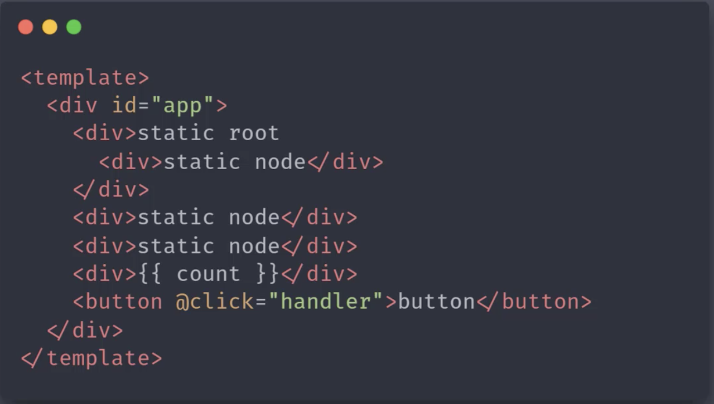
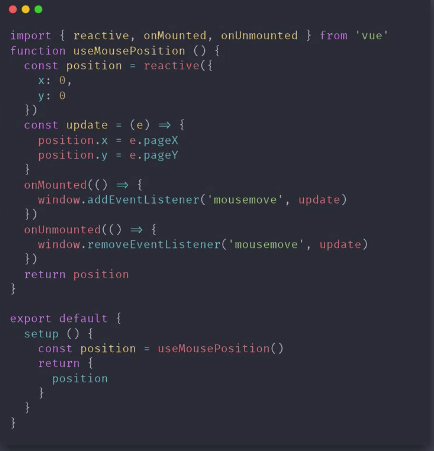

# 刘惠俊 | Part3 | 模块五
## 简答题

### 第一题
1、Vue 3.0 性能提升主要是通过哪几方面体现的？
+ 答：
+ 响应式系统升级
  + Vue.js 2.x 中响应式系统的核心 defineProperty（即使没有给属性赋值，初始化实例的时候也会递归调用 defineProperty）
  + Vue.js 3.0 中使用 Proxy 对象重写响应式系统
    + 可以监听动态新增的属性
    + 可以监听删除的属性
    + 可以监听数组的索引和 length 属性
+ 编译优化
  + Vue.js 2.x 中通过标记静态根节点，优化 diff 的过程
  + Vue.js 3.0 中标记和提升所有的静态节点，diff 的时候只需要对比动态节点内容
    + Fragments(升级 vrtur 插件)
      + vue 代码片段如下；
      + 
      + 有根节点的时候 render 函数的返回结果如下图：
      + 
      + 没有根节点的时候 render 函数的返回结果如下图：
      + 
      + 对比上面两张图，可以看出，有根节点的时候 render 函数会调用 _createBlock 创建 div 的根节点；没有根节点的时候 render 函数会调用 _createBlock 创建 Fragment 节点。然后调用 _createVNode 来创建节点
    + 静态提升
      + .png)
      + 上图可以看出，vue3.0 会提取出静态节点，优化 diff 算法
    + Patch flag
      + 
      + 上图中标记了该节点动态绑定了 text 和 props 为 [id] 的属性数组，所以在 diff 的时候只需要比较 text 和 id 属性即可
    + 缓存事件处理函数
      + 没有开启事件缓存的时候
        + 
      + 开启时间缓存的时候
        + 
      + 对比上面两图可以看出，开启了事件缓存的时候在第一轮之后的 render 都会判断是否有了第一次 render 时候的函数，有了则去缓存 
+ 源码体积的优化
  + Vue3.0 中移除了一些不常用的 APU
    + 例如：inline-template, filter 等
  + Tree-shaking

2、Vue 3.0 所采用的 Composition Api 与 Vue 2.x使用的Options Api 有什么区别？
+ 答：
+ Options API（vue 2.0）
  + 
  + 包含一个描述组件选项（data、methods、props 等）的对象
  + Options API 开发复杂组件，同一个功能逻辑的代码被拆分到不同选项
+ Composition API
  + 
  + Vue.js 3.0 新增的一组 API
  + 一组基于函数的 API
  + 可以更灵活的组织组件的逻辑
+ 

3、Proxy 相对于 Object.defineProperty 有哪些优点？
+ 答：
+ 多层属性嵌套，在访问属性过程中处理下一级属性
+ 默认监听动态添加的属性
+ 默认监听属性的删除操作
+ 默认监听数组索引和 length 属性
+ 可以作为单独的模块使用

4、Vue 3.0 在编译方面有哪些优化？
+ 答：
+ 编译优化
  + Vue.js 2.x 中通过标记静态根节点，优化 diff 的过程
  + Vue.js 3.0 中标记和提升所有的静态节点，diff 的时候只需要对比动态节点内容
    + Fragments(升级 vrtur 插件)
      + vue 代码片段如下；
      + 
      + 有根节点的时候 render 函数的返回结果如下图：
      + 
      + 没有根节点的时候 render 函数的返回结果如下图：
      + 
      + 对比上面两张图，可以看出，有根节点的时候 render 函数会调用 _createBlock 创建 div 的根节点；没有根节点的时候 render 函数会调用 _createBlock 创建 Fragment 节点。然后调用 _createVNode 来创建节点
    + 静态提升
      + .png)
      + 上图可以看出，vue3.0 会提取出静态节点，优化 diff 算法
    + Patch flag
      + 
      + 上图中标记了该节点动态绑定了 text 和 props 为 [id] 的属性数组，所以在 diff 的时候只需要比较 text 和 id 属性即可
    + 缓存事件处理函数
      + 没有开启事件缓存的时候
        + 
      + 开启时间缓存的时候
        + 
      + 对比上面两图可以看出，开启了事件缓存的时候在第一轮之后的 render 都会判断是否有了第一次 render 时候的函数，有了则去缓存 

5、Vue.js 3.0 响应式系统的实现原理？
+ 答：Vue3 使用 Proxy 对象重写响应式系统，这个系统主要有以下几个函数来组合完成的：
  + 1、reactive:
    + 接收一个参数，判断这参数是否是对象。不是对象则直接返回这个参数，不做响应式处理
    + 创建拦截器对象 handler, 设置 get/set/deleteProperty
      + get
        + 收集依赖（track）
        + 返回当前 key 的值。
          + 如果当前 key 的值是对象，则为当前 key 的对象创建拦截器 handler, 设置 get/set/deleteProperty
          + 如果当前的 key 的值不是对象，则返回当前 key 的值
      + set
        + 设置的新值和老值不相等时，更新为新值，并触发更新（trigger）
      + deleteProperty
        + 当前对象有这个 key 的时候，删除这个 key 并触发更新（trigger）
    + 返回 Proxy 对象
  + 2、effect: 接收一个函数作为参数。作用是：访问响应式对象属性时去收集依赖
  + 3、track: 
    + 接收两个参数：target 和 key
    + 如果没有 activeEffect，则说明没有创建 effect 依赖
    + 如果有 activeEffect，则去判断 WeakMap 集合中是否有 target 属性，
      + WeakMap 集合中没有 target 属性，则 set(target, (depsMap = new Map()))
      + WeakMap 集合中有 target 属性，则判断 target 属性的 map 值的 depsMap 中是否有 key 属性
        + depsMap 中没有 key 属性，则 set(key, (dep = new Set()))
        + depsMap 中有 key 属性，则添加这个 activeEffect
  + 4、trigger: 
    + 判断 WeakMap 中是否有 target 属性
      + WeakMap 中没有 target 属性，则没有 target 相应的依赖
      + WeakMap 中有 target 属性，则判断 target 属性的 map 值中是否有 key 属性，有的话循环触发收集的 effect() 
