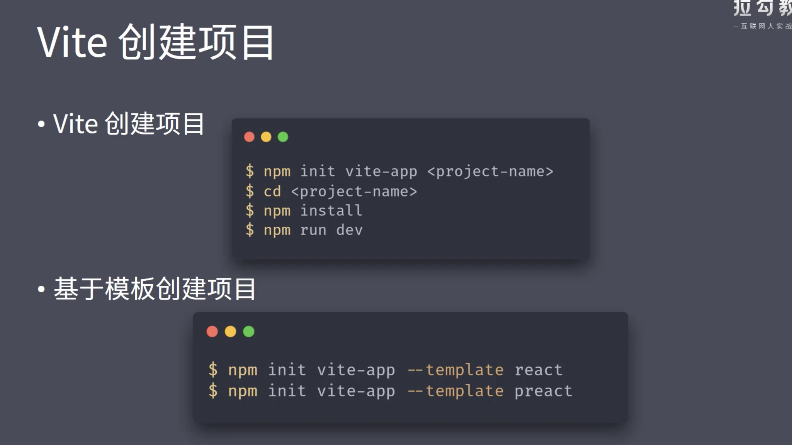
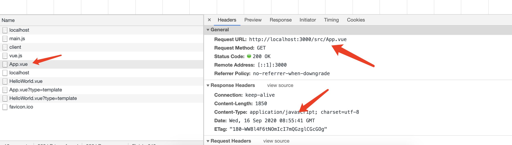
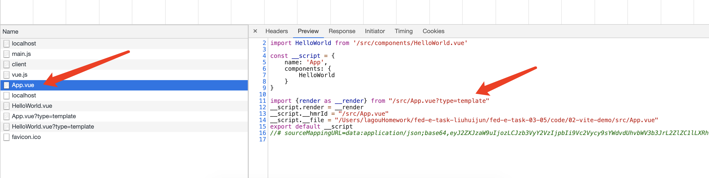
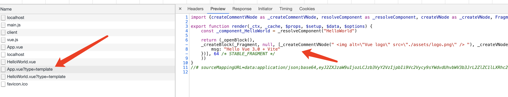
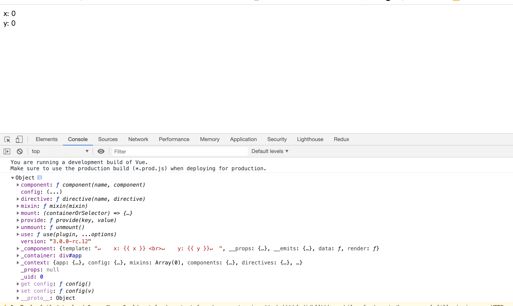
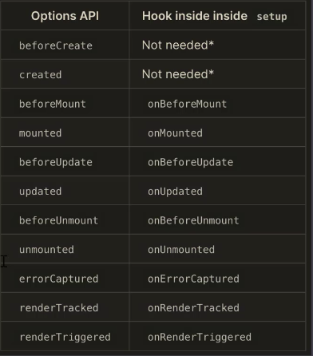
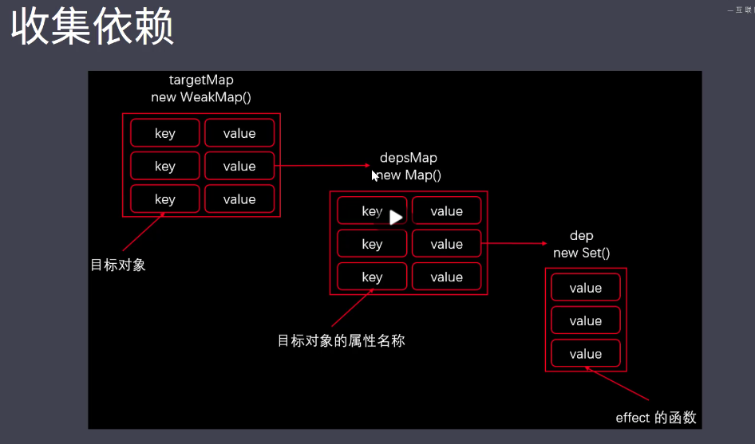
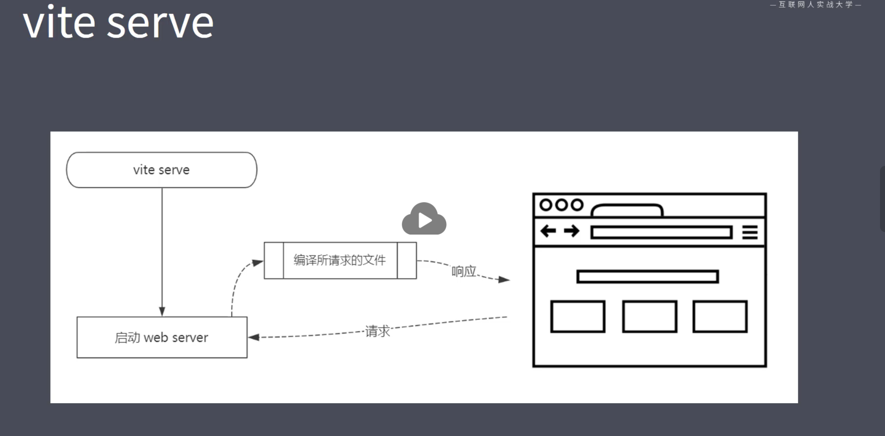
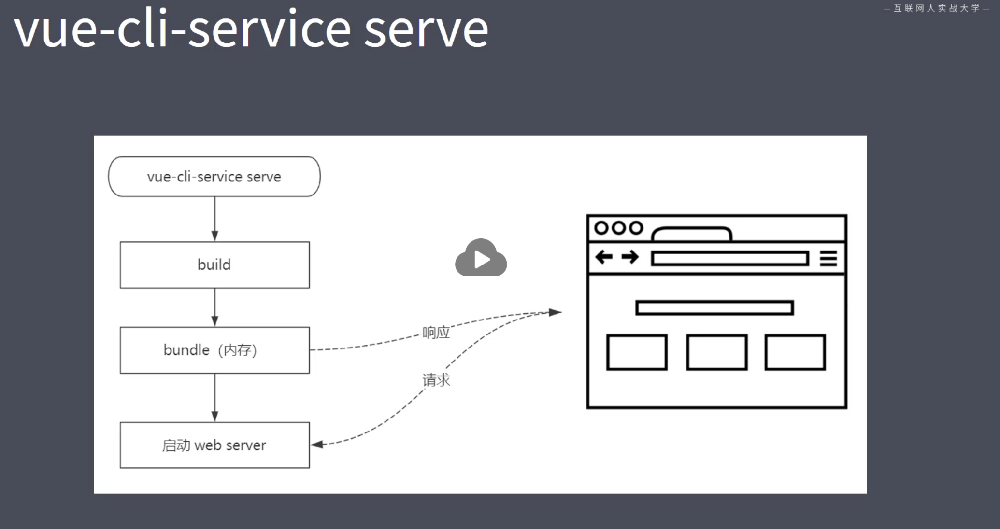

## Vue.js 3.0 Composition APIs 及 3.0 原理剖析 （项目见：<https://github.com/smallSix6/fed-e-task-liuhuijun/tree/master/fed-e-task-03-05>

### 任务一：Vue 3.0 介绍
#### 1、Vue 3.0 源码组织方式
+ 源码组织方式：
  + 源码采用 ts 重写
  + 使用 Monorepo 管理项目结构
  + packages 目录结构
    + 
    + compiler-core: 和平台无关的编译器代码
    + compiler-dom: 浏览器平台下的编译器代码(依赖于 compiler-core)
    + compiler-sfc: 编译单文件组件的代码(依赖于 compiler-core 和 compiler-dom)
    + compiler-ssr: 服务端渲染的编译器（依赖于 compiler-dom）
    + reactivity: 数据响应式的代码，可以独立使用
    + runtime-core: 和平台无关的运行时代码
    + runtime-dom: 浏览器下的运行时代码，处理原生 DOM 和事件等
    + runtime-test: 测试时的运行时代码
    + server-renderer: 服务端渲染
    + shared: 共用的 API
    + size-check: tree-shaking 之后检查包的大小
    + template-explorer: 针对浏览器编译时，会输出 render 函数
    + vue: 构建完整版的 Vue(依赖于 compiler 和 runtime)
#### 2、不同的构建版本
+ 
+ cjs（完整版）
  + vue.cjs.js: 开发版(未压缩)
  + vue.cjs.prod.js: 生产版
+ global
  + 完整版：
    + vue.global.js: 
    + vue.global.prod.js
  + 运行时版本：
    + vue.runtime.global.js
    + vue.runtime.global.prod.js
+ browser(浏览器 esm 版本):
  + 完整版
    + vue.esm-browser.js
    + vue.esm-browser.prod.js
  + 运行时
    + vue.runtime.esm-browser.js
    + vue.runtime.esm-browser.prod.js
+ bundler（没有打包所有的代码，需要配合打包工具来使用）
  + vue.esm-bundler.js
  + vue.runtime.esm-bundler.js
#### 3、Composition API 
+ RFC(Request For Comments): https://github.com/vuejs/rfcs
+ Composition API RFC: https://composition-api.vuejs.org
+ Options API（vue 2.0）
  + 
  + 包含一个描述组件选项（data、methods、props 等）的对象
  + Options API 开发复杂组件，同一个功能逻辑的代码被拆分到不同选项
+ Composition API
  + 
  + Vue.js 3.0 新增的一组 API
  + 一组基于函数的 API
  + 可以更灵活的组织组件的逻辑
+ 
#### 4、性能提升
+ 响应式系统升级
  + Vue.js 2.x 中响应式系统的核心 defineProperty（即使没有给属性赋值，初始化实例的时候也会递归调用 defineProperty）
  + Vue.js 3.0 中使用 Proxy 对象重写响应式系统
    + 可以监听动态新增的属性
    + 可以监听删除的属性
    + 可以监听数组的索引和 length 属性
+ 编译优化
  + Vue.js 2.x 中通过标记静态根节点，优化 diff 的过程
  + Vue.js 3.0 中标记和提升所有的静态节点，diff 的时候只需要对比动态节点内容
    + Fragments(升级 vrtur 插件)
      + vue 代码片段如下；
      + 
      + 有根节点的时候 render 函数的返回结果如下图：
      + 
      + 没有根节点的时候 render 函数的返回结果如下图：
      + 
      + 对比上面两张图，可以看出，有根节点的时候 render 函数会调用 _createBlock 创建 div 的根节点；没有根节点的时候 render 函数会调用 _createBlock 创建 Fragment 节点。然后调用 _createVNode 来创建节点
    + 静态提升
      + .png)
      + 上图可以看出，vue3.0 会提取出静态节点，优化 diff 算法
    + Patch flag
      + 
      + 上图中标记了该节点动态绑定了 text 和 props 为 [id] 的属性数组，所以在 diff 的时候只需要比较 text 和 id 属性即可
    + 缓存事件处理函数
      + 没有开启事件缓存的时候
        + 
      + 开启时间缓存的时候
        + 
      + 对比上面两图可以看出，开启了事件缓存的时候在第一轮之后的 render 都会判断是否有了第一次 render 时候的函数，有了则去缓存 
+ 源码体积的优化
  + Vue3.0 中移除了一些不常用的 APU
    + 例如：inline-template, filter 等
  + Tree-shaking
#### 5、vite
+ 现代浏览器都支持 ES Module (IE 不支持)
+ 通过下面的方式加载模块
  ```js
  <script type="module" src="..."></script>
  ```
+ 支持模块的 script 默认延迟加载
  + 类似于 script 标签设置 defer
  + 在文档解析完成后，触发 DOMContentLoaded 事件前执行
  + 案例目录结构如下：
    + 01-esmodule
      + modules
        + index.js
        ```js
        import { forEach } from './utils.js'
        const app = document.querySelector('#app')
        console.log(app.innerHTML)
        const arr = [1, 2, 3]
        forEach(arr, item => {
          console.log(item)
        })
        ```
        + utils.js
        ```js
        export const forEach = (array, fn) => {
          let i
          for (i = 0; i < array.length; i++) {
            fn(array[i])
          }
        }

        export const some = (array, fn) => {
          let result = true
          for (const value of array) {
            result = result || fn(value)
            if (result) {
              break
            }
          }
          return result
        }
        ```
      + index.html 
      ```js
      <!DOCTYPE html>
      <html lang="en">
      <head>
        <meta charset="UTF-8">
        <meta name="viewport" content="width=device-width, initial-scale=1.0">
        <title>Document</title>
      </head>
      <body>
        <div id="app">Hello World</div>
        <script>
          window.addEventListener('DOMContentLoaded', () => {
            console.log('DOMContentLoaded')
          })

        </script>
        <script type="module" src="./modules/index.js"></script>
      </body>
      </html>
      ```
  + 运行 `npx serve .` 命令，打印如下：
  ```js
  Hello World
  1
  2
  3
  DOMContentLoaded
  ```
+ Vite as Vue-CLI
  + Vite 在开发模式下不需要打包可以直接运行
  + Vue-CLI 开发模式下必须对项目打包才可以运行
  + Vite 在生产环境下使用 Rollup 打包
    + 基于 ES Module 的打包
  + Vue-CLI 在生产环境下使用 webpack 打包
  + Vite 特点：
    + 快速冷启动
    + 按需编译
    + 模块热更新
+ vite 创建项目方式如下：
+ 
+ 创建完 vite 项目后，运行项目，在浏览器中打开项目，查看 network，会发现有很多 .vue 结尾的请求，.vue 文件的渲染如下：
+  
+  
+ 上图中的代码 `import {render as __render} from "/src/App.vue?type=template"` 会在服务器端经过 compiler.sfc 模块的解析，返回的结果如下图
+  

### 任务二： Composition API
#### 1、Composition API 初试
+ createApp 方法
```js
<!DOCTYPE html>
<html lang="en">

<head>
  <meta charset="UTF-8">
  <meta name="viewport" content="width=device-width, initial-scale=1.0">
  <title>Document</title>
</head>

<body>
  <div id="app">
    x: {{ x }} <br>
    y: {{ y }}
  </div>
  <script type="module">
    import { createApp } from './node_modules/vue/dist/vue.esm-browser.js'

    const app = createApp({
      data() {
        return {
          x: 0,
          y: 0
        }
      }
    })
    console.log(app)

    app.mount('#app')
  </script>
</body>

</html>
```
+ 
+ setup: props 被解析完毕，但是组件实例创建之前执行的，所以 setup 内部无法获取实例，因为实例还未被创建
```js
<!DOCTYPE html>
<html lang="en">

<head>
  <meta charset="UTF-8">
  <meta name="viewport" content="width=device-width, initial-scale=1.0">
  <title>Document</title>
</head>

<body>
  <div id="app">
    x: {{ position.x }} <br>
    y: {{ position.y }}
  </div>
  <script type="module">
    // import { createApp, reactive, onMounted, onUnmounted, toRefs } from './node_modules/vue/dist/vue.esm-browser.js'
    import { createApp } from './node_modules/vue/dist/vue.esm-browser.js'

    const app = createApp({
      setup() {
        // 第一个参数 props
        // 第二个参数 context：attrs、emit、slots
        const position = {
          x: 0,
          y: 0
        }
        return {
          position
        }
      },
      mounted() {
        this.position.x = 100
      }
    })
    console.log(app)

    app.mount('#app')
  </script>
</body>

</html>
```
+ reactive: 设置响应式对象
```js
import { reactive, createApp } from './node_modules/vue/dist/vue.esm-browser.js'
setup() {
  // 第一个参数 props
  // 第二个参数 context：attrs、emit、slots
  const position = reactive({
    x: 0,
    y: 0
  })
  return {
    position
  }
},
```
#### 2、生命周期钩子函数
+ 
```js
<!DOCTYPE html>
<html lang="en">

<head>
  <meta charset="UTF-8">
  <meta name="viewport" content="width=device-width, initial-scale=1.0">
  <title>Document</title>
</head>

<body>
  <div id="app">
    x: {{ x }} <br>
    y: {{ y }}
  </div>
  <script type="module">
    import { reactive, createApp, onMounted, onUnmounted, toRefs } from './node_modules/vue/dist/vue.esm-browser.js'
    function useMousePosition() {
      const position = reactive({
        x: 0,
        y: 0
      })
      const update = e => {
        position.x = e.pageX
        position.y = e.pageY
      }
      onMounted(() => {
        window.addEventListener('mousemove', update)
      })
      onUnmounted(() => {
        window.removeEventListener('mousemove', update)
      })
      return toRefs(position)
    }
    const app = createApp({
      setup() {
        // 第一个参数 props
        // 第二个参数 context：attrs、emit、slots
        const { x, y } = useMousePosition()
        return {
          x, y
        }
      },
      mounted() {
        // this.position.x = 100
      }
    })
    console.log(app)

    app.mount('#app')
  </script>
</body>

</html>
```
#### 3、reactive-toRefs-ref
+ racctive: 把对象转化为响应式对象
+ ref: 把基本类型的数据转化为响应式的对象
+ toRefs: 把所有代理对象中的属性全部转化为响应式对象
+ ref 的代码如下：
```js
<!DOCTYPE html>
<html lang="en">
<head>
  <meta charset="UTF-8">
  <meta name="viewport" content="width=device-width, initial-scale=1.0">
  <title>Document</title>
</head>
<body>
  <div id="app">
    <button @click="increase">按钮</button>
    <span>{{ count }}</span>
  </div>
  <script type="module">
    import { createApp, ref } from './node_modules/vue/dist/vue.esm-browser.js'
    
    function useCount () {
      const count = ref(0)
      return {
        count,
        increase: () => {
          count.value++
        }
      }
    }

    createApp({
      setup () {
        return {
          ...useCount()
        }        
      }
    }).mount('#app')
  </script>
</body>
</html>
```
#### 4、computed
```js
<!DOCTYPE html>
<html lang="en">
<head>
  <meta charset="UTF-8">
  <meta name="viewport" content="width=device-width, initial-scale=1.0">
  <title>Document</title>
</head>
<body>
  <div id="app">
    <button @click="push">按钮</button>
    未完成：{{ activeCount }}
  </div>
  <script type="module">
    import { createApp, reactive, computed } from './node_modules/vue/dist/vue.esm-browser.js'
    const data = [
      { text: '看书', completed: false },
      { text: '敲代码', completed: false },
      { text: '约会', completed: true }
    ]

    createApp({
      setup () {
        const todos = reactive(data)

        const activeCount = computed(() => {
          return todos.filter(item => !item.completed).length
        })

        return {
          activeCount,
          push: () => {
            todos.push({
              text: '开会',
              completed: false
            })
          }
        }
      }
    }).mount('#app')
  </script>
</body>
</html>
```
#### 5、watch
+ Watch 的三个参数：
  + 第一个参数：要监听的数据
  + 第二个参数：监听到数据变化后执行的函数，这个函数有两个参数分别是新值和旧值
  + 第三个参数：选项对象，deep 和 immediate
+ Watch 的返回值：
  + 取消监听的函数
```js
<!DOCTYPE html>
<html lang="en">
<head>
  <meta charset="UTF-8">
  <meta name="viewport" content="width=device-width, initial-scale=1.0">
  <title>Document</title>
</head>
<body>
  <div id="app">
    <p>
      请问一个 yes/no 的问题:
      <input v-model="question">
    </p>
    <p>{{ answer }}</p>
  </div>

  <script type="module">
    // https://www.yesno.wtf/api
    import { createApp, ref, watch } from './node_modules/vue/dist/vue.esm-browser.js'

    createApp({
      setup () {
        const question = ref('')
        const answer = ref('')

        watch(question, async (newValue, oldValue) => {
          const response = await fetch('https://www.yesno.wtf/api')
          const data = await response.json()
          answer.value = data.answer
        })

        return {
          question,
          answer
        }
      }
    }).mount('#app')
  </script>
</body>
</html>
```
#### 6、watchEffect
+ WatchEffect:
  + 是 watch 函数的简化版本，也用来监视数据的变化
  + 接收一个函数作为参数，监听函数内部响应式数据的变化
  + 返回值是一个取消监听的函数
```js
<!DOCTYPE html>
<html lang="en">
<head>
  <meta charset="UTF-8">
  <meta name="viewport" content="width=device-width, initial-scale=1.0">
  <title>Document</title>
</head>
<body>
  <div id="app">
    <button @click="increase">increase</button>
    <button @click="stop">stop</button>
    <br>
    {{ count }}
  </div>

  <script type="module">
    import { createApp, ref, watchEffect } from './node_modules/vue/dist/vue.esm-browser.js'

    createApp({
      setup () {
        const count = ref(0)
        const stop = watchEffect(() => {
          console.log(count.value)
        })

        return {
          count,
          stop,
          increase: () => {
            count.value++
          }
        }
      }
    }).mount('#app')
  </script>
</body>
</html>
```
#### 7、todolist-功能演示
+ 案例见 ../code/04-todolist


### 任务三：Vue.js 3.0 响应式系统原理
#### 1、响应式系统原理-介绍
+ vue.js 响应式回顾
  + Proxy 对象实现属性监听
  + 多层属性嵌套，在访问属性过程中处理下一级属性
  + 默认监听动态添加的属性
  + 默认监听属性的删除操作
  + 默认监听数组索引和 length 属性
  + 可以作为单独的模块使用
+ 核心方法
  + reactive/ref/toRefs/computed
  + effect
  + track
  + trigger
#### 2、Proxy对象回顾
+ 问题1： set 和 deleteProperty 中需要返回布尔类型的值,在严格模式下，如果返回 false 的话会出现 Type Error 的异常
+ 问题2：
  + Proxy 和 Reflect 中使用的 receiver，
  + Proxy 中 receiver：Proxy 或者继承 Proxy 的对象
  + Reflect 中 receiver：如果 target 对象中设置了 getter，getter 中的 this 指向 receiver
  ```js
    const obj = {
      get foo() {
        console.log(this)
        return this.bar
      }
    }

    const proxy = new Proxy(obj, {
      get(target, key, receiver) {
        console.log(1111)
        if (key === 'bar') {
          return 'value - bar'
        }
        return Reflect.get(target, key, receiver)
      }
    })
    console.log(proxy.foo)
  ```
#### 3、reactive
+ reactive
  + 接收一个参数，判断这参数是否是对象
  + 创建拦截器对象 handler, 设置 get/set/deleteProperty
  + 返回 Proxy 对象
+ index.html 中的代码：
```js
<!DOCTYPE html>
<html lang="en">

<head>
  <meta charset="UTF-8">
  <meta name="viewport" content="width=device-width, initial-scale=1.0">
  <title>Document</title>
</head>

<body>
  <script type="module">
    import { reactive } from './reactivity/index.js'
    const obj = reactive({
      name: 'zs',
      age: 18
    })
    obj.name = 'lisi'
    delete obj.age
    console.log(obj)
  </script>
</body>

</html>
```
+ ./reactivity/index.js 中的代码：
```js
const isObject = val => val !== null && typeof val === 'object'
const convert = target => isObject(target) ? reactive(target) : target
const hasOwnProperty = Object.prototype.hasOwnProperty
const hasOwn = (target, key) => hasOwnProperty.call(target, key)

export function reactive(target) {
  if (!isObject(target)) return target

  const handler = {
    get(target, key, receiver) {
      // 收集依赖
      track(target, key)
      const result = Reflect.get(target, key, receiver)
      return convert(result)
    },
    set(target, key, value, receiver) {
      const oldValue = Reflect.get(target, key, receiver)
      let result = true
      if (oldValue !== value) {
        result = Reflect.set(target, key, value, receiver)
        // 触发更新
        // trigger(target, key)
        console.log('set', key, value)
      }
      return result
    },
    deleteProperty(target, key) {
      const hadKey = hasOwn(target, key)
      const result = Reflect.deleteProperty(target, key)
      console.log(222, hadKey, result)
      if (hadKey && result) {
        // 触发更新
        console.log('delete', key)
        trigger(target, key)
      }
      return result
    }
  }

  return new Proxy(target, handler)
}
```
#### 4、收集依赖
+ 
#### 5、effect-track
+ ```js
  const isObject = val => val !== null && typeof val === 'object'
  const convert = target => isObject(target) ? reactive(target) : target
  const hasOwnProperty = Object.prototype.hasOwnProperty
  const hasOwn = (target, key) => hasOwnProperty.call(target, key)

  export function reactive(target) {
    if (!isObject(target)) return target

    const handler = {
      get(target, key, receiver) {
        // 收集依赖
        track(target, key)
        const result = Reflect.get(target, key, receiver)
        return convert(result)
      },
      ...
  }

  let activeEffect = null
  export function effect(callback) {
    activeEffect = callback
    callback() // 访问响应式对象属性，去收集依赖
    activeEffect = null
  }

  let targetMap = new WeakMap()
  export function track (target, key) {
    if (!activeEffect) return
  let depsMap = targetMap.get(target)
  if (!depsMap) {
    targetMap.set(target, (depsMap = new Map()))
  }
  let dep = depsMap.get(key)
  if (!dep) {
    depsMap.set(key, (dep = new Set()))
  }
  dep.add(activeEffect)
  }
  ```
#### 6、trigger
+ 02-effect-html 中的代码：
```js
<!DOCTYPE html>
<html lang="en">
<head>
  <meta charset="UTF-8">
  <meta name="viewport" content="width=device-width, initial-scale=1.0">
  <title>Document</title>
</head>
<body>
  <script type="module">
    import { reactive, effect } from './reactivity/index.js'

    const product = reactive({
      name: 'iPhone',
      price: 5000,
      count: 3
    })
    let total = 0 
    effect(() => {
      total = product.price * product.count
    })
    console.log(total)

    product.price = 4000
    console.log(total)

    product.count = 1
    console.log(total)

  </script>
</body>
</html>
```
+ ./reactivity/index.js 中的代码：
```js
const isObject = val => val !== null && typeof val === 'object'
const convert = target => isObject(target) ? reactive(target) : target
const hasOwnProperty = Object.prototype.hasOwnProperty
const hasOwn = (target, key) => hasOwnProperty.call(target, key)

export function reactive(target) {
  if (!isObject(target)) return target

  const handler = {
    ...
    set(target, key, value, receiver) {
      ...
      if (oldValue !== value) {
        result = Reflect.set(target, key, value, receiver)
        // 触发更新
        trigger(target, key)
      }
      return result
    },
    deleteProperty(target, key) {
      ...
      if (hadKey && result) {
        // 触发更新
        console.log('delete', key)
        trigger(target, key)
      }
      return result
    }
  }

  return new Proxy(target, handler)
}
 ...
export function trigger(target, key) {
  const depsMap = targetMap.get(target)
  if (!depsMap) return
  const dep = depsMap.get(key)
  if (dep) {
    dep.forEach(effect => {
      effect()
    })
  }
}

```
#### 7、ref
+ reactive vs ref
  + ref可以把基本数据类型数据转换成响应式对象
  + ref返回的对象，重新赋值成对象也是响应式的
  + reactive返回的对象，重新赋值丢失响应式
  + reactive返回的对象不可解构
+ reactive
```js
const product = reactive({
  name: 'iPhone',
  price: 5000,
  count: 3
})
```
+ ref
```js
const price = ref(5000)
const count = ref(3)
```
+ ref 的实现：
```js
export function ref(raw) {
  // 判断 raw 是否是 ref 创建的对象，如果是的话直接返回
  if (isObject(raw) && raw.__v_isRef) {
    return
  }
  let value = convert(raw)
  const r = {
    __v_isRef: true,
    get value() {
      track(r, 'value')
      return value
    },
    set value(newValue) {
      if (newValue !== value) {
        raw = newValue;
        value = convert(raw)
        trigger(r, 'value')
      }
    }
  }
  return r
}
```
#### 8、toRefs
+ 04-toRefs.html 中的代码：
```js
<!DOCTYPE html>
<html lang="en">
<head>
  <meta charset="UTF-8">
  <meta name="viewport" content="width=device-width, initial-scale=1.0">
  <title>Document</title>
</head>
<body>
  <script type="module">
    import { reactive, effect, toRefs } from './reactivity/index.js'

    function useProduct () {
      const product = reactive({
        name: 'iPhone',
        price: 5000,
        count: 3
      })
      
      return toRefs(product)
    }

    const { price, count } = useProduct()


    let total = 0 
    effect(() => {
      total = price.value * count.value
    })
    console.log(total)

    price.value = 4000
    console.log(total)

    count.value = 1
    console.log(total)

  </script>
</body>
</html>
```
+ ./reactivity/index.js 中的代码:
```js
...
export function ref(raw) {
  // 判断 raw 是否是 ref 创建的对象，如果是的话直接返回
  if (isObject(raw) && raw.__v_isRef) {
    return
  }
  let value = convert(raw)
  const r = {
    __v_isRef: true,
    get value() {
      track(r, 'value')
      return value
    },
    set value(newValue) {
      if (newValue !== value) {
        raw = newValue;
        value = convert(raw)
        trigger(r, 'value')
      }
    }
  }
  return r
}

export function toRefs(proxy) {
  const ret = proxy instanceof Array ? new Array(proxy.length) : {}
  for (const key in proxy) {
    ret[key] = toProxyRef(proxy, key)
  }
  return ret
}

function toProxyRef(proxy, key) {
  const r = {
    __v_isRef: true,
    get value() {
      return proxy[key]
    },
    set value(newValue) {
      proxy[key] = newValue
    }
  }
  return r
}

```
#### 9、computed
+ 05-computed.html 中的代码：
```js
<!DOCTYPE html>
<html lang="en">
<head>
  <meta charset="UTF-8">
  <meta name="viewport" content="width=device-width, initial-scale=1.0">
  <title>Document</title>
</head>
<body>
  <script type="module">
    import { reactive, effect, computed } from './reactivity/index.js'

    const product = reactive({
      name: 'iPhone',
      price: 5000,
      count: 3
    })
    let total = computed(() => {
      return product.price * product.count
    })
   
    console.log(total.value)

    product.price = 4000
    console.log(total.value)

    product.count = 1
    console.log(total.value)

  </script>
</body>
</html>
```
+ ./reactivity/index.js 中的代码：
```js
...
export function computed(getter) {
  const result = ref()
  effect(() => (result.value = getter()))
  return result
}
```

### 任务四：Vite 实现原理
#### 1、Vite 
+ Vite 概念：
  + Vite 是一个面向现代浏览器的一个更轻、更快的 Web 应用开发工具
  + 它基于 ECMAScript 标准原生模块系统 （ES Modules) 实现
+ Vite 项目依赖
  + Vite
  + @vue/compiler-sfc
+ 基础使用
  + vite serve
  + vite build
+ vite serve
+ 
+ vue-cli-service serve
+ 
+ HMR
  + Vite HMR
    + 立即编译当前所修改的文件
  + Webpack HMR
    + 会自动以这个文件为入口重写 build 一次，所有的涉及到的依赖也都会被加载一遍
+ Build
  + vite build
    + Rollup
    + Dynamic import
      + Polyfill
+ 打包 or 不打包
  + 使用 webpack 打包的两个原因：
    + 浏览器环境并不支持模块化
    + 零散的模块文件会产生大量的 HTTP 请求
+ 开箱即用：
  + TypeScript - 内置支持
  + less/sass/stylus/postcss - 内置支持（需要单独安装）
  + JSX
  + Web Assembly
+ Vite特性
  + 快速冷启动
  + 模块热更新
  + 按需编译
  + 开箱即用


#### 2、vite 实现原理
+ Vite 核心功能
  + 静态 Web 服务器
    + vite-cli
      + package.json
      ```js
      {
        "name": "vite-cli",
        "version": "1.0.0",
        "description": "",
        "main": "index.js",
        "bin": "newIndex.js",
        "scripts": {
          "test": "echo \"Error: no test specified\" && exit 1"
        },
        "keywords": [],
        "author": "",
        "license": "ISC",
        "dependencies": {
          "@vue/compiler-sfc": "^3.0.0-rc.10",
          "koa": "^2.13.0",
          "koa-send": "^5.0.1"
        }
      }
      ```
      + newIndex.js
      ```js
      #!/usr/bin/env node
      const path = require('path')
      const { Readable } = require('stream')
      const Koa = require('koa')
      const send = require('koa-send')
      const compilerSFC = require('@vue/compiler-sfc')

      const app = new Koa()

      // 1. 静态文件服务器
      app.use(async (ctx, next) => {
        await send(ctx, ctx.path, { root: process.cwd(), index: 'index.html' })
        await next()
      })

      app.listen(3000)
      console.log('Server running @ http://localhost:3000')
      ```
      + 执行 `npm link`到全局，就可以使用 `vite-cli` 命令启动本地服务了
    + 修改第三方模块的路径
      + newIndex.js 修改代码如下：
      ```js
      #!/usr/bin/env node
      const path = require('path')
      const { Readable } = require('stream')
      const Koa = require('koa')
      const send = require('koa-send')
      const compilerSFC = require('@vue/compiler-sfc')

      const app = new Koa()

      const streamToString = stream => new Promise((resolve, reject) => {
        const chunks = []
        stream.on('data', chunk => chunks.push(chunk))
        stream.on('end', () => resolve(Buffer.concat(chunks).toString('utf-8')))
        stream.on('error', reject)
      })

      const stringToStream = text => {
        const stream = new Readable()
        stream.push(text)
        stream.push(null)
        return stream
      }


      // 1. 静态文件服务器
      app.use(async (ctx, next) => {
        await send(ctx, ctx.path, { root: process.cwd(), index: 'index.html' })
        await next()
      })

      // 2. 修改第三方模块的路径
      app.use(async (ctx, next) => {
        if (ctx.type === 'application/javascript') {
          const contents = await streamToString(ctx.body)
          // import vue from 'vue'
          // import App from './App.vue'
          ctx.body = contents
            .replace(/(from\s+['"])(?![\.\/])/g, '$1/@modules/')
        }
      })

      app.listen(3000)
      console.log('Server running @ http://localhost:3000')
      ```
    + 加载第三方模块
      + newIndex.js 修改代码如下：
      ```js
      #!/usr/bin/env node
      const path = require('path')
      const { Readable } = require('stream')
      const Koa = require('koa')
      const send = require('koa-send')
      const compilerSFC = require('@vue/compiler-sfc')

      const app = new Koa()

      const streamToString = stream => new Promise((resolve, reject) => {
        const chunks = []
        stream.on('data', chunk => chunks.push(chunk))
        stream.on('end', () => resolve(Buffer.concat(chunks).toString('utf-8')))
        stream.on('error', reject)
      })

      const stringToStream = text => {
        const stream = new Readable()
        stream.push(text)
        stream.push(null)
        return stream
      }
      // 3. 加载第三方模块
      app.use(async (ctx, next) => {
        // ctx.path --> /@modules/vue
        if (ctx.path.startsWith('/@modules/')) {
          const moduleName = ctx.path.substr(10)
          const pkgPath = path.join(process.cwd(), 'node_modules', moduleName, 'package.json')
          const pkg = require(pkgPath)
          ctx.path = path.join('/node_modules', moduleName, pkg.module)
        }
        await next()
      })

      // 1. 静态文件服务器
      app.use(async (ctx, next) => {
        await send(ctx, ctx.path, { root: process.cwd(), index: 'index.html' })
        await next()
      })

      // 2. 修改第三方模块的路径
      app.use(async (ctx, next) => {
        if (ctx.type === 'application/javascript') {
          const contents = await streamToString(ctx.body)
          // import vue from 'vue'
          // import App from './App.vue'
          ctx.body = contents
            .replace(/(from\s+['"])(?![\.\/])/g, '$1/@modules/')
        }
      })


      app.listen(3000)
      console.log('Server running @ http://localhost:3000')

      ```
  + 编译单文件组件
    + 拦截浏览器不识别的模块，并处理
    + newIndex.js 修改代码如下:
    ```js
    #!/usr/bin/env node
    const path = require('path')
    const { Readable } = require('stream')
    const Koa = require('koa')
    const send = require('koa-send')
    const compilerSFC = require('@vue/compiler-sfc')

    const app = new Koa()

    const streamToString = stream => new Promise((resolve, reject) => {
      const chunks = []
      stream.on('data', chunk => chunks.push(chunk))
      stream.on('end', () => resolve(Buffer.concat(chunks).toString('utf-8')))
      stream.on('error', reject)
    })

    const stringToStream = text => {
      const stream = new Readable()
      stream.push(text)
      stream.push(null)
      return stream
    }

    // 3. 加载第三方模块
    app.use(async (ctx, next) => {
      // ctx.path --> /@modules/vue
      if (ctx.path.startsWith('/@modules/')) {
        const moduleName = ctx.path.substr(10)
        const pkgPath = path.join(process.cwd(), 'node_modules', moduleName, 'package.json')
        const pkg = require(pkgPath)
        ctx.path = path.join('/node_modules', moduleName, pkg.module)
      }
      await next()
    })

    // 1. 静态文件服务器
    app.use(async (ctx, next) => {
      await send(ctx, ctx.path, { root: process.cwd(), index: 'index.html' })
      await next()
    })

    // 4. 处理单文件组件
    app.use(async (ctx, next) => {
      if (ctx.path.endsWith('.vue')) {
        const contents = await streamToString(ctx.body)
        const { descriptor } = compilerSFC.parse(contents)
        let code
        if (!ctx.query.type) {
          code = descriptor.script.content
          // console.log(code)
          code = code.replace(/export\s+default\s+/g, 'const __script = ')
          code += `
          import { render as __render } from "${ctx.path}?type=template"
          __script.render = __render
          export default __script
          `
        } else if (ctx.query.type === 'template') {
          const templateRender = compilerSFC.compileTemplate({ source: descriptor.template.content })
          code = templateRender.code
        }
        ctx.type = 'application/javascript'
        ctx.body = stringToStream(code)
      }
      await next()
    })

    // 2. 修改第三方模块的路径
    app.use(async (ctx, next) => {
      if (ctx.type === 'application/javascript') {
        const contents = await streamToString(ctx.body)
        // import vue from 'vue'
        // import App from './App.vue'
        ctx.body = contents
          .replace(/(from\s+['"])(?![\.\/])/g, '$1/@modules/')
          .replace(/process\.env\.NODE_ENV/g, '"development"')
      }
    })

    app.listen(3000)
    console.log('Server running @ http://localhost:3000')
    ```
  + HMR