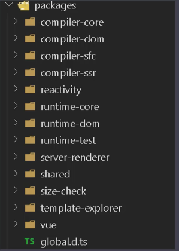
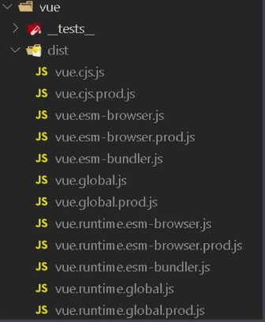
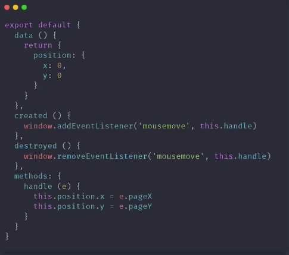
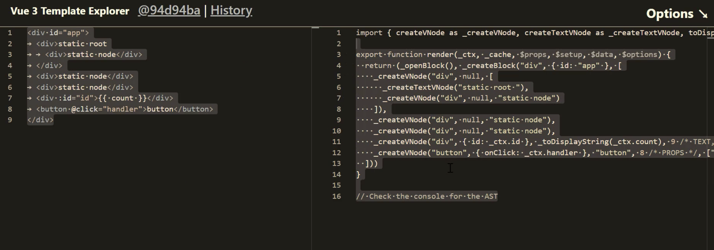
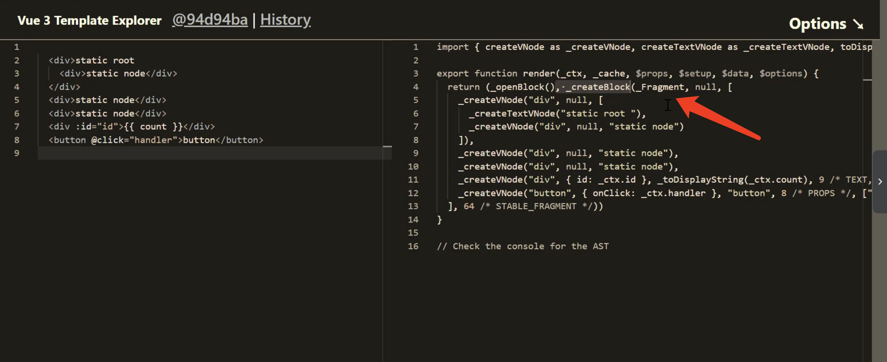
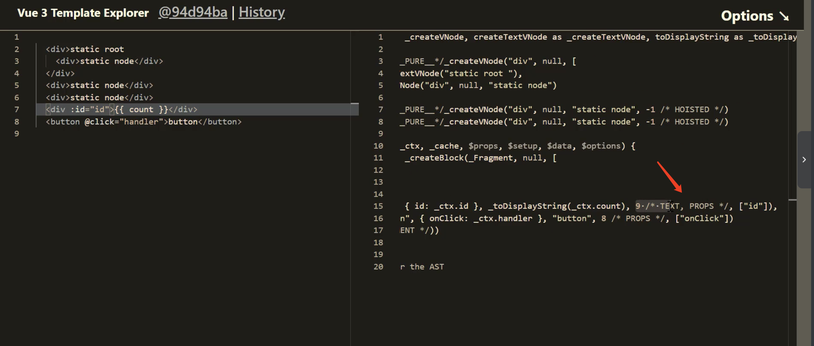
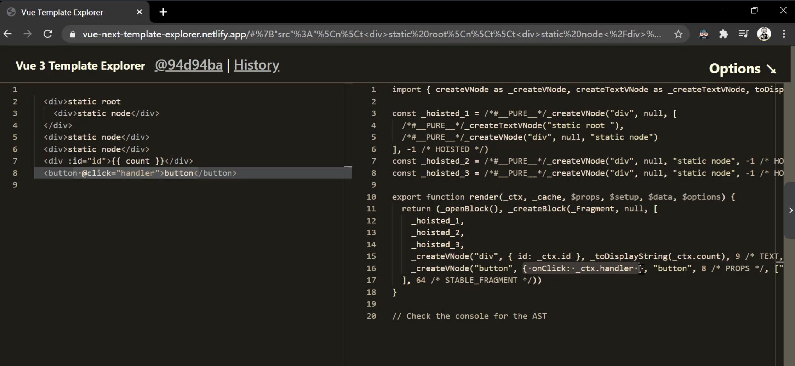

## Vue.js 3.0 Composition APIs 及 3.0 原理剖析 （项目见：<https://github.com/smallSix6/fed-e-task-liuhuijun/tree/master/fed-e-task-03-05>

### 任务一：Vue 3.0 介绍
#### 1、Vue 3.0 源码组织方式
+ 源码组织方式：
  + 源码采用 ts 重写
  + 使用 Monorepo 管理项目结构
  + packages 目录结构
    + 
    + compiler-core: 和平台无关的编译器代码
    + compiler-dom: 浏览器平台下的编译器代码(依赖于 compiler-core)
    + compiler-sfc: 编译单文件组件的代码(依赖于 compiler-core 和 compiler-dom)
    + compiler-ssr: 服务端渲染的编译器（依赖于 compiler-dom）
    + reactivity: 数据响应式的代码，可以独立使用
    + runtime-core: 和平台无关的运行时代码
    + runtime-dom: 浏览器下的运行时代码，处理原生 DOM 和事件等
    + runtime-test: 测试时的运行时代码
    + server-renderer: 服务端渲染
    + shared: 共用的 API
    + size-check: tree-shaking 之后检查包的大小
    + template-explorer: 针对浏览器编译时，会输出 render 函数
    + vue: 构建完整版的 Vue(依赖于 compiler 和 runtime)
#### 2、不同的构建版本
+ 
+ cjs（完整版）
  + vue.cjs.js: 开发版(未压缩)
  + vue.cjs.prod.js: 生产版
+ global
  + 完整版：
    + vue.global.js: 
    + vue.global.prod.js
  + 运行时版本：
    + vue.runtime.global.js
    + vue.runtime.global.prod.js
+ browser(浏览器 esm 版本):
  + 完整版
    + vue.esm-browser.js
    + vue.esm-browser.prod.js
  + 运行时
    + vue.runtime.esm-browser.js
    + vue.runtime.esm-browser.prod.js
+ bundler（没有打包所有的代码，需要配合打包工具来使用）
  + vue.esm-bundler.js
  + vue.runtime.esm-bundler.js
#### 3、Composition API 
+ RFC(Request For Comments): https://github.com/vuejs/rfcs
+ Composition API RFC: https://composition-api.vuejs.org
+ Options API（vue 2.0）
  + 
  + 包含一个描述组件选项（data、methods、props 等）的对象
  + Options API 开发复杂组件，同一个功能逻辑的代码被拆分到不同选项
+ Composition API
  + 
  + Vue.js 3.0 新增的一组 API
  + 一组基于函数的 API
  + 可以更灵活的组织组件的逻辑
+ 
#### 4、性能提升
+ 响应式系统升级
  + Vue.js 2.x 中响应式系统的核心 defineProperty（即使没有给属性赋值，初始化实例的时候也会递归调用 defineProperty）
  + Vue.js 3.0 中使用 Proxy 对象重写响应式系统
    + 可以监听动态新增的属性
    + 可以监听删除的属性
    + 可以监听数组的索引和 length 属性
+ 编译优化
  + Vue.js 2.x 中通过标记静态根节点，优化 diff 的过程
  + Vue.js 3.0 中标记和提升所有的静态节点，diff 的时候只需要对比动态节点内容
    + Fragments(升级 vrtur 插件)
      + vue 代码片段如下；
      + 
      + 有根节点的时候 render 函数的返回结果如下图：
      + 
      + 没有根节点的时候 render 函数的返回结果如下图：
      + 
      + 对比上面两张图，可以看出，有根节点的时候 render 函数会调用 _createBlock 创建 div 的根节点；没有根节点的时候 render 函数会调用 _createBlock 创建 Fragment 节点。然后调用 _createVNode 来创建节点
    + 静态提升
      + .png)
      + 上图可以看出，vue3.0 会提取出静态节点，优化 diff 算法
    + Patch flag
      + 
      + 上图中标记了该节点动态绑定了 text 和 props 为 [id] 的属性数组，所以在 diff 的时候只需要比较 text 和 id 属性即可
    + 缓存事件处理函数
      + 没有开启事件缓存的时候
        + 
      + 开启时间缓存的时候
        + 
      + 对比上面两图可以看出，开启了事件缓存的时候在第一轮之后的 render 都会判断是否有了第一次 render 时候的函数，有了则去缓存 
+ 源码体积的优化
  + Vue3.0 中移除了一些不常用的 APU
    + 例如：inline-template, filter 等
  + Tree-shaking
#### 5、vite
+ 现代浏览器都支持 ES Module (IE 不支持)
+ 通过下面的方式加载模块
  ```js
  <script type="module" src="..."></script>
  ```
+ 支持模块的 script 默认延迟加载
  + 类似于 script 标签设置 defer
  + 在文档解析完成后，触发 DOMContentLoaded 事件前执行
  + 案例：
.
+-- 01-esmodule
|   +-- modules
|   +-- index.html 


