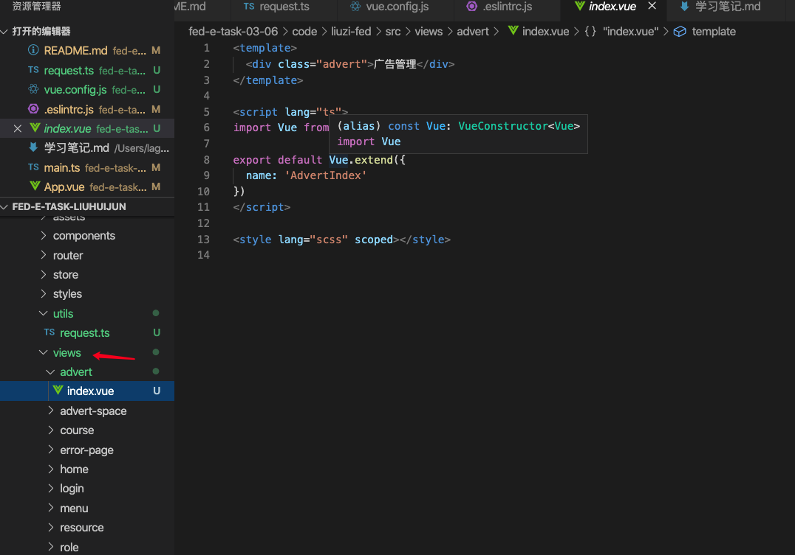

## Vue.js + Vuex + TypeScript 实战项目开发与项目优化 （项目见：<https://github.com/smallSix6/fed-e-task-liuhuijun/tree/master/fed-e-task-03-06>

### 任务一：Vue 项目实战(code/liuzi-fed)
#### 1、使用 VueCLI 创建项目
+ 创建项目：vue create liuzi-fed
+ 配置信息如下图：
+ 
+ cd liuzi-fed
+ npm run serve
#### 2、调整初始目录结构
+ 在 src 目录下添加 services、styles 和 utils 文件夹
#### 3、使用 TS 开发 Vue 
+ 两种方式：
  1. 全新项目：使用 Vue CLI 脚手架工具创建 Vue 项目
  + 
  2. 已有项目：添加 Vue 官方配置的 TS 适配插件
  + 使用 @vue/cli 安装 TS 插件
  ```js
  vue add @vue/typescript
  ```
#### 4、使用 TS 开发 Vue 项目
+ 相关配置说明
  + 安装了 TS 相关的依赖项
    + dependencies 依赖：

    | 依赖项                        |  说明            |
    |-----                         |----             |
    |vue-class-component           |提供使用 Class 语法写 Vue 组件|
    |vue-property-decorator        |在 Class 语法基础上提供了一些辅助装饰器|

    + devDependencies 依赖：

    | 依赖项                             |  说明            |
    |-----                              |----             |
    |@typescript-eslint/eslint-plugin   |使用 ESLint 效验 ts 代码|
    |@typescript-eslint/parser          |将 ts 转为 AST 供 ESLint 效验使用|
    |@vue/cli-plugin-typescript         |使用 ts + ts-loader + fork-ts-checker-webpack-piugin 进行更快的类型检查|
    |@vue/eslint-config-typescript      |兼容 ESLint 的 ts 效验规则|
    |typescript                         |ts 编译器，提供类型效验和转换 js 功能|
  + ts 配置文件 `tsconfig.json`
    ```js
    {
      "compilerOptions": {
        "target": "esnext",
        "module": "esnext",
        "strict": true,
        "jsx": "preserve",
        "importHelpers": true,
        "moduleResolution": "node",
        "experimentalDecorators": true,
        "skipLibCheck": true,
        "esModuleInterop": true,
        "allowSyntheticDefaultImports": true,
        "sourceMap": true,
        "baseUrl": ".",
        "types": [
          "webpack-env"
        ],
        "paths": {
          "@/*": [
            "src/*"
          ]
        },
        "lib": [
          "esnext",
          "dom",
          "dom.iterable",
          "scripthost"
        ]
      },
      "include": [
        "src/**/*.ts",
        "src/**/*.tsx",
        "src/**/*.vue",
        "tests/**/*.ts",
        "tests/**/*.tsx"
      ],
      "exclude": [
        "node_modules"
      ]
    }
    ```
  + shims-vue.d.ts 文件的作用
  ```js
  // 主要用于 ts 识别 .vue 文件模板
  // ts 默认不支持导入 .vue 模板，这个文件告诉 ts 导入 .vue 文件模板都按 VueConstructor<Vue> 类型识别处理
  declare module '*.vue' {
    import Vue from 'vue'
    export default Vue
  }
  ```
  + shims-tsx.d.ts 文件的作用
  ```js
  <!-- 为 jsx 组件模板补充类型声明 -->
  import Vue, { VNode } from 'vue'
  declare global {
    namespace JSX {
      // tslint:disable no-empty-interface
      interface Element extends VNode {}
      // tslint:disable no-empty-interface
      interface ElementClass extends Vue {}
      interface IntrinsicElements {
        [elem: string]: any;
      }
    }
  }
  ```
+ 使用 OptionsAPI 定义 Vue 组件
  + vue 官网中的 ts 支持 <https://cn.vuejs.org/v2/guide/typescript.html#%E5%9F%BA%E6%9C%AC%E7%94%A8%E6%B3%95>
+ 使用 ClassAPIs 定义 Vue 组件
  + 参考：
    + https://class-component.vuejs.org/
  ```js
  <template>
    <div id="app">
      <h1>大前端学习</h1>
      <p>{{a}}</p>
      <button @click="test">test</button>
      <router-view />
    </div>
    </template>

    <script lang="ts">
    import Vue from 'vue'
    import Component from 'vue-class-component'

    @Component
    export default class App extends Vue {
      a = 1
      b = '2'
      c= {
        a: 1,
        b: '2'
      }

      test () {
        console.log(this.a)
      }
    }
    </script>
    <style lang="scss" scoped>
    </style>
  ```
+ 关于装饰器语法
  + 装饰器是 ES 草案中的一个新特性，不过这个草案最近有可能发生重大调整，所以不建议在生产环境中使用
  + 类装饰器：
  ```js
  function testable (target) {
    target.isTestable = true
  }

  @testable
  class MyTestableClass {
    // ...
  }

  console.log(MyTestableClass.isTestable) // true
  ```
  + 装饰器就是扩展类的属性。
+ 使用 VuePropertyDecorator 创建 Vue 组件
  + 装饰器语法不稳定
  ```js
  import { Vue, Component, Prop } from 'vue-property-decorator' 
  @Component 
  export default class Button extends Vue { 
    private count: number = 1 
    private text: string = 'Click me' 
    @Prop() readonly size?: string get content () { 
      return `${this.text} ${this.count}` 
    }
    increment () { this.count++ }
    mounted () { console.log('button is mounted') } 
  }
  ```
  + 这种方式继续放大了 Class 这种组件定义方法。
+ 总结一下
  + 创建组件的三种方式：
    1、Options APIs
    ```js
    import Vue from 'vue'
    export default Vue.extend({
      data() {
        return {
          count: 0
        }
      },
      methods: {
        increment() {
          this.count++
        },
        decrement() {
          this.count--
        }
      }
    })
    ```
    2、Class APIs
    ```js
    import Vue from 'vue'
    import Component from 'vue-class-component' // Define the component in class-style 
    @Component
    export default class Counter extends Vue { // Class properties will be component data 
      count = 0 // Methods will be component methods 
      increment() {
        this.count++
      }
      decrement() {
        this.count--
      }
    }
    ```
    3、Class APIs + decorator
    ```js
    import {
      Vue,
      Component,
      Prop
    } from 'vue-property-decorator'
    @Component
    export default class YourComponent extends Vue {
      @Prop(Number) readonly propA: number | undefined 
      @Prop({
        default: 'default value'
      }) readonly propB!: string 
      @Prop([String, Boolean]) readonly propC: string | boolean | undefined
    }
    ```
+ 个人建议：No Class APIs，只用 Options APIs。
  + Class 语法仅仅是一种写法而已，最终还是要转换为普通的组件数据结构。
  + 装饰器语法还没有正式定稿发布，建议了解即可，正式发布以后在选择使用也可以。
+ 使用 Options APIs 最好是使用 export default Vue.extend({ ... }) 而不是 export default { ... } 。
#### 5、代码格式规范
+ 介绍：
  + 这里主要说明以下几点：
    + 代码格式规范介绍
    + 我们项目中配置的具体代码规范是什么
    + 遇到代码格式规范错误怎么办
    + 如何自定义代码格式校验规范
  + 良好的代码格式规范更有利于：
    + 更好的多人协作
    + 更好的阅读
    + 更好的维护
    + ...
  + 标准是什么
    + Standard Style 宽松一点，适合个人或小团队
    + Airbnb 更严格，适合大型团队
    + google 更严格，适合大型团队
  + 如果约束代码规范
    + 只靠口头约定肯定是不行的，所以要利用工具来强制执行
      + JSLint （不推荐，快被淘汰了）
      + JSHint （不推荐，快被淘汰了）
      + ESLint （主流）
        + .eslintrc.js
        ```js
        module.exports = {
          root: true,
          env: {
            node: true
          },
          // 使用插件的编码校验规则
          extends: [
            'plugin:vue/essential',
            '@vue/standard',
            '@vue/typescript/recommended'
          ],
          parserOptions: {
            ecmaVersion: 2020
          },
          // 自定义编码校验规则
          rules: {
            'no-console': process.env.NODE_ENV === 'production' ? 'warn' : 'off',
            'no-debugger': process.env.NODE_ENV === 'production' ? 'warn' : 'off'
          }
        }
        ```
  + eslint-plugin-vue
    + GitHub 仓库：https://github.com/vuejs/eslint-plugin-vue
    + 官方文档：https://eslint.vuejs.org/
    + 该插件使我们可以使用 ESLint 检查 .vue 文件的 <template> 和 <script>
    + 查找语法错误
    + 查找对Vue.js指令的错误使用
    + 查找违反Vue.js样式指南的行为
  + @vue/eslint-config-standard
    + eslint-plugin-standard
    + JavaScript Standard Style
  + @vue/eslint-config-typescript
    + 规则列表：https://github.com/typescript-eslint/typescript-eslint/tree/master/packages/e
    + slint-plugin#supported-rules
  + 如何自定义代码格式校验规范
    ```js
    { "rules": { "semi": ["error", "always"], "quotes": ["error", "double"] } }
    ```
    + ESLint 附带有大量的规则。你可以使用注释或配置文件修改你项目中要使用的规则。要改变一个规则设置，你必须将规则 ID 设置为下列值之一：
      + "off" 或 0 - 关闭规则
      + "warn" 或 1 - 开启规则，使用警告级别的错误： warn (不会导致程序退出) 
      + "error" 或 2 - 开启规则，使用错误级别的错误：  error (当被触发的时候，程序会退出)
    + 为了在文件注释里配置规则，使用以下格式的注释：
    ```js
    /* eslint eqeqeq: "off", curly: "error" */
    ```
    + 在这个例子里， eqeqeq 规则被关闭， curly 规则被打开，定义为错误级别。你也可以使用对应的数字定义规则严重程度：
    ```js
    /* eslint eqeqeq: 0, curly: 2 */
    ```
    + 这个例子和上个例子是一样的，只不过它是用的数字而不是字符串。 eqeqeq 规则是关闭的， curly 规则被设置为错误级别。
    + 如果一个规则有额外的选项，你可以使用数组字面量指定它们，比如：
    ```js
    /* eslint quotes: ["error", "double"], curly: 2 */
    ```
    + 这条注释为规则 quotes 指定了 “double”选项。数组的第一项总是规则的严重程度（数字或字符串）。
    + 还可以使用 rules 连同错误级别和任何你想使用的选项，在配置文件中进行规则配置。例如：
    ```js
    { "rules": { "eqeqeq": "off", "curly": "error", "quotes": ["error", "double"] } }
    ```
    + 配置定义在插件中的一个规则的时候，你必须使用 插件名/规则ID 的形式。比如：
    ```js
    { "plugins": [ "plugin1" ],"rules": { "eqeqeq": "off", "curly": "error", "quotes": ["error", "double"], "plugin1/rule1": "error" } }
    ```
    + 在这些配置文件中，规则 plugin1/rule1 表示来自插件 plugin1 的 rule1 规则。你也可以使用这种格式的注释配置，比如：
    ```js
    /* eslint "plugin1/rule1": "error" */
    ```
    + 注意：当指定来自插件的规则时，确保删除 eslint-plugin- 前缀。ESLint 在内部只使用没有前缀的名称去定位规则。
#### 6、导入 Element 组件库
+ ElementUI官方文档：https://element.eleme.cn/
+ 用法：
  + main.ts 中的代码：
  ```js
  import Vue from 'vue'
  import ElementUI from 'element-ui'
  import 'element-ui/lib/theme-chalk/index.css'
  import App from './App.vue'
  import router from './router'
  import store from './store'

  Vue.use(ElementUI)
  Vue.config.productionTip = false

  new Vue({
    router,
    store,
    render: h => h(App)
  }).$mount('#app')
  ```
  + App.vue 中的代码：
  ```js
  <template>
    <div id="app">
      <div id="nav">
        <router-link to="/">Home</router-link>|
        <router-link to="/about">About</router-link>
      </div>
      <router-view />
      <el-row>
        <el-button>默认按钮</el-button>
        <el-button type="primary">主要按钮</el-button>
        <el-button type="success">成功按钮</el-button>
        <el-button type="info">信息按钮</el-button>
        <el-button type="warning">警告按钮</el-button>
        <el-button type="danger">危险按钮</el-button>
      </el-row>
    </div>
  </template>

  <style lang="scss">
  </style>
  ```
#### 7、样式处理
+ 引入
  + ```js
    src/styles
    |-- index.scss # 全局样式（在入口模块被加载生效）
    |-- mixin.scss # 公共的 mixin 混入（可以把重复的样式封装为 mixin 混入到复用的地方）
    |-- reset.scss # 重置基础样式
    |-- variables.scss # 公共样式变量
    ```
  + elementUI 的样式就不需要导入了，改为导入全局样式文件，main.js
  ```js
  import Vue from 'vue'
  import ElementUI from 'element-ui'
  // import 'element-ui/lib/theme-chalk/index.css'
  import App from './App.vue'
  import router from './router'
  import store from './store'

  // 加载全局样式
  import './styles/index.scss'

  Vue.use(ElementUI)

  Vue.config.productionTip = false

  new Vue({
    router,
    store,
    render: h => h(App)
  }).$mount('#app')
  ```
+ 共享全局样式变量
  + [向预处理器 Loader 传递选项](https://cli.vuejs.org/zh/guide/css.html#%E5%90%91%E9%A2%84%E5%A4%84%E7%90%86%E5%99%A8-loader-%E4%BC%A0%E9%80%92%E9%80%89%E9%A1%B9)
  + 有的时候你想要向 webpack 的预处理器 loader 传递选项。你可以使用 `vue.config.js` 中的 `css.loaderOptions` 选项。比如你可以这样向所有 Sass/Less 样式传入共享的全局变量：
  ```js
  // vue.config.js
  // vue.config.js
  module.exports = {
    css: {
      loaderOptions: {
        // 默认情况下 `sass` 选项会同时对 `sass` 和 `scss` 语法同时生效
        // 因为 `scss` 语法在内部也是由 sass-loader 处理的
        // 但是在配置 `prependData` 选项的时候
        // `scss` 语法会要求语句结尾必须有分号，`sass` 则要求必须没有分号
        // 在这种情况下，我们可以使用 `scss` 选项，对 `scss` 语法进行单独配置
        scss: {
          prependData: `@import "~@/styles/variables.scss";` // css 里要加~符号才能使用@目录
        }
      }
    }
  }
  ```
 + 然后就可以在任意组件中使用全局样式变量了，
  + App.vue 中的代码：
  ```js
  <template>
    <div id="app">
      <h1>学习</h1>
      <p class="text">Hello world</p>
      <router-view />
    </div>
  </template>

  <style lang="scss" scoped>
  // @import "~@/styles/variables.scss";

  .text {
    color: $success-color;
  }
  </style>
  ```
#### 8、接口处理
+ 配置后端代理：解决跨域问题：如果你的前端应用和后端 API 服务器没有运行在同一个主机上，你需要在开发环境下将 API 请求代理到 API 服务器。这个问题可以通过 vue.config.js 中的 devServer.proxy 选项来配置。
```js
devServer: {
  proxy: {
    '/boss': {
      target: 'http://eduboss.lagou.com',
      changeOrigin: true // 把请求头中的 host 配置为 target
    },
    '/front': {
      target: 'http://edufront.lagou.com',
      changeOrigin: true // 把请求头中的 host 配置为 target
    }
  }
}
```
+ 封装请求模块
  + `npm i axios`
  + /src/utils/request.ts 中的代码如下：
  ```js
  import axios from 'axios'

  const request = axios.create({
    // 配置选项
    // baseURL,
    // timeout,
  })

  // 请求拦截器

  // 响应拦截器

  export default request
  ```
#### 9、布局
+ 初始化路由组件
  + 
  + 路由表配置：router/index.ts
  ```js
  import Vue from 'vue'
  import VueRouter, { RouteConfig } from 'vue-router'

  Vue.use(VueRouter)

  const routes: Array<RouteConfig> = [
    {
      path: '/',
      name: 'home',
      component: () => import(/* webpackChunkName: 'home' */ '@/views/home/index.vue')
    },
    {
      path: '/login',
      name: 'login',
      component: () => import(/* webpackChunkName: 'login' */ '@/views/login/index.vue')
    },
    {
      path: '/user',
      name: 'user',
      component: () => import(/* webpackChunkName: 'user' */ '@/views/user/index.vue')
    },
    {
      path: '/role',
      name: 'role',
      component: () => import(/* webpackChunkName: 'role' */ '@/views/role/index.vue')
    },
    {
      path: '/advert',
      name: 'advert',
      component: () => import(/* webpackChunkName: 'advert' */ '@/views/advert/index.vue')
    },
    {
      path: '/advert-space',
      name: 'advert-space',
      component: () => import(/* webpackChunkName: 'advert-space' */ '@/views/advert-space/index.vue')
    },
    {
      path: '/menu',
      name: 'menu',
      component: () => import(/* webpackChunkName: 'menu' */ '@/views/menu/index.vue')
    },
    {
      path: '/resource',
      name: 'resource',
      component: () => import(/* webpackChunkName: 'resource' */ '@/views/resource/index.vue')
    },
    {
      path: '/course',
      name: 'course',
      component: () => import(/* webpackChunkName: 'course' */ '@/views/course/index.vue')
    },
    {
      path: '*',
      name: '404',
      component: () => import(/* webpackChunkName: '404' */ '@/views/error-page/404.vue')
    }
  ]

  const router = new VueRouter({
    routes
  })

  export default router
  ```
+ Container 布局容器：
  + layout/index.vue
  ```js
  <template>
    <el-container>
      <el-aside width="200px">Aside</el-aside>
      <el-container>
        <el-header>Header</el-header>
        <el-main>Main</el-main>
      </el-container>
    </el-container>
  </template>

  <script lang="ts">
  import Vue from 'vue'

  export default Vue.extend({
    name: 'LayoutIndex'
  })
  </script>

  <style lang="scss" scoped>
  .el-container {
    min-height: 100vh;
    min-width: 980px;
  }
  .el-aside {
    background: #d3dce6
  }
  .el-header {
    background: #b3c0d1
  }
  .el-main {
    background: #e9eef3
  }
  </style>
  ```
+ 侧边栏菜单
  + layout/components/app-aside.vue
  ```js
  <template>
    <div class="aside">
    <el-menu
        router
        default-active="4"
        @open="handleOpen"
        @close="handleClose"
        background-color="#545c64"
        text-color="#fff"
        active-text-color="#ffd04b">
        <el-submenu index="1">
          <template slot="title">
            <i class="el-icon-location"></i>
            <span>权限管理</span>
          </template>
          <el-menu-item index="/role">
            <i class="el-icon-setting"></i>
            <span slot="title">角色管理</span>
          </el-menu-item>
          <el-menu-item index="/menu">
            <i class="el-icon-setting"></i>
            <span slot="title">菜单管理</span>
          </el-menu-item>
          <el-menu-item index="/resource">
            <i class="el-icon-setting"></i>
            <span slot="title">资源管理</span>
          </el-menu-item>
        </el-submenu>
        <el-menu-item index="/course">
          <i class="el-icon-menu"></i>
          <span slot="title">课程管理</span>
        </el-menu-item>
        <el-menu-item index="/user">
          <i class="el-icon-document"></i>
          <span slot="title">用户管理</span>
        </el-menu-item>
        <el-submenu index="4">
          <template slot="title">
            <i class="el-icon-location"></i>
            <span>广告管理</span>
          </template>
          <el-menu-item index="/advert">
            <i class="el-icon-setting"></i>
            <span slot="title">广告列表</span>
          </el-menu-item>
          <el-menu-item index="/advert-space">
            <i class="el-icon-setting"></i>
            <span slot="title">广告位列表</span>
          </el-menu-item>
        </el-submenu>
      </el-menu>
    </div>
  </template>

  <script lang="ts">
  import Vue from 'vue'

  export default Vue.extend({
    name: 'AppAside',
    methods: {
      handleOpen (key: string, keyPath: string): void {
        console.log(key, keyPath)
      },
      handleClose (key: string, keyPath: string): void {
        console.log(key, keyPath)
      }
    }
  })
  </script>

  <style lang="scss" scoped>
  .aside {
    .el-menu {
      min-height: 100vh;
    }
  }
  </style>
  ```
+ 头部header
  + layout/components/app-header.vue
  ```js
  <template>
    <div class="header">
      <el-breadcrumb separator-class="el-icon-arrow-right">
        <el-breadcrumb-item :to="{ path: '/' }">首页</el-breadcrumb-item>
        <el-breadcrumb-item>活动管理</el-breadcrumb-item>
        <el-breadcrumb-item>活动列表</el-breadcrumb-item>
        <el-breadcrumb-item>活动详情</el-breadcrumb-item>
      </el-breadcrumb>
      <el-dropdown>
      <span class="el-dropdown-link">
        <el-avatar shape="square" :size="30" src="https://cube.elemecdn.com/9/c2/f0ee8a3c7c9638a54940382568c9dpng.png"></el-avatar>
        <i class="el-icon-arrow-down el-icon--right"></i>
      </span>
      <el-dropdown-menu slot="dropdown">
        <el-dropdown-item>用户ID</el-dropdown-item>
        <el-dropdown-item divided>退出</el-dropdown-item>
      </el-dropdown-menu>
    </el-dropdown>
    </div>
  </template>

  <script lang="ts">
  import Vue from 'vue'

  export default Vue.extend({
    name: 'AppHeader'
  })
  </script>

  <style lang="scss" scoped>
  .header {
    height: 100%;
    display: flex;
    align-items: center;
    justify-content: space-between;
    .el-dropdown-link {
      display: flex;
      align-items: center;
    }
  }
  </style>
  ```
  + App.vue
  ```js
  <template>
    <div id="app">
      <router-view />
    </div>
  </template>

  <script lang="ts">
  import Vue from 'vue'

  export default Vue.extend({
    name: 'App'
  })
  </script>

  <style lang="scss" scoped>
  // @import "~@/styles/variables.scss";

  .text {
    color: $success-color;
  }
  </style>
  ```
  + 路由表配置：
  ```js
  import Vue from 'vue'
  import VueRouter, { RouteConfig } from 'vue-router'
  import Layout from '@/layout/index.vue'

  const routes: Array<RouteConfig> = [
    {
      path: '/login',
      name: 'login',
      component: () => import(/* webpackChunkName: 'login' */ '@/views/login/index.vue')
    },
    {
      path: '/',
      component: Layout,
      children: [
        {
          path: '',
          name: 'home',
          component: () => import(/* webpackChunkName: 'home' */ '@/views/home/index.vue')
        },
        {
          path: '/user',
          name: 'user',
          component: () => import(/* webpackChunkName: 'user' */ '@/views/user/index.vue')
        },
        {
          path: '/role',
          name: 'role',
          component: () => import(/* webpackChunkName: 'role' */ '@/views/role/index.vue')
        },
        {
          path: '/advert',
          name: 'advert',
          component: () => import(/* webpackChunkName: 'advert' */ '@/views/advert/index.vue')
        },
        {
          path: '/advert-space',
          name: 'advert-space',
          component: () => import(/* webpackChunkName: 'advert-space' */ '@/views/advert-space/index.vue')
        },
        {
          path: '/menu',
          name: 'menu',
          component: () => import(/* webpackChunkName: 'menu' */ '@/views/menu/index.vue')
        },
        {
          path: '/resource',
          name: 'resource',
          component: () => import(/* webpackChunkName: 'resource' */ '@/views/resource/index.vue')
        },
        {
          path: '/course',
          name: 'course',
          component: () => import(/* webpackChunkName: 'course' */ '@/views/course/index.vue')
        }
      ]
    },
    {
      path: '*',
      name: '404',
      component: () => import(/* webpackChunkName: '404' */ '@/views/error-page/404.vue')
    }
  ]
  export default router
  ```
#### 10、登录
+ 页面布局
  + views/login/index.vue
  ```js
  <template>
    <div class="login">
      <el-form ref="form" :model="form" label-width="80px" label-position="top" class="login-form">
        <el-form-item label="手机号">
          <el-input v-model="form.name"></el-input>
        </el-form-item>
        <el-form-item label="密码">
          <el-input v-model="form.passW"></el-input>
        </el-form-item>
        <el-form-item>
          <el-button class="login-btn" type="primary" @click="onSubmit">登录</el-button>
        </el-form-item>
      </el-form>
    </div>
  </template>

  <script lang="ts">
  import Vue from 'vue'

  export default Vue.extend({
    name: 'LoginIndex',
    data () {
      return {
        form: {
          name: "18201288771",
          passW: "111111",
          region: '',
          date1: '',
          date2: '',
          delivery: false,
          type: [],
          resource: '',
          desc: ''
        }
      }
    },
    methods: {
      onSubmit () {
        console.log('submit!')
      }
    }
  })
  </script>

  <style lang="scss" scoped>
  .login {
    height: 100vh;
    display: flex;
    justify-content: center;
    align-items: center;
    .login-form {
      width: 300px;
      padding: 20px;
      background: #fff;
      border-radius: 5px;
    }
    .login-btn {
      width: 100%;
    }
  }
  </style>
  ```
+ 请求登录
  + `npm install qs`
  ```js
  <template>
    <div class="login">
      <el-form ref="form" :model="form" label-width="80px" label-position="top" class="login-form">
        <el-form-item label="手机号">
          <el-input v-model="form.phone"></el-input>
        </el-form-item>
        <el-form-item label="密码">
          <el-input v-model="form.password"></el-input>
        </el-form-item>
        <el-form-item>
          <el-button class="login-btn" type="primary" @click="onSubmit">登录</el-button>
        </el-form-item>
      </el-form>
    </div>
  </template>

  <script lang="ts">
  import Vue from "vue";
  import qs from "qs";
  import request from "@/utils/request";

  export default Vue.extend({
    name: "LoginIndex",

    data () {
      return {
        form: {
          phone: "18201288771",
          password: "111111"
        }
      };
    },

    methods: {
      async onSubmit () {
        // 1. 表单验证
        // 2. 验证通过 -> 提交表单
        const { data } = await request({
          method: "POST",
          url: "/front/user/login",
          headers: { "content-type": "application/x-www-form-urlencoded" },
          data: qs.stringify(this.form) // axios 默认发送是 application/json 格式的数据
        });
        console.log(data);
        // 3. 处理请求结果：成功》跳转到首页；失败》给出提示
      }
    }
  });
  </script>

  <style lang="scss" scoped>
  .login {
    height: 100vh;
    display: flex;
    justify-content: center;
    align-items: center;
    .login-form {
      width: 300px;
      padding: 20px;
      background: #fff;
      border-radius: 5px;
    }
    .login-btn {
      width: 100%;
    }
  }
  </style>
  ```
+ 处理请求结果
  ```js
  // 3. 处理请求结果
  if (data.state !== 1) {
    // 失败：给出提示
    return this.$message.error(data.message)
  }
  // 成功：跳转到首页
  this.$message.success('登录成功')
  this.$router.push({
    name: 'home'
  })
  ```
+ 表单验证
```js
<template>
  <div class="login">
    <!--
      1. :model="ruleForm"
      2. :rules="rules"
      3. ref="ruleForm"
      4. el-form-item 绑定 prop 属性
    -->
    <el-form
      class="login-form"
      label-position="top"
      ref="form"
      :model="form"
      :rules="rules"
      label-width="80px"
    >
      <el-form-item label="手机号" prop="phone">
        <el-input v-model="form.phone"></el-input>
      </el-form-item>
      <el-form-item label="密码" prop="password">
        <el-input type="password" v-model="form.password"></el-input>
      </el-form-item>
      <el-form-item>
        <el-button class="login-btn" type="primary" :loading="isLoginLoading" @click="onSubmit">登录</el-button>
      </el-form-item>
    </el-form>
  </div>
</template>

<script lang="ts">
import Vue from "vue";
import { Form } from "element-ui";
import { login } from "@/services/user";

export default Vue.extend({
  name: "LoginIndex",
  data() {
    return {
      form: {
        phone: "18201288771",
        password: "111111"
      },
      rules: {
        phone: [
          { required: true, message: "请输入手机号", trigger: "blur" },
          {
            pattern: /^1\d{10}$/,
            message: "请输入正确的手机号",
            trigger: "blur"
          }
        ],
        password: [
          { required: true, message: "请输入密码", trigger: "blur" },
          { min: 6, max: 18, message: "长度在 6 到 18 个字符", trigger: "blur" }
        ]
      },
      isLoginLoading: false
    };
  },

  methods: {
    async onSubmit() {
      try {
        // 1. 表单验证
        await (this.$refs.form as Form).validate();

        // 登录按钮 loading
        this.isLoginLoading = true;

        // 2. 验证通过 -> 提交表单
        const { data } = await login(this.form);
        // const { data } = await request({
        //   method: 'POST',
        //   url: '/front/user/login',
        //   headers: { 'content-type': 'application/x-www-form-urlencoded' },
        //   data: qs.stringify(this.form) // axios 默认发送的是 application/json 格式的数据
        // })

        // 3. 处理请求结果
        //    失败：给出提示
        if (data.state !== 1) {
          return this.$message.error(data.message);
        }
        //    成功：跳转到首页
        this.$router.push({
          name: "home"
        });
        this.$message.success("登录成功");
      } catch (err) {
        console.log("登录失败", err);
      }

      // 结束登录按钮的 loading
      this.isLoginLoading = false;
    }
  }
});
</script>

<style lang="scss" scoped>
.login {
  height: 100vh;
  display: flex;
  justify-content: center;
  align-items: center;
  .login-form {
    width: 300px;
    background: #fff;
    padding: 20px;
    border-radius: 5px;
  }
  .login-btn {
    width: 100%;
  }
}
</style>
```
#### 11、身份认证
+ 把登录状态存储到Vuex容器中
  + 登录成功时，记录登录状态，状态需要能够全局访问（放到Vuex容器中）。然后在访问需要登录的页面的时候，判断有没有登录状态（路由拦截器）
  + 容器的状态实现了数据共享，在组件里面访问方便，但是没有持久化的功能。为了防止页面刷新数据丢失，我们需要把user数据持久化
  + store/index.ts
  ```js
  import Vue from 'vue'
  import Vuex from 'vuex'

  Vue.use(Vuex)

  export default new Vuex.Store({
    state: {
      user: JSON.parse(window.localStorage.getItem('user') || 'null') // 当前登录用户状态
    },
    mutations: {
      // 修改容器数据，必须使用mutation函数
      setUser (state, payload) {
        state.user = JSON.parse(payload)
        window.localStorage.setItem('user', payload)
      }
    },
    actions: {
    },
    modules: {
    }
  })
  ```
  + views/login/index.vue
  ```js
  // 成功：跳转到首页
  this.$message.success('登录成功')
  this.$store.commit('setUser', data.content)
  ```
+ 效验页面访问权限
  + [前置路由守卫](https://router.vuejs.org/zh/guide/advanced/navigation-guards.html#%E5%85%A8%E5%B1%80%E5%89%8D%E7%BD%AE%E5%AE%88%E5%8D%AB)
  ```js
  const router = new VueRouter({ ... })

  router.beforeEach((to, from, next) => {
    // ...
  })
  ```
  + 在路由表中配置前置路由拦截守卫
    + router/index.js
  ```js
  import Vue from 'vue'
  import VueRouter, { RouteConfig } from 'vue-router'
  import Layout from '@/layout/index.vue'
  import store from '@/store'

  Vue.use(VueRouter)

  const routes: Array<RouteConfig> = [
    {
      path: '/login',
      name: 'login',
      component: () => import(/* webpackChunkName: 'login' */ '@/views/login/index.vue')
    },
    {
      path: '/',
      component: Layout,
      meta: { // 父路由写过了 requiresAuth ，子路由就可以不用写了
        requiresAuth: true // 自定义数据
      }, // meta 默认就是一个空对象，不写也行
      children: [
        {
          path: '',
          name: 'home',
          component: () => import(/* webpackChunkName: 'home' */ '@/views/home/index.vue')
          // meta: {
          //   requiresAuth: true // 自定义数据
          // } // meta 默认就是一个空对象，不写也行
        },
        {
          path: '/user',
          name: 'user',
          component: () => import(/* webpackChunkName: 'user' */ '@/views/user/index.vue')
        },
        {
          path: '/role',
          name: 'role',
          component: () => import(/* webpackChunkName: 'role' */ '@/views/role/index.vue')
        },
        {
          path: '/advert',
          name: 'advert',
          component: () => import(/* webpackChunkName: 'advert' */ '@/views/advert/index.vue')
        },
        {
          path: '/advert-space',
          name: 'advert-space',
          component: () => import(/* webpackChunkName: 'advert-space' */ '@/views/advert-space/index.vue')
        },
        {
          path: '/menu',
          name: 'menu',
          component: () => import(/* webpackChunkName: 'menu' */ '@/views/menu/index.vue')
        },
        {
          path: '/resource',
          name: 'resource',
          component: () => import(/* webpackChunkName: 'resource' */ '@/views/resource/index.vue')
        },
        {
          path: '/course',
          name: 'course',
          component: () => import(/* webpackChunkName: 'course' */ '@/views/course/index.vue')
        }
      ]
    },
    {
      path: '*',
      name: '404',
      component: () => import(/* webpackChunkName: '404' */ '@/views/error-page/404.vue')
    }
  ]

  const router = new VueRouter({
    routes
  })

  // 路由前置守卫
  router.beforeEach((to, from, next) => {
    if (to.matched.some(record => record.meta.requiresAuth)) {
      // 只要有一级路由需要身份认证，就需要验证登录状态
      if (!store.state.user) {
        next({
          name: 'login',
          query: {
            redirect: to.fullPath // 把登录成功需要返回的页面告诉登录页面
          }
        })
      } else {
        next() // 允许通过
      }
    } else {
      next() // 确保一定要调用 next()
    }
  })

  export default router
  ```
+ 展示当前登录用户信息
  + src/services/user.ts
  ```js
  /**
  * 用户相关请求模块
  */

  import request from "@/utils/request";
  import qs from "qs";
  import store from '@/store/index'

  interface User {
    phone: string;
    password: string;
  }

  export const login = (data: User) => {
    return request({
      method: "POST",
      url: "/front/user/login",
      // axios中，
      // 如果 data 是 qs.stringify(data) 格式，则 content-type 是 application/x-www-form-urlencoded
      // 如果 data 是 json 格式，则 content-type 是 application/json
      // 如果 data 是FormData 格式，则 content-type 是 multipart/form-data
      headers: { "content-type": "application/x-www-form-urlencoded" },
      data: qs.stringify(data) // axios 默认发送的是 application/json 格式的数据
    });
  };

  export const getUserInfo = () => {
    return request({
      method: 'GET',
      url: '/front/user/getInfo',
      headers: {
        Authorization: store.state.user.access_token
      }
    })
  }
  ```
  + src/layout/components/app-header.vue
  ```js
  <template>
    <div class="header">
      <el-breadcrumb separator-class="el-icon-arrow-right">
        <el-breadcrumb-item :to="{ path: '/' }">首页</el-breadcrumb-item>
        <el-breadcrumb-item>活动管理</el-breadcrumb-item>
        <el-breadcrumb-item>活动列表</el-breadcrumb-item>
        <el-breadcrumb-item>活动详情</el-breadcrumb-item>
      </el-breadcrumb>
      <el-dropdown>
      <span class="el-dropdown-link">
        <el-avatar shape="square" :size="30" :src="userInfo.portrait || ''"></el-avatar>
        <i class="el-icon-arrow-down el-icon--right"></i>
      </span>
      <el-dropdown-menu slot="dropdown">
        <el-dropdown-item>{{userInfo.userName}}</el-dropdown-item>
        <el-dropdown-item divided>退出</el-dropdown-item>
      </el-dropdown-menu>
    </el-dropdown>
    </div>
  </template>

  <script lang="ts">
  import Vue from 'vue'
  import { getUserInfo } from '@/services/user'

  export default Vue.extend({
    name: 'AppHeader',
    data () {
      return {
        userInfo: {} // 当前登录用户信息
      }
    },
    created () {
      this.loadUserInfo()
    },
    methods: {
      async loadUserInfo () {
        const { data } = await getUserInfo()
        this.userInfo = data.content
      }
    }
  })
  </script>

  <style lang="scss" scoped>
  .header {
    height: 100%;
    display: flex;
    align-items: center;
    justify-content: space-between;
    .el-dropdown-link {
      display: flex;
      align-items: center;
    }
  }
  </style>
  ```
+ 使用请求拦截器统一设置 Token
  + utils/request.ts
  ```js
  // 请求拦截器
  request.interceptors.request.use(function (config) {
    // 这里是拦截的接口
    // 改写 config 对象
    const { user } = store.state
    if (user && user.access_token) {
      config.headers.Authorization = user.access_token
    }
    return config
  }, function (error) {
    return Promise.reject(error)
  })
  ```
  + 原本写在services/user.ts里面的接口中的Authorization请求头就可以去掉了
+ 用户退出
  + src/layout/components/app-header.vue
  ```js
  <template>
    <div class="header">
        ...
        <el-dropdown-menu slot="dropdown">
          <el-dropdown-item>{{userInfo.userName}}</el-dropdown-item>
          <el-dropdown-item divided @click.native="handleLogout">退出</el-dropdown-item>
        </el-dropdown-menu>
        ...
    </div>
  </template>

  <script lang="ts">
  import Vue from "vue";
  import { getUserInfo } from "@/services/user";

  export default Vue.extend({
    name: "AppHeader",
    data() {
      return {
        userInfo: {} // 当前登录用户信息
      };
    },
    created() {
      this.loadUserInfo();
    },
    methods: {
      async loadUserInfo() {
        const { data } = await getUserInfo();
        this.userInfo = data.content;
      },
      handleLogout() {
        this.$confirm("确认退出吗?", "退出提示", {
          confirmButtonText: "确定",
          cancelButtonText: "取消",
          type: "warning"
        })
          .then(() => {
            // 确认执行
            // 清除登录状态
            this.$store.commit("setUser", null); // 此时清空了容器中的数据，也清空了本地存储
            // 跳转到登录页
            this.$router.push({
              name: "login"
            });
            this.$message({
              type: "success",
              message: "退出成功!"
            });
          })
          .catch(() => {
            this.$message({
              type: "info",
              message: "已取消退出"
            });
          });
      }
    }
  });
  </script>
  ...
  ```


### 任务二：用户登录和身份认证
#### 1、处理 Token 过期
+ 概念介绍
  + access_token: 获取需要授权的接口数据
  + expires_in: 过期时间
  + refresh_token: 刷新获取新的 access_token
  + 为什么access_token 需要有过期时间以及为什么比较短？为了安全。
  + 方法一：在请求发起前拦截每个请求，判断 token 的有效时间是否已经过期，若已过期，则将请求挂起，先刷新token后再继续请求。
    + 优点：在请求前拦截，能节省请求，省流量。
    + 缺点：需要后端额外提供一个token过期时间的字段；使用本地时间判断，若本地时间被篡改，特别是本地时间比服务器时间慢时，拦截会失败。
  + 方法二：不在请求前拦截，而是拦截返回后的数据，先发起请求，接口返回过期后，先刷新token，再进行一次重试。
    + 优点：不需要额外的token过期字段，不需要判断时间。
    + 缺点：会消耗多一次请求，耗流量。
  + 综上，方法一和二优缺点是互补的，方法一有校验失败的风险（本地时间被篡改），方法二更简单粗暴，等知道服务器已经过期了再重试一次，只是会耗多一次请求。
  + 使用方式二处理刷新Token的操作。
+ 分析响应拦截器
  + src/utils/request.ts
  ```js
  // 响应拦截器 request
  request.interceptors.response.use(function (response) { // 状态码为 2xx 都会进入这里
    console.log('请求响应成功了', response)
    return response
  }, function (error) { // 超过 2xx 状态码都在这里
    console.dir('请求响应失败了', error)
    // 如果使用的 HTTP 状态码，错误处理就写到这里
    return Promise.reject(error)
  })
  ```
+ axios 错误处理
  + src/utils/request.ts
  ```js
  import axios from 'axios'
  import { Message } from 'element-ui'
  import store from '@/store'
  import router from '@/router'
  import qs from 'qs'

  function redirectLogin () {
    return router.push({
      name: 'login',
      query: {
        redirect: router.currentRoute.fullPath
      }
    })
  }

  function refreshToken () {
    return axios.create()({ // 创建一个新的 axios 实例发送请求，因为如果使用request会可能发生 401 死循环
      method: 'POST',
      url: '/front/user/refresh_token',
      data: qs.stringify({
        // refreshtoken 只能使用一次
        refreshtoken: store.state.user.refresh_token
      })
    })
  }

  const request = axios.create({
    // 配置选项
    // baseURL,
    // timeout,
  })

  // 请求拦截器 request
  request.interceptors.request.use(function (config) {
    // 这里是拦截的接口
    // 改写 config 对象
    const { user } = store.state
    if (user && user.access_token) {
      config.headers.Authorization = user.access_token
    }
    return config
  }, function (error) {
    return Promise.reject(error)
  })

  // 响应拦截器 request
  let isRefreshing = false // 控制刷新 token 的状态
  let requests: (() => void)[] = [] // 存储刷新 token 期间过来的 401 请求
  request.interceptors.response.use(function (response) { // 状态码为 2xx 都会进入这里
    console.log('请求响应成功了', response)
    return response
  }, async function (error) { // 超过 2xx 状态码都在这里
    console.dir('请求响应失败了', error)
    // 如果使用的 HTTP 状态码，错误处理就写到这里
    if (error.response) { // 请求收到响应了，但是状态码超过了 2xx 范围
      // 400
      // 401
      // 403
      // 404
      // 500
      const { status } = error.response
      if (status === 400) {
        Message.error('请求参数错误')
      } else if (status === 401) {
        // token 无效 （没有提供 token, token 是无效的, token 过期了）
        // 如果有 refresh_token 则尝试使用 refresh_token 获取新的 access_token
        if (!store.state.user) {
          redirectLogin()
          return Promise.reject(error)
        }
        if (!isRefreshing) { // 解决多次请求重新刷新 Token 的问题
          isRefreshing = true
          // 尝试刷新获取新的 token
          return refreshToken().then(res => {
            if (!res.data.success) {
              throw new Error('刷新 Token 失败')
            }
            // 成功了 -> 把本次失败的请求重新发出去
            // 把成功刷新拿到的 access_token 更新到容器和本地存储中
            store.commit('setUser', res.data.content)
            // 把本地失败的请求重新发出去
            requests.forEach(cb => cb())
            requests = [] // 重置 requests 数组
            return request(error.config) // 失败请求的配置信息
          }).catch(err => {
            // 把当前登录用户状态清除
            store.commit('setUser', null)
            // 失败了 -> 直接去跳转到登录页
            redirectLogin()
            return Promise.reject(err)
          }).finally(() => {
            isRefreshing = false // 重置状态
          })
        }
        // 刷新状态下，把请求挂起，放到 requests 数组中
        return new Promise(resolve => {
          requests.push(() => {
            resolve(request(error.config))
          })
        })
      } else if (status === 403) {
        Message.error('没有权限，请联系管理员')
      } else if (status === 404) {
        Message.error('请求资源不存在')
      } else if (status >= 500) {
        Message.error('服务端错误，请联系管理员')
      }
    } else if (error.request) { // 请求发出去了，但是没有收到响应（请求超时，网络断开）
      Message.error('请求超时，请刷新重试')
    } else { // 在设置请求时发生了一些事情，触发了一个错误
      Message.error('请求失败: ' + error.message)
    }
    // 把请求失败的错误对象继续抛出，扔给下一个调用者
    return Promise.reject(error)
  })

  export default request
  ```
