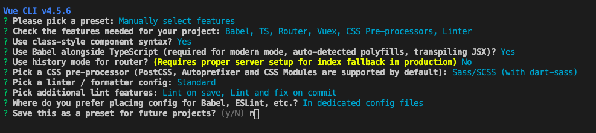
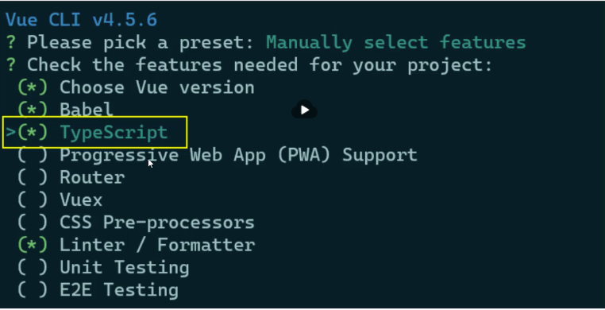

## Vue.js + Vuex + TypeScript 实战项目开发与项目优化 （项目见：<https://github.com/smallSix6/fed-e-task-liuhuijun/tree/master/fed-e-task-03-06>

### 任务一：Vue 项目实战
#### 1、使用 VueCLI 创建项目
+ 创建项目：vue create liuzi-fed
+ 配置信息如下图：
+ 
+ cd liuzi-fed
+ npm run serve
#### 2、调整初始目录结构
+ 在 src 目录下添加 services、styles 和 utils 文件夹
#### 3、使用 TS 开发 Vue 
+ 两种方式：
  1. 全新项目：使用 Vue CLI 脚手架工具创建 Vue 项目
  + 
  2. 已有项目：添加 Vue 官方配置的 TS 适配插件
  + 使用 @vue/cli 安装 TS 插件
  ```js
  vue add @vue/typescript
  ```
#### 4、使用 TS 开发 Vue 项目
+ 相关配置说明
  + 安装了 TS 相关的依赖项
    + dependencies 依赖：
    | 依赖项                        |  说明            |
    |-----                         |----             |
    |vue-class-component           |提供使用 Class 语法写 Vue 组件|
    |vue-property-decorator        |在 Class 语法基础上提供了一些辅助装饰器|

