## Vue
### Vue 的基本使用
#### watch 如何深度监听？watch 监听引用类型，拿不到 oldVal
```js
export default {
    data() {
        return {
            name: '双越',
            info: {
                city: '北京'
            }
        }
    },
    watch: {
        name(oldVal, val) {
            // eslint-disable-next-line
            console.log('watch name', oldVal, val) // 值类型，可正常拿到 oldVal 和 val
        },
        info: {
            handler(oldVal, val) {
                // eslint-disable-next-line
                console.log('watch info', oldVal, val) // 引用类型，拿不到 oldVal 。因为指针相同，此时已经指向了新的 val
            },
            deep: true // 深度监听
        }
    }
}
```
#### v-for 和 v-if 不能一起使用
#### 事件修饰符，按键修饰符
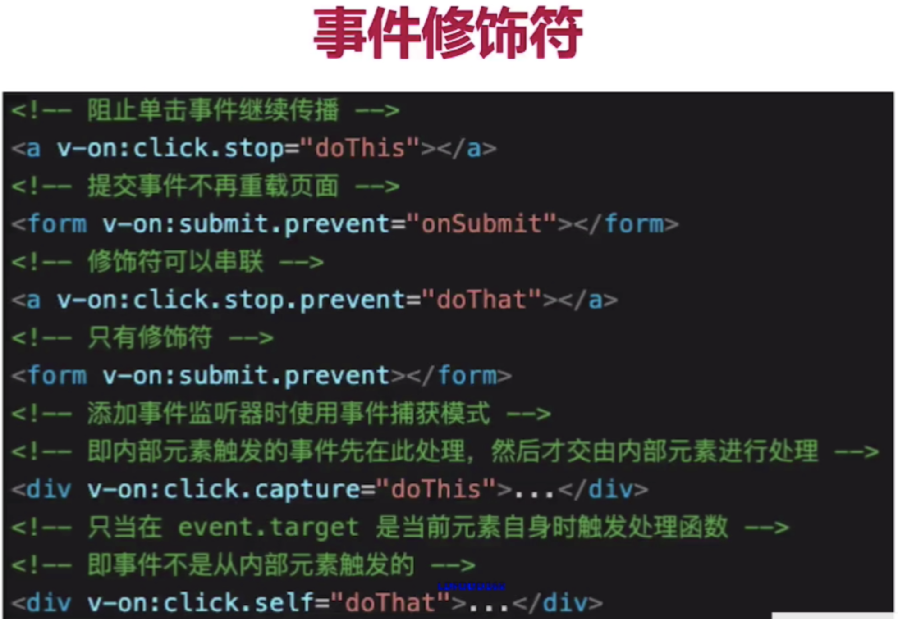
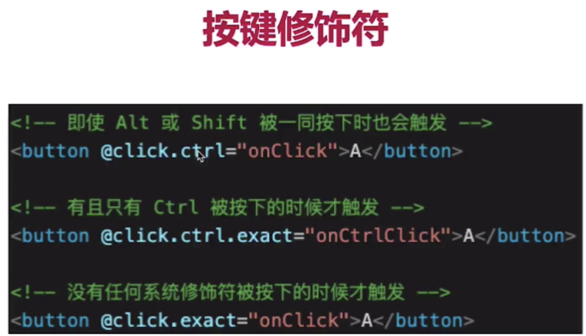
#### 事件被绑定到哪里？
  1. event 是原生的
  2. 事件被挂载到当前元素，和 React 不一样
  3. 和 DOM 事件一样
#### props 和 $emit
  + props:
    + 父组件中的代码
    ```js
    <template>
        <div>
            <Input @add="addHandler"/>
            <List :list="list" @delete="deleteHandler"/>
        </div>
    </template>

    <script>
    import Input from './Input'
    import List from './List'

    export default {
        components: {
            Input,
            List
        },
        data() {
            return {
                list: [
                    {
                        id: 'id-1',
                        title: '标题1'
                    },
                    {
                        id: 'id-2',
                        title: '标题2'
                    }
                ]
            }
        },
        methods: {
            addHandler(title) {
                this.list.push({
                    id: `id-${Date.now()}`,
                    title
                })
            },
            deleteHandler(id) {
                this.list = this.list.filter(item => item.id !== id)
            }
        },
        created() {
            // eslint-disable-next-line
            console.log('index created')
        },
        mounted() {
            // eslint-disable-next-line
            console.log('index mounted')
        },
        beforeUpdate() {
            // eslint-disable-next-line
            console.log('index before update')
        },
        updated() {
            // eslint-disable-next-line
            console.log('index updated')
        },
    }
    </script>
    ```
    + 子组件中的代码：
    ```js
    <template>
        <div>
            <ul>
                <li v-for="item in list" :key="item.id">
                    {{item.title}}

                    <button @click="deleteItem(item.id)">删除</button>
                </li>
            </ul>
        </div>
    </template>

    <script>
    import event from './event'

    export default {
        // props: ['list']
        props: {
            // prop 类型和默认值
            list: {
                type: Array,
                default() {
                    return []
                }
            }
        },
        data() {
            return {

            }
        },
        methods: {
            deleteItem(id) {
                this.$emit('delete', id)
            },
            addTitleHandler(title) {
                // eslint-disable-next-line
                console.log('on add title', title)
            }
        },
        created() {
            // eslint-disable-next-line
            console.log('list created')
        },
        mounted() {
            // eslint-disable-next-line
            console.log('list mounted')

            // 绑定自定义事件
            event.$on('onAddTitle', this.addTitleHandler)
        },
        beforeUpdate() {
            // eslint-disable-next-line
            console.log('list before update')
        },
        updated() {
            // eslint-disable-next-line
            console.log('list updated')
        },
        beforeDestroy() {
            // 及时销毁，否则可能造成内存泄露
            event.$off('onAddTitle', this.addTitleHandler)
        }
    }
    </script>
    ```
  + $emit
  ```js
  // 子组件通过 $emit 触发父组件的方法
  this.$emit('add', this.title)
  ```
#### 组件间通讯——自定义事件
  + 这种方法通过一个空的Vue实例作为中央事件总线（事件中心），用它来触发事件和监听事件,巧妙而轻量地实现了任何组件间的通信，包括父子、兄弟、跨级。当我们的项目比较大时，可以选择更好的状态管理解决方案vuex。
  + 触发事件的组件用 event.$emit, 接收事件的组件用 event.$on 来绑定事件
  + Input 兄弟组件
  ```js
  // 调用自定义事件
  let event = new Vue()
  event.$emit('onAddTitle', this.title)
  ```
  + List 兄弟组件
  ```js
  mounted() {
    // eslint-disable-next-line
    console.log('list mounted')
    let event = new Vue()
    // 绑定自定义事件
    event.$on('onAddTitle', this.addTitleHandler)
  },
  beforeDestroy() {
      // 及时销毁，否则可能造成内存泄露
      event.$off('onAddTitle', this.addTitleHandler)
  }
  ```
#### 组件生命周期
  + 挂载阶段
    + beforeCrate
    + created(Vue 初始化结束了)
    + beforeMount
    + mounted（页面挂载结束了）
  + 更新阶段
    + beforeUpdate
    + updated
  + 销毁阶段
    + beforeDestroy
    + destroyed
  + created: 父组件先实例化，子组件在实例化
  + mountd、updated 和 destroyed：子组件先触发，父组件后触发
#### Vue 高级特性
  + 自己实现 v-model
  ```js
  <template>
      <!-- 例如：vue 颜色选择 -->
      <input type="text"
          :value="text1"
          @input="$emit('change1', $event.target.value)"
      >
      <!--
          1. 上面的 input 使用了 :value 而不是 v-model
          2. 上面的 change1 和 model.event1 要对应起来
          3. text1 属性对应起来
      -->
  </template>

  <script>
  export default {
      model: {
          prop: 'text1', // 对应 props text1
          event: 'change1'
      },
      props: {
          text1: String,
          default() {
              return ''
          }
      }
  }
  </script>
  ```
  + $nextTick
    + Vue 是异步渲染
    + data 改变之后，DOM 不会立刻渲染
    + $nextTick 会在 DOM 渲染之后被触发，以获取最新 DOM 节点
    ```js
    <template>
      <div id="app">
        <ul ref="ul1">
            <li v-for="(item, index) in list" :key="index">
                {{item}}
            </li>
        </ul>
        <button @click="addItem">添加一项</button>
      </div>
    </template>

    <script>
    export default {
      name: 'app',
      data() {
          return {
            list: ['a', 'b', 'c']
          }
      },
      methods: {
        addItem() {
            this.list.push(`${Date.now()}`)
            this.list.push(`${Date.now()}`)
            this.list.push(`${Date.now()}`)

            // 1. 异步渲染，$nextTick 待 DOM 渲染完再回调
            // 3. 页面渲染时会将 data 的修改做整合，多次 data 修改只会渲染一次
            this.$nextTick(() => {
              // 获取 DOM 元素
              const ulElem = this.$refs.ul1
              // eslint-disable-next-line
              console.log( ulElem.childNodes.length )
            })
        }
      }
    }
    </script>
    ```
  + slot
    + 基本使用
      + Index.vue 中的代码：
      ```js
      <template>
          <div>
              <p>vue 高级特性</p>

              <!-- slot -->
              <SlotDemo :url="website.url">
                  {{website.title}}
              </SlotDemo>
          </div>
      </template>

      <script>
      import SlotDemo from './SlotDemo'
      export default {
          components: {
              SlotDemo,
          },
          data() {
              return {
                  name: '双越',
                  website: {
                      url: 'http://ddddd.com/',
                      title: 'ddddd',
                      subTitle: 'dddddddd'
                  },
                  // NextTickName: "NextTick",
                  showFormDemo: false
              }
          }
      }
      </script>
      ```
      + SlotDemo 中的代码：
      ```js
      <template>
          <a :href="url">
              <slot>
                  默认内容，即父组件没设置内容时，这里显示
              </slot>
          </a>
      </template>

      <script>
      export default {
          props: ['url'],
          data() {
              return {}
          }
      }
      </script>
      ```
    + 作用域插槽
      + Index.vue 中的代码
      ```js
      <template>
          <div>
              <p>vue 高级特性</p>
              <hr>
              <ScopedSlotDemo :url="website.url">
                  <template v-slot="slotProps">
                      {{slotProps.slotData.title}}
                  </template>
              </ScopedSlotDemo>
          </div>
      </template>

      <script>
      import ScopedSlotDemo from './ScopedSlotDemo'
      export default {
          components: {
              ScopedSlotDemo,
          },
          data() {
              return {
                  name: '双越',
                  website: {
                      url: 'http://dddd.com/',
                      title: 'dddd',
                      subTitle: 'ddddd'
                  },
                  // NextTickName: "NextTick",
                  showFormDemo: false
              }
          }
      }
      </script>
      ```
      + ScopedSlotDemo.vue 中的代码：
      ```js
      <template>
          <a :href="url">
              <slot :slotData="website">
                  {{website.subTitle}} <!-- 默认值显示 subTitle ，即父组件不传内容时 -->
              </slot>
          </a>
      </template>

      <script>
      export default {
          props: ['url'],
          data() {
              return {
                  website: {
                      url: 'http://wangEditor.com/',
                      title: 'wangEditor',
                      subTitle: '轻量级富文本编辑器'
                  }
              }
          }
      }
      </script>
      ```
    + 具名插槽
      + 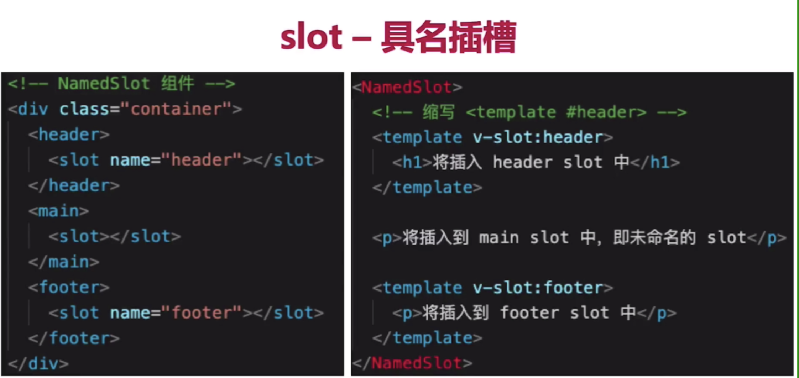
  + 动态组件
  ```js
  <template>
      <div>
          <p>vue 高级特性</p>
          <hr>

          <!-- 动态组件 -->
          <!-- <component :is="NextTickName"/> -->
      </div>
  </template>

  <script>
  import NextTick from './NextTick'
  export default {
      components: {
          NextTick
      },
      data() {
          return {
              NextTickName: "NextTick",
          }
      }
  }
  </script>
  ```
  + 异步组件
  ```js
  <template>
      <div>
          <p>vue 高级特性</p>
          <hr>

          
          <!-- 异步组件 -->
          <!-- <FormDemo v-if="showFormDemo"/>
          <button @click="showFormDemo = true">show form demo</button> -->
      </div>
  </template>

  <script>
  export default {
      components: {
          FormDemo: () => import('../BaseUse/FormDemo'),
      },
      data() {
          return {
              showFormDemo: false
          }
      }
  }
  </script>
  ```
  + keep-alive
    + 缓存组件
    + 频繁切换，不需要重复渲染
    + KeepAlive.vue 的代码：
    ```js
    <template>
        <div>
            <button @click="changeState('A')">A</button>
            <button @click="changeState('B')">B</button>
            <button @click="changeState('C')">C</button>

            <keep-alive> <!-- tab 切换 -->
                <KeepAliveStageA v-if="state === 'A'"/> <!-- v-show -->
                <KeepAliveStageB v-if="state === 'B'"/>
                <KeepAliveStageC v-if="state === 'C'"/>
            </keep-alive>
        </div>
    </template>

    <script>
    import KeepAliveStageA from './KeepAliveStateA'
    import KeepAliveStageB from './KeepAliveStateB'
    import KeepAliveStageC from './KeepAliveStateC'

    export default {
        components: {
            KeepAliveStageA,
            KeepAliveStageB,
            KeepAliveStageC
        },
        data() {
            return {
                state: 'A'
            }
        },
        methods: {
            changeState(state) {
                this.state = state
            }
        }
    }
    </script>
    ```
    + KeepAliveStageA 中的代码：
    ```js
    <template>
        <p>state A</p>
    </template>

    <script>
    export default {
        mounted() {
            // eslint-disable-next-line
            console.log('A mounted')
        },
        destroyed() {
            // eslint-disable-next-line
            console.log('A destroyed')
        }
    }
    </script>
    ```
    + KeepAliveStageB 中的代码：
    ```js
    <template>
        <p>state B</p>
    </template>

    <script>
    export default {
        mounted() {
            // eslint-disable-next-line
            console.log('B mounted')
        },
        destroyed() {
            // eslint-disable-next-line
            console.log('B destroyed')
        }
    }
    </script>
    ```
    + KeepAliveStageC 中的代码：
    ```js
    <template>
        <p>state C</p>
    </template>

    <script>
    export default {
        mounted() {
            // eslint-disable-next-line
            console.log('C mounted')
        },
        destroyed() {
            // eslint-disable-next-line
            console.log('C destroyed')
        }
    }
    </script>
    ```
  + mixin
    + 多个组件有相同的逻辑，抽离出来
    + mixin 并不是完美的解决方案，会有一些问题
      + 变量来源不明确，不利于阅读
      + 多 mixin 可能会造成命名冲突
      + mixin 和组件可能出现多对多的关系，复杂度较高
    + VUE3 提出的 Composition API 旨在解决这些问题
    + MixinDemo.vue 中的代码
    ```js
    <template>
        <div>
            <p>{{name}} {{major}} {{city}}</p>
            <button @click="showName">显示姓名</button>
        </div>
    </template>

    <script>
    import myMixin from './mixin'

    export default {
        mixins: [myMixin], // 可以添加多个，会自动合并起来
        data() {
            return {
                name: '双越',
                major: 'web 前端'
            }
        },
        methods: {
        },
        mounted() {
            // eslint-disable-next-line
            console.log('component mounted', this.name)
        }
    }
    </script>
    ```
    + mixin.js 中的代码：
    ```js
    export default {
        data() {
            return {
                city: '北京'
            }
        },
        methods: {
            showName() {
                // eslint-disable-next-line
                console.log(this.name)
            }
        },
        mounted() {
            // eslint-disable-next-line
            console.log('mixin mounted', this.name)
        }
    }
    ```
#### Vuex 使用
  + 概念：
    + state
    + getters
    + action
    + mutation
  + 用于 Vue 组件
    + dispatch
    + commit
    + mapState
    + mapGetters
    + mapActions
    + mapMutations
  + 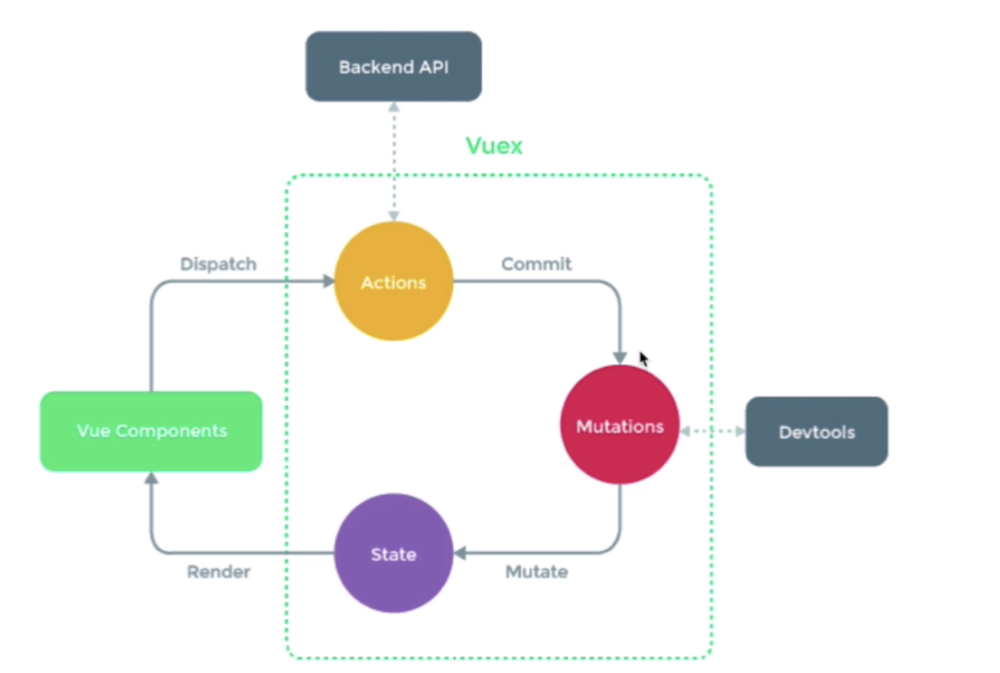
#### Vue-router 使用
  + 路由模式：Hash、H5 history（需要 server 端支持）
    + 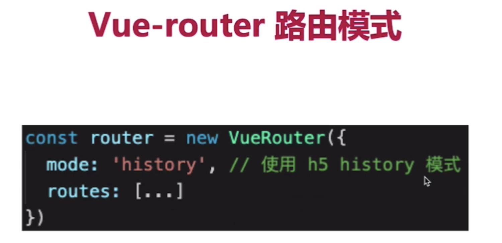
  + 路由配置：动态路由、懒加载
    + 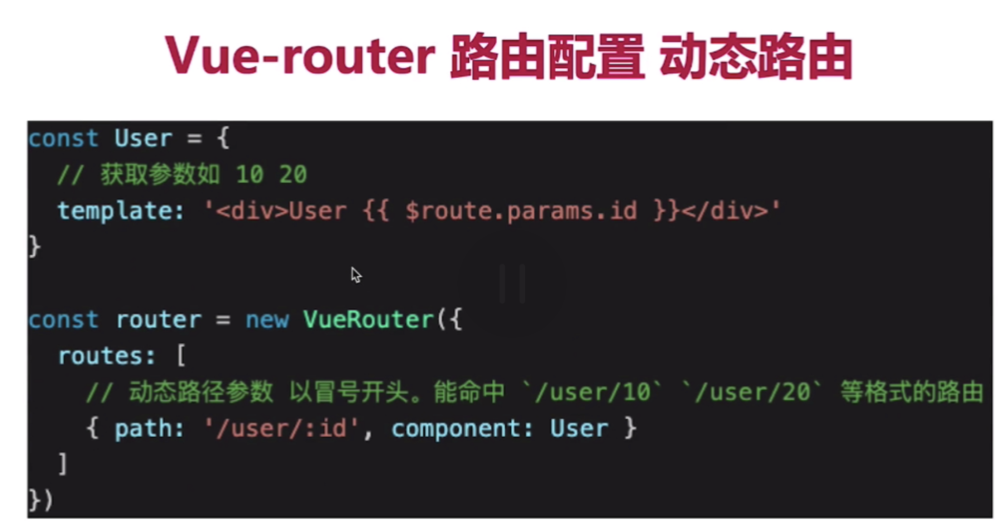
    + 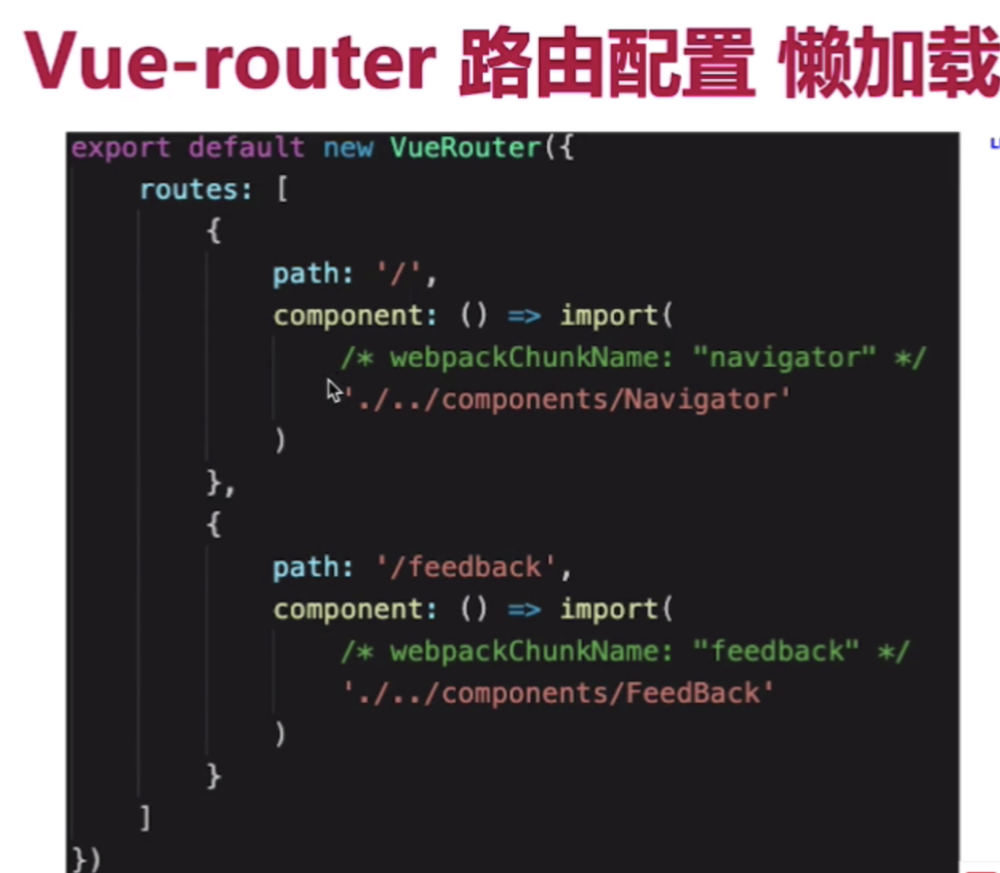

## React
### React 的使用
#### 插入 html: `<p dangerouslySetInnerHTML={rawHtmlData}></p>`
#### event:
  1. event 是 SyntheticEvent ，模拟出来 DOM 事件所有能力
  2. event.nativeEvent 是原生事件对象
  3. 所有的事件，都被挂载到 document 上
  4. 和 DOM 事件不一样，和 Vue 事件也不一样
#### 受控组件
```js
// 受控组件
return <div>
    <p>{this.state.name}</p>
    <label htmlFor="inputName">姓名：</label> {/* 用 htmlFor 代替 for */}
    <input id="inputName" value={this.state.name} onChange={this.onInputChange}/>
</div>
```
#### setState 是同步还是异步:
```js
// 第二，不要直接修改 state ，使用不可变值 ----------------------------
// this.state.count++ // 错误
this.setState({
    count: this.state.count + 1 // SCU
})
// 操作数组、对象的的常用形式

// 第三，setState 可能是异步更新（有可能是同步更新） ----------------------------

this.setState({
    count: this.state.count + 1
}, () => {
    // 联想 Vue $nextTick - DOM
    console.log('count by callback', this.state.count) // 回调函数中可以拿到最新的 state
})
console.log('count', this.state.count) // 异步的，拿不到最新值

// setTimeout 中 setState 是同步的
setTimeout(() => {
    this.setState({
        count: this.state.count + 1
    })
    console.log('count in setTimeout', this.state.count)
}, 0)

// 自己定义的 DOM 事件，setState 是同步的。再 componentDidMount 中

// 第四，state 异步更新的话，更新前会被合并 ----------------------------

// 传入对象，会被合并（类似 Object.assign ）。执行结果只一次 +1
this.setState({
    count: this.state.count + 1
})
this.setState({
    count: this.state.count + 1
})
this.setState({
    count: this.state.count + 1
})

// 传入函数，不会被合并。执行结果是 +3
this.setState((prevState, props) => {
    return {
        count: prevState.count + 1
    }
})
this.setState((prevState, props) => {
    return {
        count: prevState.count + 1
    }
})
this.setState((prevState, props) => {
    return {
        count: prevState.count + 1
    }
})

// 第五：自定义事件中
bodyClickHandler = () => {
    this.setState({
        count: this.state.count + 1
    })
    console.log('count in body event', this.state.count)
}
componentDidMount() {
    // 自己定义的 DOM 事件，setState 是同步的
    document.body.addEventListener('click', this.bodyClickHandler)
}
```
#### react 组件生命周期
  + 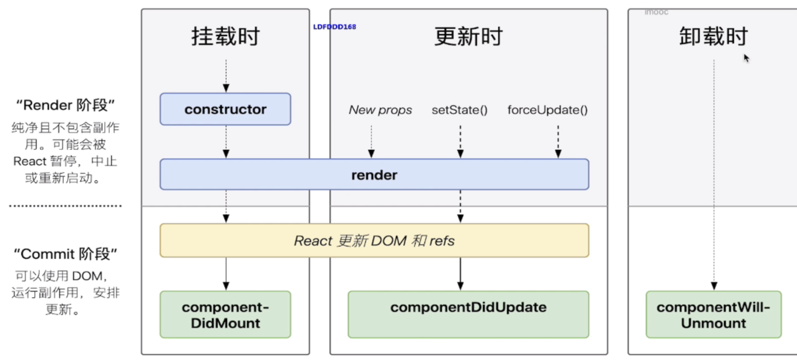
    1. 挂载卸载过程
      + 1.1. constructor()
      + 1.2. componentWillMount()
      + 1.3. componentDidMount()
      + 1.4. componentWillUnmount ()
    2. 更新过程
      + 2.1. componentWillReceiveProps (nextProps)
      + 2.2. shouldComponentUpdate(nextProps,nextState)
      + 2.3. componentWillUpdate (nextProps,nextState)
      + 2.4. componentDidUpdate(prevProps,prevState)
      + 2.5. render()
#### 非受控组件
```js
import React from 'react'

class App extends React.Component {
    constructor(props) {
        super(props)
        this.state = {
            name: '双越',
            flag: true,
        }
        this.nameInputRef = React.createRef() // 创建 ref
        this.fileInputRef = React.createRef()
    }
    render() {
        // // input defaultValue
        // return <div>
        //     {/* 使用 defaultValue 而不是 value ，使用 ref */}
        //     <input defaultValue={this.state.name} ref={this.nameInputRef}/>
        //     {/* state 并不会随着改变 */}
        //     <span>state.name: {this.state.name}</span>
        //     <br/>
        //     <button onClick={this.alertName}>alert name</button>
        // </div>

        // // checkbox defaultChecked
        // return <div>
        //     <input
        //         type="checkbox"
        //         defaultChecked={this.state.flag}
        //     />
        // </div>

        // file
        return <div>
            <input type="file" ref={this.fileInputRef}/>
            <button onClick={this.alertFile}>alert file</button>
        </div>

    }
    alertName = () => {
        const elem = this.nameInputRef.current // 通过 ref 获取 DOM 节点
        alert(elem.value) // 不是 this.state.name
    }
    alertFile = () => {
        const elem = this.fileInputRef.current // 通过 ref 获取 DOM 节点
        alert(elem.files[0].name)
    }
}

export default App
```
  + 使用场景
    + 必须手动操作 DOM 元素，setState 实现不了
    + 文件上传 `<input type="file" ref={this.fileInputRef}/>`
    + 某些富文本编辑器，需要传入 DOM 元素
  + 受控组件 VS 非受控组件
    + 优先使用受控组件，符合 React 设计原则
    + 必须手动操作 DOM 元素用非受控组件
#### Portals:
  + 组件默认会按照既定层次嵌套渲染
  + 如何让组件渲染到父组件以外
  ```js
  import React from 'react'
  import ReactDOM from 'react-dom'
  import './style.css'

  class App extends React.Component {
      constructor(props) {
          super(props)
          this.state = {
          }
      }
      render() {
          // // 正常渲染
          // return <div className="modal">
          //     {this.props.children} {/* vue slot */}
          // </div>

          // 使用 Portals 渲染到 body 上。
          // fixed 元素要放在 body 上，有更好的浏览器兼容性。
          return ReactDOM.createPortal(
              <div className="modal">{this.props.children}</div>,
              document.body // DOM 节点
          )
      }
  }

  export default App
  ```
#### context:
  + 公共信息（语言、主题）如何传递给每个组件
  + 用 props 太繁琐，用 redux 小题大做
  ```js
  import React from 'react'

  // 创建 Context 填入默认值（任何一个 js 变量）
  const ThemeContext = React.createContext('light')

  // 底层组件 - 函数是组件
  function ThemeLink (props) {
      // const theme = this.context // 会报错。函数式组件没有实例，即没有 this

      // 函数式组件可以使用 Consumer
      return <ThemeContext.Consumer>
          { value => <p>link's theme is {value}</p> }
      </ThemeContext.Consumer>
  }

  // 底层组件 - class 组件
  class ThemedButton extends React.Component {
      // 指定 contextType 读取当前的 theme context。
      // static contextType = ThemeContext // 也可以用 ThemedButton.contextType = ThemeContext
      render() {
          const theme = this.context // React 会往上找到最近的 theme Provider，然后使用它的值。
          return <div>
              <p>button's theme is {theme}</p>
          </div>
      }
  }
  ThemedButton.contextType = ThemeContext // 指定 contextType 读取当前的 theme context。

  // 中间的组件再也不必指明往下传递 theme 了。
  function Toolbar(props) {
      return (
          <div>
              <ThemedButton />
              <ThemeLink />
          </div>
      )
  }

  class App extends React.Component {
      constructor(props) {
          super(props)
          this.state = {
              theme: 'light'
          }
      }
      render() {
          return <ThemeContext.Provider value={this.state.theme}>
              <Toolbar />
              <hr/>
              <button onClick={this.changeTheme}>change theme</button>
          </ThemeContext.Provider>
      }
      changeTheme = () => {
          this.setState({
              theme: this.state.theme === 'light' ? 'dark' : 'light'
          })
      }
  }

  export default App
  ```
#### 异步组件
  + import()
  + React.lazy(() => import('./ContextDemo'))
  + React.Suspense
  ```js
  import React from 'react'

  const ContextDemo = React.lazy(() => import('./ContextDemo'))

  class App extends React.Component {
      constructor(props) {
          super(props)
      }
      render() {
          return <div>
              <p>引入一个动态组件</p>
              <hr />
              <React.Suspense fallback={<div>Loading...</div>}>
                  <ContextDemo/>
              </React.Suspense>
          </div>

          // 1. 强制刷新，可看到 loading （看不到就限制一下 chrome 网速）
          // 2. 看 network 的 js 加载
      }
  }

  export default App
  ```
#### 性能优化
  + shouldComponentUpdate (简称 SCU)
    + 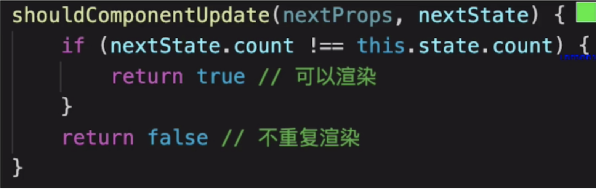
    + React 默认：父组件有更新，子组件则无条件也更新！！！
    + 性能优化对于 React 更加重要！
  + PureComponent 和 React.memo
  + 不可变值 immutable.js
    + 彻底拥抱 “不可变值”
    + 基于共享数据（不是深拷贝），速度好
    + 有一定的学习和迁移成本，按需使用
#### 关于组件公共逻辑的抽离
  + mixin, 已被 React 弃用
  + 高阶组件 HOC
    + 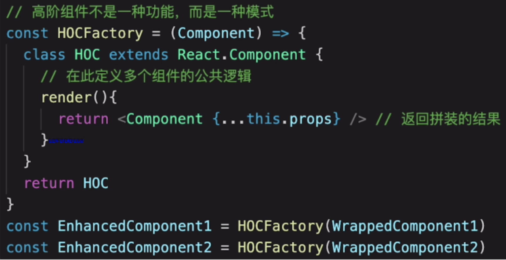
    ```js
    import React from 'react'

    // 高阶组件
    const withMouse = (Component) => {
        class withMouseComponent extends React.Component {
            constructor(props) {
                super(props)
                this.state = { x: 0, y: 0 }
            }
      
            handleMouseMove = (event) => {
                this.setState({
                    x: event.clientX,
                    y: event.clientY
                })
            }
      
            render() {
                return (
                    <div style={{ height: '500px' }} onMouseMove={this.handleMouseMove}>
                        {/* 1. 透传所有 props 2. 增加 mouse 属性 */}
                        <Component {...this.props} mouse={this.state}/>
                    </div>
                )
            }
        }
        return withMouseComponent
    }

    const App = (props) => {
        const a = props.a
        const { x, y } = props.mouse // 接收 mouse 属性
        return (
            <div style={{ height: '500px' }}>
                <h1>The mouse position is ({x}, {y})</h1>
                <p>{a}</p>
            </div>
        )
    }

    export default withMouse(App) // 返回高阶函数
    ```
  + Render Props
  ```js
  import React from 'react'
  import PropTypes from 'prop-types'

  class Mouse extends React.Component {
      constructor(props) {
          super(props)
          this.state = { x: 0, y: 0 }
      }
    
      handleMouseMove = (event) => {
        this.setState({
          x: event.clientX,
          y: event.clientY
        })
      }
    
      render() {
        return (
          <div style={{ height: '500px' }} onMouseMove={this.handleMouseMove}>
              {/* 将当前 state 作为 props ，传递给 render （render 是一个函数组件） */}
              {this.props.render(this.state)}
          </div>
        )
      }
  }
  Mouse.propTypes = {
      render: PropTypes.func.isRequired // 必须接收一个 render 属性，而且是函数
  }

  const App = (props) => (
      <div style={{ height: '500px' }}>
          <p>{props.a}</p>
          <Mouse render={
              /* render 是一个函数组件 */
              ({ x, y }) => <h1>The mouse position is ({x}, {y})</h1>
          }/>
          
      </div>
  )

  /**
  * 即，定义了 Mouse 组件，只有获取 x y 的能力。
  * 至于 Mouse 组件如何渲染，App 说了算，通过 render prop 的方式告诉 Mouse 。
  */

  export default App
  ```
  + HOC vs Render Props
    + HOC:模式简单，但会增加组件层级
    + Render Props:代码简洁吗，学习成本较高
#### Redux 单项数据流概述
  1. dispatch(action)
  2. reducer -> newState
  3. subscribe 触发通知
  + 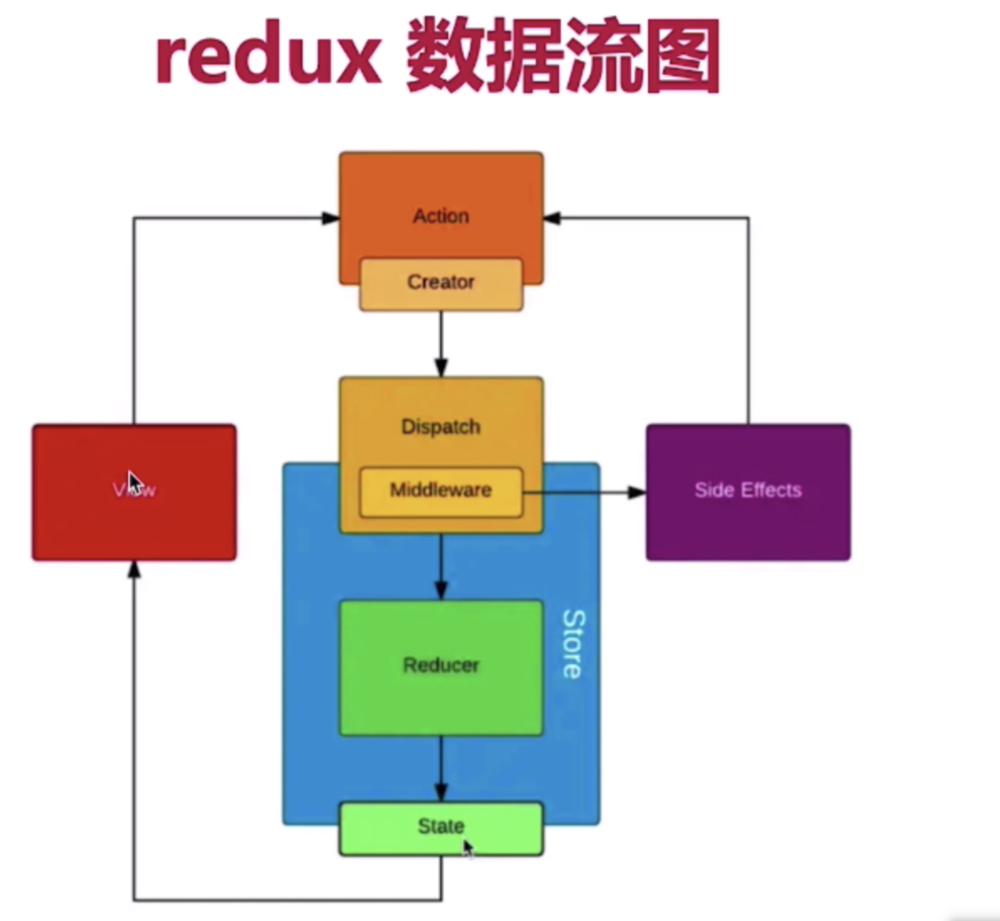
#### react-redux 知识点：
  + 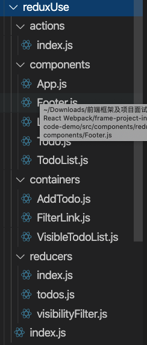
  + index.js 中创建 store
  ```js
  import React from 'react'
  import { Provider } from 'react-redux'
  import { createStore } from 'redux'
  import todoApp from './reducers'
  import App from './components/App'

  let store = createStore(todoApp)

  export default function () {
      return <Provider store={store}>
          <App />
      </Provider>
  }
  ```
  + 单个文件中使用 redux:
  ```js
  import React from 'react'
  import { connect } from 'react-redux'
  import { addTodo } from '../actions'

  // 函数组件，接收 props 参数
  let AddTodo = ({ dispatch }) => {
    // dispatch 即 props.dispatch

    let input

    return (
      <div>
        <form
          onSubmit={e => {
            e.preventDefault()
            if (!input.value.trim()) {
              return
            }
            // 创建一个 todo
            dispatch(addTodo(input.value))
            input.value = ''
          }}
        >
          <input
            ref={node => {
              input = node
            }}
          />
          <button type="submit">
            Add Todo
          </button>
        </form>
      </div>
    )
  }

  // connect 高阶组件 ，将 dispatch 作为 props 注入到 AddTodo 组件中
  AddTodo = connect()(AddTodo)

  export default AddTodo
  ```
  ```js
  import { connect } from 'react-redux'
  import { toggleTodo } from '../actions'
  import TodoList from '../components/TodoList'

  // 不同类型的 todo 列表
  const getVisibleTodos = (todos, filter) => {
    switch (filter) {
      case 'SHOW_ALL':
        return todos
      case 'SHOW_COMPLETED':
        return todos.filter(t => t.completed)
      case 'SHOW_ACTIVE':
        return todos.filter(t => !t.completed)
    }
  }

  const mapStateToProps = state => {
    // state 即 vuex 的总状态，在 reducer/index.js 中定义
    return {
      // 根据完成状态，筛选数据
      todos: getVisibleTodos(state.todos, state.visibilityFilter)
    }
  }

  const mapDispatchToProps = dispatch => {
    return {
      // 切换完成状态
      onTodoClick: id => {
        dispatch(toggleTodo(id))
      }
    }
  }

  // connect 高阶组件，将 state 和 dispatch 注入到组件 props 中
  const VisibleTodoList = connect(
    mapStateToProps,
    mapDispatchToProps
  )(TodoList)

  export default VisibleTodoList
  ```
  + 异步 action:
    + 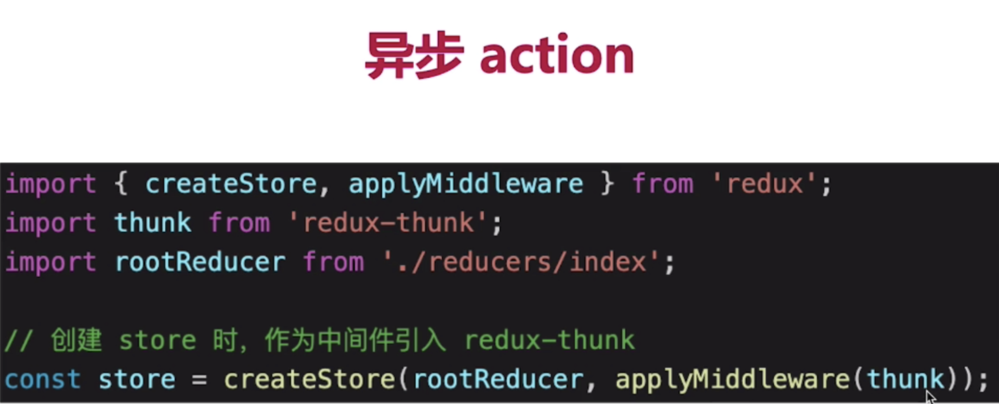
#### Redux 中间件：
  + 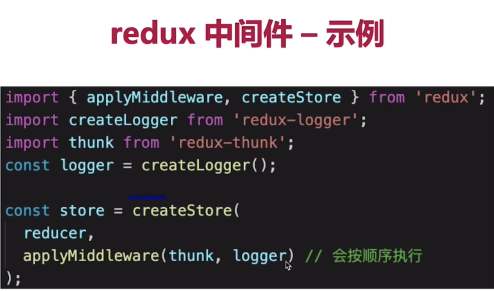
#### react-router:
  + 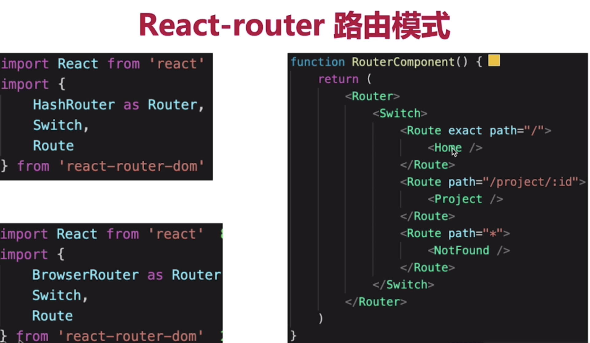

### React 原理
#### vnode 数据结构
  + 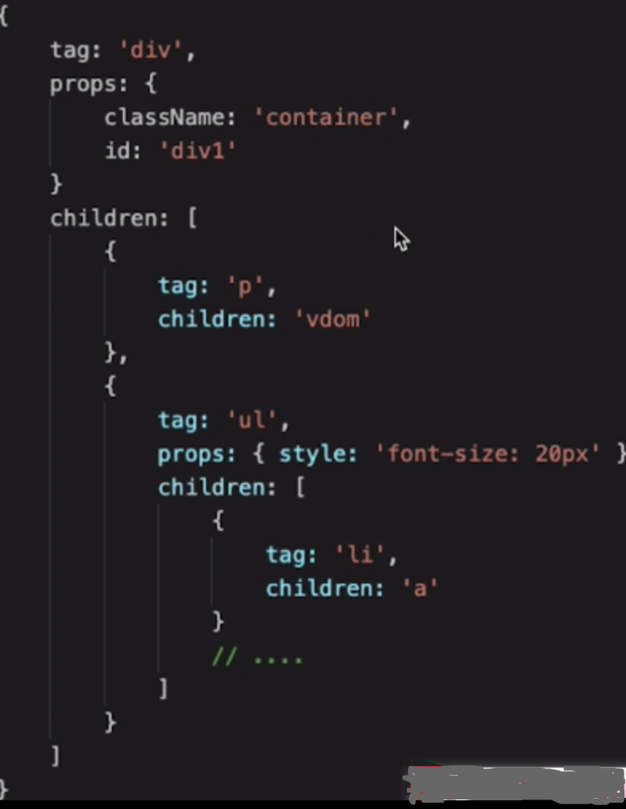
#### 合成事件：
  + 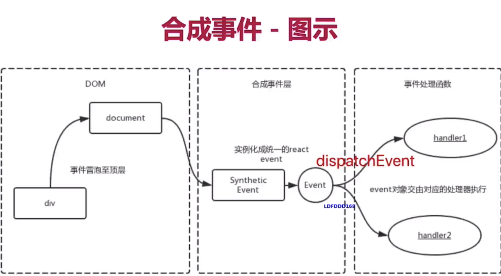
  + 为何要合成事件机制
    + 更好的兼容性和跨平台
    + 挂载到 document 上，减少了内存消耗，避免频繁解绑
    + 方便事件的统一管理（如事务机制）
#### batchUpdate:
  + setState:
    + 有时异步（普通使用），有时同步（setTimeout、DOM 事件）
    + 有时合并（对象形式），有时不合并（函数形式）
    + 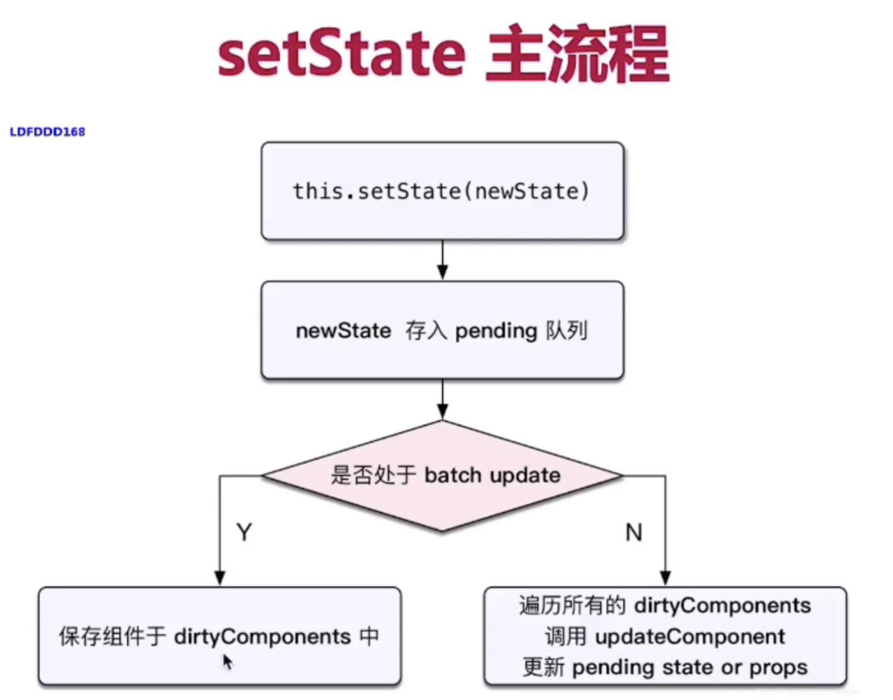
    + 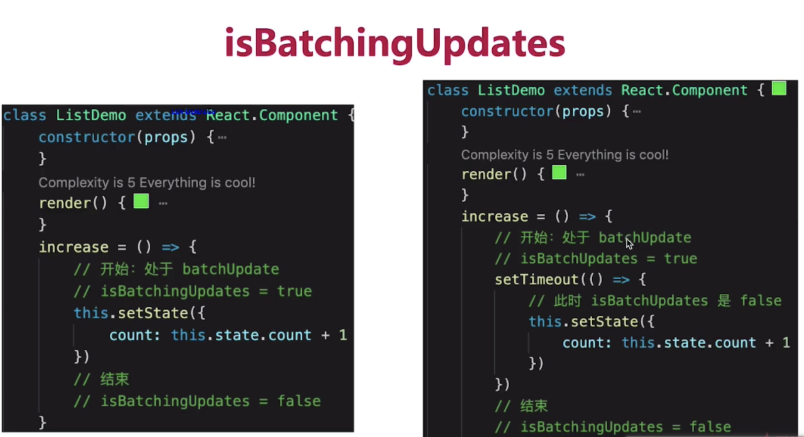
#### react-fiber 如何优化性能：
  + 将 reconciliation 阶段进行任务拆分（commit 无法拆分）
  + DOM 需要渲染时暂停，空闲时恢复
  + window.requestIdleCallback 回调


#### React 面试题
#### React 性能优化
  + 渲染列表时加 key
  + 自定义事件、DOM 事件及时销毁
  + 合理使用异步组件
  + 减少函数 bind this 的次数
  + 合理使用 scu、PureComponent 和 memo
  + 合理使用 Immutable.js
  + webpack 层面的优化
  + 前端通用的性能优化，如图片懒加载
#### React 和 Vue
  + 相同点：
    + 都支持组件化
    + 都是数据驱动视图
    + 都使用 vdom 操作 DOM
  + 不同点：
    + React 使用 JSX 拥抱 JS，Vue 使用模板拥抱 html
    + React 函数式编程，Vue 声明式编程
    + React 更多需要自力更生，Vue 把想要的都给你
#### hooks: 
  + 会有 Capture Value 特性
  + 推荐配合 `eslint-plugin-react-hooks` 使用
  + useEffect:
    + useEffect 依赖一个空数组的时候，会记住 state 的值
    ```js
    useEffect(()=>{
      setInterval(() => {
        console.log(num)
        setNum(num+1)
      }, 500);
    },[])
    // 一直打印 0，依赖空数组时，这个 effect 会记住 num 的值，每次都是 0
    ```
    + useEffect 依赖的数组里有值时，每次依赖项更新时，会把更新的值传给 effect 并重新执行 effect 里面的代码
    ```js
      useEffect(()=>{
        setInterval(() => {
          console.log(num)
          setNum(num+1)
        }, 500);
      },[num])
    ```
    + useEffect 里面不加 return 时，useEffect 中的代码块相当于在 class 组件的 componentDidMount 和 componentDidUpdate 中的代码块；加了 return 后，return 后的代码块相当于 class 组件里的 componentWillUnmount 中的代码块
    ```js
      useEffect(()=>{
        const timer = setInterval(() => {
          console.log(num)
          setNum(num+1)
        }, 500);
        return ()=>clearInterval(timer)
      },[num])
    ```
  + useRef:
    + 代码如下：
    ```js
    useEffect(()=>{
      countRef.current = count
    },[count])
    useEffect(()=>{
      const timer = setInterval(() => {
        console.log(countRef)
        setCount(countRef.current+1)
      }, 500);
      return ()=>clearInterval(timer)
    },[])
    ```
    ```js
    const btnRef = useRef(null)
    useEffect(()=>{
      const handleClick = ()=>{
        setCount(count+1)
      }
      btnRef.current.addEventListener('click',handleClick,false);
      return ()=>{
        btnRef.current.removeEventListener('click', handleClick,false);
      }
    },[count])
    return (
      <div>
        <p>count: {count}</p>
        <button ref={btnRef}>+1</button>
      </div>
    )
    ```
  + memo: 相当于 pureComponent
  ```js
  // 只传一个参数
  import React, {useState, useEffect, useRef, memo} from 'react';
  const Child = memo(()=> {
    return (
      <div>
        fffffff
      </div>
    )
  })
  // 传了两个参数，第二个参数相当于 shouldComponentUpdate
  import React, {useState, useEffect, useRef, memo} from 'react';
  const Child = memo(()=> {
    return (
      <div>
        fffffff
      </div>
    )
  },(prev,next)=>{
    return prev.count === next.count
  })
  ```
  + useMemo: 缓存的一个值
  ```js
  const Child = memo((props)=> {
    console.log(props)
    const date = new Date()
    return (
      <div>
        当前时间：{date.getHours()}: {date.getMinutes()}: {date.getSeconds()}
      </div>
    )
  })
  const Parent = ()=> {
    const [count, setCount] = useState(0)
    const [clickTimeCount, setTimeClickCount] = useState(0)
    const timeOption = useMemo(()=>{
      return {
        clickTimeCount
      }
    },[clickTimeCount])
    return (
      <div>
        <div>count: {count}</div>
        <button onClick={()=>{
          setCount(count+1)
        }}>+1</button>
        <button onClick={()=>{
          setTimeClickCount(clickTimeCount+1)
        }}>GET CURRENT TIME</button>
        <Child count={timeOption}/>
      </div>
    )
  }
  ```
  + useCallback: 缓存的是一个函数
  ```js
  import React, {useState, useEffect, useRef, memo, useMemo, useCallback} from 'react';
  const Child = memo((props)=> {
    console.log(props)
    const date = new Date()
    return (
      <div>
        当前时间：{date.getHours()}: {date.getMinutes()}: {date.getSeconds()}
        <input type="text" onChange={props.onChange}/>
      </div>
    )
  })
  const Parent = ()=> {
    const [count, setCount] = useState(0)
    const [text, setText] = useState('')
    const [clickTimeCount, setTimeClickCount] = useState(0)
    const handleOnchange = useCallback( (e)=>{
      setText(e.target.value)
    },[])

    return (
      <div>
        <div>count: {count}</div>
        <div>text: {text}</div>

        <button onClick={()=>{
          setCount(count+1)
        }}>+1</button>
        <button onClick={()=>{
          setTimeClickCount(clickTimeCount+1)
        }}>GET CURRENT TIME</button>
        <Child count={clickTimeCount} onChange={handleOnchange}/>
      </div>
    )
  }
  ```
  + 自定义 hooks: 通用逻辑抽离
    + 新建一个 hooks.js 文件，代码如下：
    ```js
    import {useState,useEffect} from 'react'

    export const useWindowSize = () => {
      const [width, setWidth] = useState('0px')
      const [height, setHeight] = useState('0px')
      useEffect(()=>{
        setWidth(document.documentElement.clientWidth+ 'px')
        setHeight(document.documentElement.clientHeight+ 'px')
      },[])
      useEffect(()=>{
        const handleResize = ()=>{
          setWidth(document.documentElement.clientWidth+ 'px')
          setHeight(document.documentElement.clientHeight+ 'px')
        }
        window.addEventListener('resize',handleResize,false)
        return ()=>{
          window.removeEventListener('resize',handleResize,false)
        }
      },[])
      return [width, height]
    }
    ```
    + 别的组件中引用这个自定义 hooks：
  ```js
  import React, {useState, useEffect, useRef, memo, useMemo, useCallback} from 'react';
  import {useWindowSize} from './hooks'
  const Parent = ()=> {
    const [width, height] = useWindowSize()
    return (
      <div>
        size:{width} * {height}
      </div>
    )
  }

  function App() {
    return (
      <div className="App">
        <Parent />
      </div>
    );
  }
  export default App;
  ```
  + useReducer、useContext:
  ```js
  import React, {useReducer,useContext} from 'react';

  const Ctx = React.createContext(null)
  const reducer = (state,action) => {
    switch (action.type) {
      case 'ADD':
        return state + 1
      case 'SUB':
        return state - 1
      default:
        return state
    }
  }
  const Child = ()=>{
    const [count, dispatch] = useContext(Ctx)
    return (
      <div>
        child: count: {count}
        <button onClick={()=>dispatch({type:'ADD'})}>+1</button>
        <button onClick={()=>dispatch({type:'SUB'})}>-1</button>
      </div>
    )
  }
  const Parent = ()=> {
    const [count, dispatch] = useContext(Ctx)
    return (
      <div>
        Parent: {count}
        <Child />
      </div>
    )
  }

  function App() {
    const [count, dispatch] = useReducer(reducer, 20)
    return (
      <Ctx.Provider value={[count, dispatch]}>
        <div className="App">
          <Parent />
        </div>
      </Ctx.Provider>
    );
  }
  export default App;
  ```
  + useSelector(mapStateToProps)、useDispatch(mapDispatchToProps)：
  ```js
  import React from 'react'
  import {useSelector, useDispatch} from 'react-redux'
  import {updateName, updateTel} from './action'
  export default ()=>{
    const formData = useSelector(state => {
      console.log(state)
      return state.form
    })
    const dispatch = useDispatch()
    return (
      <div>
        form: <br />
        姓名： <input type='text' onChange={e=>{dispatch(updateName(e.target.value))}} /><br />
        电话： <input type='tel' onChange={e=>{dispatch(updateTel(e.target.value))}} /><br />
      </div>
    )
  }
  ```
#### redux
  1. store: 存放数据的仓库
  2. state: 数据仓库当中存储的数据
  3. action: 操作数据的行为对象
  4. dispatch: store.dispatch(action),唯一的更改 state 的方法
  5. reducer: 根据 dispatch 过来的 action 来更新 state 的值

#### useContext、useReducer的使用
  + index.js
  ```js
  import React from 'react';
  import ReactDOM from 'react-dom';

  import Store from './store'
  import App from './App'

  ReactDOM.render(
    <Store>
      <App />
    </Store>,

    document.getElementById('root')
  );
  ```
  +  store.js
  ```js
  import React, { useEffect } from 'react';
  import Reducer from './reducer'

  export const AppContext = React.createContext()


  function Store(props){

      const { book, dispatch } = Reducer()

      console.log(book)
      console.log(dispatch)

      useEffect(()=>{
          dispatch({
              type: 'save',
              name: '六级'
          })
          dispatch({
              type: 'add',
              count: 666
          })
      },[])

      return (
          <AppContext.Provider value={{book,dispatch}}>
              {props.children}
          </AppContext.Provider>
      )
  }
  export default Store
  ```
  + reducer.js
  ```js
  import {useReducer} from 'react';

  function Reducer (){

      const [book,dispatch] = useReducer((state,action)=>{
          
          switch(action.type){
              case 'add':
                  state.count = action.count
                  break;
              case 'save':
                  state.name = action.name
                  break;
              default:
                  break;  
          }
          return {...state}

      },{
          list: [],
          count: 1
      })
      return { book, dispatch }
  }
  export default Reducer 
  ```
  + other.js
  ```js
  import React, { useContext } from 'react';

  import { AppContext } from '../store'

  function Other(){
      const GlobalContext = useContext(AppContext)
      console.log(GlobalContext)
      return (
          <>  
              <h1>Other Page</h1>
          </>
      )
  }

  export default Other
  ```


## webpack 和 babel
### 自动补全 css 前缀
  ```js
  {
      test: /\.css$/,
      // loader 的执行顺序是：从后往前
      loader: ['style-loader', 'css-loader', 'postcss-loader'] // 加了 postcss
  },
  ```
  + postcss.config.js 配置：
  ```js
  module.exports = {
      plugins: [require('autoprefixer')]
  }
  ```
### 抽离并压缩 css (生产环境)
  ```js
  const MiniCssExtractPlugin = require('mini-css-extract-plugin')
  ...
  // 抽离 css
  {
      test: /\.css$/,
      loader: [
          MiniCssExtractPlugin.loader,  // 注意，这里不再用 style-loader
          'css-loader',
          'postcss-loader'
      ]
  },
  // 抽离 less --> css
  {
      test: /\.less$/,
      loader: [
          MiniCssExtractPlugin.loader,  // 注意，这里不再用 style-loader
          'css-loader',
          'less-loader',
          'postcss-loader'
      ]
  }
  ...
  plugins: [
      new CleanWebpackPlugin(), // 会默认清空 output.path 文件夹
      new webpack.DefinePlugin({
          // window.ENV = 'production'
          ENV: JSON.stringify('production')
      }),

      // 抽离 css 文件
      new MiniCssExtractPlugin({
          filename: 'css/main.[contentHash:8].css'
      })
  ],
  optimization: {
      // 压缩 css
      minimizer: [new TerserJSPlugin({}), new OptimizeCSSAssetsPlugin({})],
  }
  ```
### 抽离公共的代码：
  ```js
  optimization: {
        // 压缩 css
        minimizer: [new TerserJSPlugin({}), new OptimizeCSSAssetsPlugin({})],

        // 分割代码块
        splitChunks: {
            chunks: 'all',
            /**
             * initial 入口 chunk，对于异步导入的文件不处理
                async 异步 chunk，只对异步导入的文件处理
                all 全部 chunk
             */

            // 缓存分组
            cacheGroups: {
                // 第三方模块
                vendor: {
                    name: 'vendor', // chunk 名称
                    priority: 1, // 权限更高，优先抽离，重要！！！
                    test: /node_modules/,
                    minSize: 0,  // 大小限制
                    minChunks: 1  // 最少复用过几次
                },

                // 公共的模块
                common: {
                    name: 'common', // chunk 名称
                    priority: 0, // 优先级
                    minSize: 0,  // 公共模块的大小限制
                    minChunks: 2  // 公共模块最少复用过几次
                }
            }
        }
    }
  ```
### module、chunk 和 bundle 的区别
  + module：各个源码文件，webpack 中一切皆模块
  + chunk: 多个模块合并成的，如 entry、import() 和 splitChunk
  + bundle: 最终的输出文件
### webpack 性能优化-构建速度
  + 优化 bebel-loader：没有变动的 js 用之前编译过的缓存的代码
  ```js
      module: {
          rules: [
              {
                  test: /\.js$/,
                  loader: ['babel-loader?cacheDirectory'], // 开启缓存
                  include: srcPath, // 明确范围
                  exclude: /node_modules/
              }
              // css 处理
          ]
      },
  ```
  + IgnorePlugin
    ```js
    plugins: [
      // 忽略 moment 下的 /locale 目录
      new webpack.IgnorePlugin(/\.\/locale/, /moment/),
    ]
    ```
  + noParse
  + 开启多进程打包：
    + 项目较大，打包较慢，开启多进程能提高速度
    + 项目较小，打包很快，开启多进程会降低速度（进程开销）
    1. happyPack: 
      + js单线程，开启多进程打包
      + 提高构建速度（特别是多核 CPU)
        ```js
        const HappyPack = require('happypack')
        ...
        module: {
          rules: [
              // js
              {
                  test: /\.js$/,
                  // 把对 .js 文件的处理转交给 id 为 babel 的 HappyPack 实例
                  use: ['happypack/loader?id=babel'],
                  include: srcPath,
                  // exclude: /node_modules/
              },
          ]
        }
        plugins: [
          // happyPack 开启多进程打包
          new HappyPack({
              // 用唯一的标识符 id 来代表当前的 HappyPack 是用来处理一类特定的文件
              id: 'babel',
              // 如何处理 .js 文件，用法和 Loader 配置中一样
              loaders: ['babel-loader?cacheDirectory']
          }),
        ]
        ```
    2. ParallelUglifyPlugin
      + webpack 内置 Uglify 工具压缩 JS, 但 JS 是单线程的，开启多进程压缩更快
      + 和 happyPack 同理
      ```js
      const ParallelUglifyPlugin = require('webpack-parallel-uglify-plugin')
      ...
      plugins: [
        // 使用 ParallelUglifyPlugin 并行压缩输出的 JS 代码
        new ParallelUglifyPlugin({
            // 传递给 UglifyJS 的参数
            // （还是使用 UglifyJS 压缩，只不过帮助开启了多进程）
            uglifyJS: {
                output: {
                    beautify: false, // 最紧凑的输出
                    comments: false, // 删除所有的注释
                },
                compress: {
                    // 删除所有的 `console` 语句，可以兼容ie浏览器
                    drop_console: true,
                    // 内嵌定义了但是只用到一次的变量
                    collapse_vars: true,
                    // 提取出出现多次但是没有定义成变量去引用的静态值
                    reduce_vars: true,
                }
            }
        })
      ]
      ```
  + 自动刷新
    ```js
    watch: true, // 开启监听，默认为 false
    watchOptions: {
        ignored: /node_modules/, // 忽略哪些
        // 监听到变化发生后会等300ms再去执行动作，防止文件更新太快导致重新编译频率太高
        // 默认为 300ms
        aggregateTimeout: 300,
        // 判断文件是否发生变化是通过不停的去询问系统指定文件有没有变化实现的
        // 默认每隔1000毫秒询问一次
        poll: 1000
    }
    ```
  + 热更新
    + webpack.config.js
    ```js
    const HotModuleReplacementPlugin = require('webpack/lib/HotModuleReplacementPlugin')
    ...
    entry: {
        // index: path.join(srcPath, 'index.js'),
        index: [
            'webpack-dev-server/client?http://localhost:8080/',
            'webpack/hot/dev-server',
            path.join(srcPath, 'index.js')
        ],
        other: path.join(srcPath, 'other.js')
    },
    plugins: [
      new HotModuleReplacementPlugin()
    ],
    devServer: {
        port: 8080,
        progress: true,  // 显示打包的进度条
        contentBase: distPath,  // 根目录
        open: true,  // 自动打开浏览器
        compress: true,  // 启动 gzip 压缩

        hot: true,

        // 设置代理
        proxy: {
            // 将本地 /api/xxx 代理到 localhost:3000/api/xxx
            '/api': 'http://localhost:3000',

            // 将本地 /api2/xxx 代理到 localhost:3000/xxx
            '/api2': {
                target: 'http://localhost:3000',
                pathRewrite: {
                    '/api2': ''
                }
            }
        }
    },
    ```
    + index.js
    ```js
    // 增加，开启热更新之后的代码逻辑
    if (module.hot) {
        module.hot.accept(['./math'], () => {
            const sumRes = sum(10, 30)
            console.log('sumRes in hot', sumRes)
        })
    }
    ```
  + DLLPlugin: 动态链接库插件
    + 前端框架如: Vue、React, 体积大，构建慢
    + 较稳定，不常升级版本
    + 同一个版本只构建一次即可，不用每次都重新构建 
    + webpack 已内置 DLLPlugin
    + DLLPlugin - 打包出 dll 文件
      + package.json:
      ```js
      "scripts": {
        "test": "echo \"Error: no test specified\" && exit 1",
        "dev": "webpack-dev-server --config build/webpack.dev.js",
        "dll": "webpack --config build/webpack.dll.js"
      },
      ```
      + webpack.dll.js:
      ```js
      const path = require('path')
      const DllPlugin = require('webpack/lib/DllPlugin')
      const { srcPath, distPath } = require('./paths')

      module.exports = {
        mode: 'development',
        // JS 执行入口文件
        entry: {
          // 把 React 相关模块的放到一个单独的动态链接库
          react: ['react', 'react-dom']
        },
        output: {
          // 输出的动态链接库的文件名称，[name] 代表当前动态链接库的名称，
          // 也就是 entry 中配置的 react 和 polyfill
          filename: '[name].dll.js',
          // 输出的文件都放到 dist 目录下
          path: distPath,
          // 存放动态链接库的全局变量名称，例如对应 react 来说就是 _dll_react
          // 之所以在前面加上 _dll_ 是为了防止全局变量冲突
          library: '_dll_[name]',
        },
        plugins: [
          // 接入 DllPlugin
          new DllPlugin({
            // 动态链接库的全局变量名称，需要和 output.library 中保持一致
            // 该字段的值也就是输出的 manifest.json 文件 中 name 字段的值
            // 例如 react.manifest.json 中就有 "name": "_dll_react"
            name: '_dll_[name]',
            // 描述动态链接库的 manifest.json 文件输出时的文件名称
            path: path.join(distPath, '[name].manifest.json'),
          }),
        ],
      }
      ```
      + `npm run dll`
    + DLLReferencePlugin - 使用 dll 
      + index.html: `<script src="./react.dll.js"></script>`
      + webpack.dev.js:
        ```js
        // 第一，引入 DllReferencePlugin
        const DllReferencePlugin = require('webpack/lib/DllReferencePlugin');
        plugins: [
            new webpack.DefinePlugin({
                // window.ENV = 'production'
                ENV: JSON.stringify('development')
            }),
            // 第二，告诉 Webpack 使用了哪些动态链接库
            new DllReferencePlugin({
                // 描述 react 动态链接库的文件内容
                manifest: require(path.join(distPath, 'react.manifest.json')),
            }),
        ],
        ```
### 性能优化——产出代码：
  + 体积更小
  + 合理分包，不重复加载
  + 速度更快、内存使用更少
  + 产出代码优化方式：
    1. 小图片 base64 编码
    2. bundle 加 contentHash:8
    3. 懒加载 import 语法
    4. 提取公共代码
    5. IngorePlugin
    6. 使用 CDN 加速（生产环境）：
      ```js
      output: {
          // filename: 'bundle.[contentHash:8].js',  // 打包代码时，加上 hash 戳
          filename: '[name].[contentHash:8].js', // name 即多入口时 entry 的 key
          path: distPath,
          publicPath: 'http://cdn.abc.com'  // 修改所有静态文件 url 的前缀（如 cdn 域名），这里暂时用不到
      },
      ```
    7. 使用 production: 压缩代码、Vue 和 React 等会自动删掉调试代码（如开发环境的 warning）、开启 Tree-Shaking（ES6 才生效）
    8. Scope Hosting
      + 代码体积更小
      + 创建函数作用域更少
      + 代码可读性更好
      + 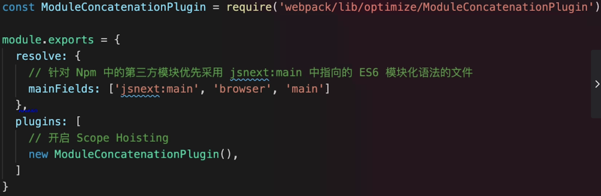
### ES Module 和 Commonjs 的区别
  + ES Module 静态引入，编译时引入
  + Commonjs 动态引入，执行时引入
  + 只有 ES Module 才能静态分析，实现 Tree-shaking
### 前端为何要进行打包和构建
  + 代码层面
    + 体积更小（Tree-Shaking、压缩、合并），加载更快
    + 编译高级语言或语法（TS、es6+、模块化、scss)
    + 兼容性和错误检查（Polyfill、postcss、eslint）
  + 研发流程
    + 统一高效的开发环境
    + 统一的构建流程和产出标准
    + 集成公司构建规范
### loader 和 plugin 的区别
  + loader: 模块转换器，如 less -> css
  + plugin: 扩展插件，如 HtmlWebpackPlugin


## 一面/二面
+ 页面加载过程
  + DNS 解析
  + 浏览器根据 IP 地址向服务器发起 http 请求
  + 服务器处理 http 请求（首先Client端发送连接请求报文，Server段接受连接后回复ACK报文，并为这次连接分配资源。Client端接收到ACK报文后也向Server段发生ACK报文，并分配资源，这样TCP连接就建立了），并返回给浏览器
  + 根据 HTML 代码生成 DOM Tree
  + 根据 CSS 代码生成 CSSDOM
  + 将 DOM Tree 和 CSSOM 整合生成 Render Tree
  + 根据 Render Tree 渲染页面
  + 遇到 `<script> `则暂停渲染,优先加载并执行 js 代码，完成再继续
  + 直至 Render Tree 渲染完成
+ window.onload 和 DOMContentLoaded 的区别：
  + `window.addEventListener('load',function(){// 页面的全部资源加载完才会执行，包括图片、视频等})`
  + `window.addEventListener('DOMContentLoaded',function(){// DOM 渲染完即可执行，此时图片、视频还可能没有加载完})`
+ 性能优化：
  + 多使用内存、缓存或其它方法
    + webpack 输出文件加 contenthash 
    + 静态资源加 hash 后缀，根据文件内容计算 hash
    + url 和 文件不变，则会自动触发 http 缓存机制，返回 304
  + 减少 CPU 计算量，减少网络加载耗时
  + 空间换时间
  + 让加载更快
    + 减少资源体积：压缩代码
    + 减少访问次数：合并代码，SSR 服务端渲染，缓存
    + 使用更快的网络：CDN
  + 让渲染更快
    + css 放在 head, JS 放在 body 最下面
    + 尽早开始执行 JS，用 DOMContentLoaded 触发
    + 懒加载
    + 对 DOM 操作进行缓存
    + 频繁 DOM 操作，合并到一起插入 DOM 结构
  + 预解析 DNS
+ 安全
  + XSS 攻击: 替换特殊字符，如 `< 变为 &lt;` ,`> 变为 &gt`
  + xsrf 攻击：
+ 缓存：
  + Cache-control
    + max-age 优先级高于 expires
    + s-maxage
    + private
    + public
    + no-cache
    + no-store
  + 
+ HTTP 协议类
  + http 协议的主要特点
    1. 简单快速：统一资源符固定，处理起来简单快速
    2. 灵活：头部信息里包含了特定类型，一个 http 协议就可以完成不同类型数据的传输
    3. 无连接
    4. 无状态
  + http 报文的组成部分
    + 请求报文：
      1. 请求行
      2. 请求头
      3. 空行
      4. 请求体
    + 响应报文
      1. 状态行
      2. 响应头
      3. 空行
      4. 响应体
  + http 方法
    + GET: 获取资源
    + POST：传输资源
    + PUT：更新资源
    + DELETE：删除资源
    + HEAD：获得报文首部
  + 
